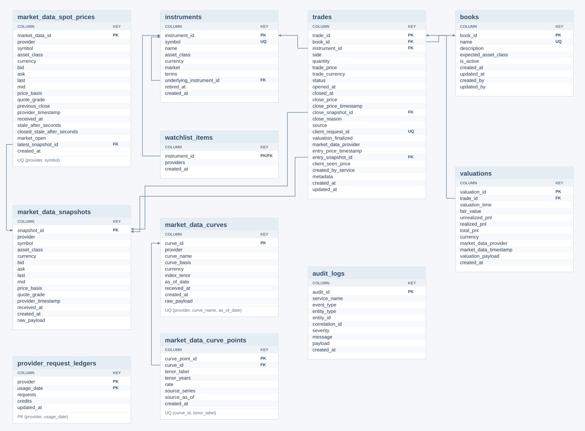

# Trading Desk

A portfolio project for exploring market data, instrument pricing and simulated trading.
Python 3.14, Bottle, SQLAlchemy, PostgreSQL and React/Vite. Trades are recorded locally;
the app does not send orders to a broker.

## Features

- Provider watchlist for equities, FX and commodities, with quote history and freshness states.
- Spot trades, fixed-coupon bonds, interest-rate swaps and European options.
- Model previews, trade opening/closing, valuation history and P&L grouped into books.
- Live updates through server-sent events, reporting-currency conversion and basic risk views.
- Provider status, request budgets and operational logs.

Quote sources: Finnhub, Twelve Data and Alpha Vantage. NBP and ECB supply reference FX;
FRED, ECB and EIOPA supply rate curves. Availability depends on credentials and provider access.

## Run

Install Docker with Compose, then:

```sh
cp .env.example .env
# Set POSTGRES_PASSWORD and use it in DATABASE_URL and DATABASE_MIGRATION_URL.
# Add provider API keys for the sources you want to use.
docker compose up --build
```

Open [localhost:3000](http://localhost:3000). Add instruments from Market Data, create a
book for the intended asset class, then open a trade. Quote-priced instruments need a usable
provider quote; model contracts also need an eligible curve. Missing API keys disable their feeds.

`.env.example` lists configuration. The main storage defaults are 90 days of quote observations
and at most one ordinary persisted valuation per trade per 60 seconds. Live updates are more frequent.

The instrument schema change requires a fresh development database. To discard the old local
Compose data and rebuild:

```sh
docker compose down -v
docker compose up --build
```

This removes the local database and cached frontend dependencies. There is no legacy-data backfill.

## Structure

| Location | Responsibility |
| --- | --- |
| `libs/desk-domain` | Instrument/trade storage, terms, provider vocabulary and domain queries |
| `libs/desk-pricing` | Pure numerical functions for bonds, swaps, options and risk |
| `libs/desk-runtime` | Configuration, database sessions, logging and HTTP runtime |
| `services/market-data-service` · 8001 | Provider adapters, watchlist, quote/curve storage and streams |
| `services/pricing-service` · 8002 | Pricing, valuation persistence, scenarios and valuation stream |
| `services/monitoring-service` · 8003 | Health, audit and logs |
| `services/books-service` · 8004 | Book management |
| `services/blotter-service` · 8006 | Trade, valuation and portfolio reads |
| `services/trade-action-service` · 8008 | Trade validation, command queue and trade writes |
| `frontend/src` | React views, components, state and API clients |
| `db` | Alembic schema migrations |

Providers normalize data before storing it. Pricing reads active trades and market inputs,
calculates values and publishes updates. Trade commands validate current data again before
writing. Blotter reads durable trades and receives valuation updates. PostgreSQL holds durable
state; streams update consumers, which reload state after reconnecting.

## Database

[Editable schema](assets/database.svg) · [ORM models](libs/desk-domain/src/desk_domain/models.py)



- `instruments` owns identity, currency and contract terms. The normalized symbol is unique
  within this app's supported catalogue. Options reference their underlying instrument.
- `watchlist_items` selects providers for an instrument. Removing a source needed by an active
  trade is blocked, including option-underlying dependencies. Open and removal coordinate on
  the same instrument row lock. Closed trades allow unwatching; their instruments remain protected.
- Contract fields live in `instruments.terms`; pricing settings and execution context live in
  trade metadata. Repositories reconstruct the inputs consumed by pricing and trade details.
- `valuations` stores calculated values, P&L and calculation context. Book and product identity
  come from the trade. Quote snapshots record observed price changes per provider and symbol.

## Scope and simplifications

Execution is simulated from stored quotes or model prices. Contracts use fixed `maturity_years`;
calendar aging, automatic expiry and contract versioning are outside the current scope.
IRS pricing uses one curve for discounting and projection. Pricing models are fixed per product
for now. Quote history contains observations collected by this app, without vendor backfill.
Valuation history follows a trade's current book after reassignment. Exact historical replay,
authentication, broker connectivity and durable command delivery are not implemented.

## Development and checks

Dependencies are pinned in `requirements.txt`. To work on the Python packages locally:

```sh
python3.14 -m venv .venv
.venv/bin/pip install -r requirements.txt
for package in libs/* services/*; do
  .venv/bin/pip install --no-deps -e "$package"
done
```

Load configuration with local database/service URLs before running a service entry point.
The Vite proxy in `frontend/vite.config.js` uses Compose service names by default.

```sh
.venv/bin/python -m compileall -q libs services db
cd frontend
npm ci
npm run build
npm run lint
npm run deadcode
```

Verify changed behavior through the running app: import → preview → open → value → close;
check rejected removal while active, unwatch/re-add after close, retained history and restart.
Exercise concurrency with separate database connections. Recompute financial results independently.
Check empty, missing/stale-data and closed states, plus normal and narrow browser widths.

The instrument refactor was checked with six running services, an isolated PostgreSQL database
and deterministic normalized market data. All six asset classes passed the trading/history flows;
spot and underlying removal races passed in both orders. Fresh migration/ORM agreement, 60-second
valuation sampling, restart recovery and a browser-entered bond were verified. Python compilation,
package builds and frontend checks passed. Live vendor HTTP access and Docker startup were not verified.
