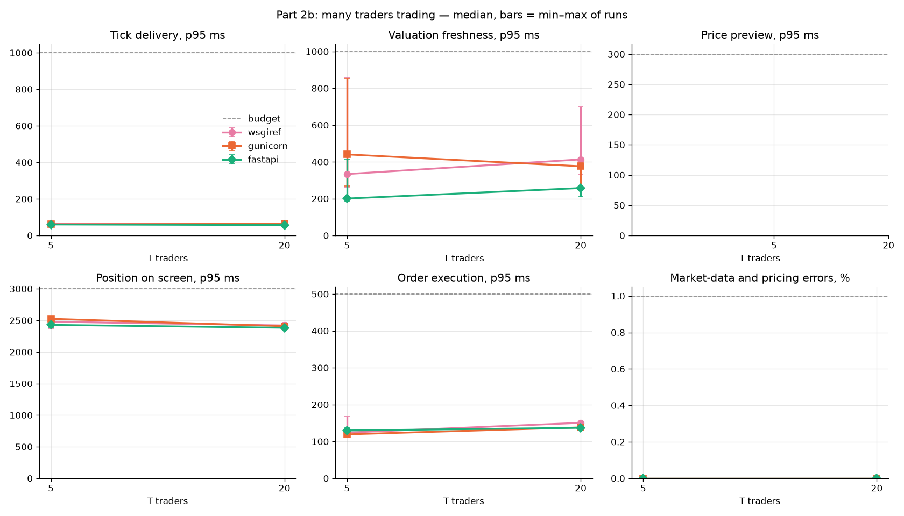
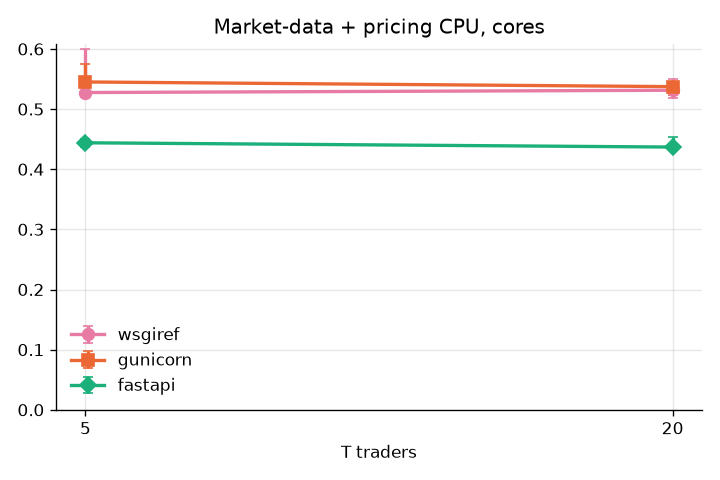

# Part 2b: many traders trading

Median of runs (spread = max − min). ✓ within budget, ✗ out.

## Decision

- T within the market-data and pricing budgets, gunicorn: 5, 20
- fastapi within those budgets at each of them: **yes**
- Market-data + pricing CPU per client at most 10 % higher (T = 20): **yes**
- The Part 2 GO for the streams: **stands**

## Flagged runs

- none

## Tick delivery (ms, p95, budget 1000)

| variant | T = 5 | T = 20 |
| --- | --- | --- |
| wsgiref | 64.3 (14.8) ✓ | 61.7 (1.93) ✓ |
| gunicorn | 60.7 (3.64) ✓ | 63.6 (3.19) ✓ |
| fastapi | 60.1 (4.79) ✓ | 56.8 (2.57) ✓ |

## Valuation freshness (ms, p95, budget 1000)

| variant | T = 5 | T = 20 |
| --- | --- | --- |
| wsgiref | 334 (594) ✓ | 413 (368) ✓ |
| gunicorn | 440 (586) ✓ | 376 (158) ✓ |
| fastapi | 201 (228) ✓ | 258 (56.6) ✓ |

## Price preview (ms, p95, budget 300)

| variant | T = 5 | T = 20 |
| --- | --- | --- |
| wsgiref | – | – |
| gunicorn | – | – |
| fastapi | – | – |

## Position on screen (ms, p95, budget 3000)

| variant | T = 5 | T = 20 |
| --- | --- | --- |
| wsgiref | 2481 (132) ✓ | 2421 (55.5) ✓ |
| gunicorn | 2527 (98.4) ✓ | 2409 (24.2) ✓ |
| fastapi | 2430 (167) ✓ | 2385 (53.0) ✓ |

## Order execution (ms, p95, budget 500)

| variant | T = 5 | T = 20 |
| --- | --- | --- |
| wsgiref | 124 (52.7) ✓ | 150 (20.4) ✓ |
| gunicorn | 119 (6.58) ✓ | 138 (11.2) ✓ |
| fastapi | 130 (21.6) ✓ | 137 (17.5) ✓ |

## Market-data and pricing errors (%, budget 1)

| variant | T = 5 | T = 20 |
| --- | --- | --- |
| wsgiref | 0.00 (0.00) ✓ | 0.00 (0.00) ✓ |
| gunicorn | 0.00 (0.00) ✓ | 0.00 (0.00) ✓ |
| fastapi | 0.00 (0.00) ✓ | 0.00 (0.00) ✓ |

## All errors (%, budget 1)

| variant | T = 5 | T = 20 |
| --- | --- | --- |
| wsgiref | 0.00 (0.00) ✓ | 0.00 (0.00) ✓ |
| gunicorn | 0.00 (0.00) ✓ | 0.00 (0.00) ✓ |
| fastapi | 0.00 (0.00) ✓ | 0.00 (0.00) ✓ |

## Market-data + pricing CPU: cores (per 100 clients)

| variant | T = 5 | T = 20 |
| --- | --- | --- |
| wsgiref | 0.53 (1.06) | 0.53 (1.06) |
| gunicorn | 0.55 (1.09) | 0.54 (1.07) |
| fastapi | 0.44 (0.89) | 0.44 (0.87) |

