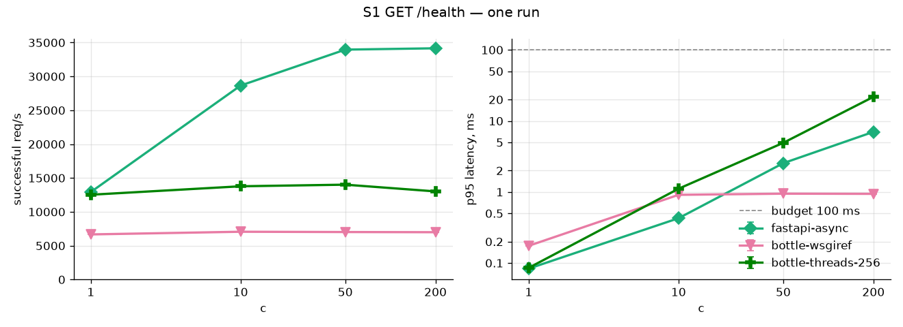
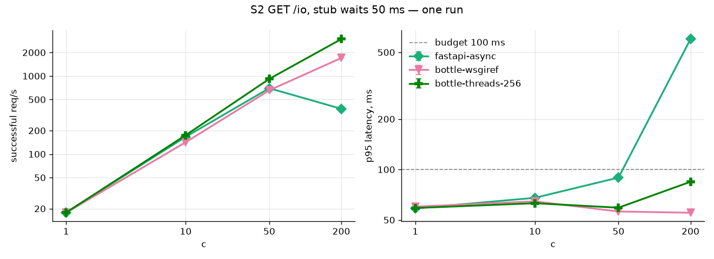
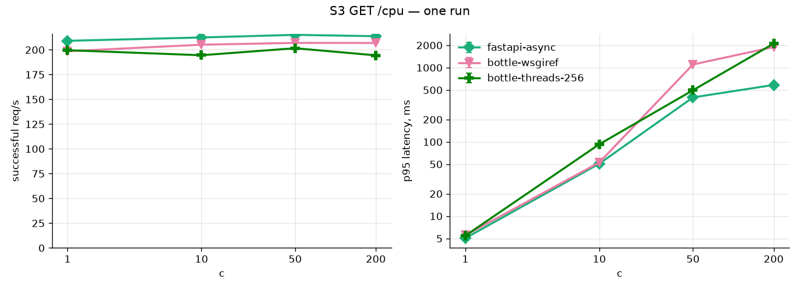
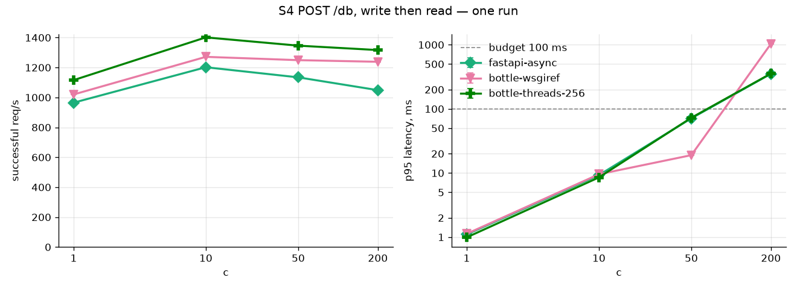
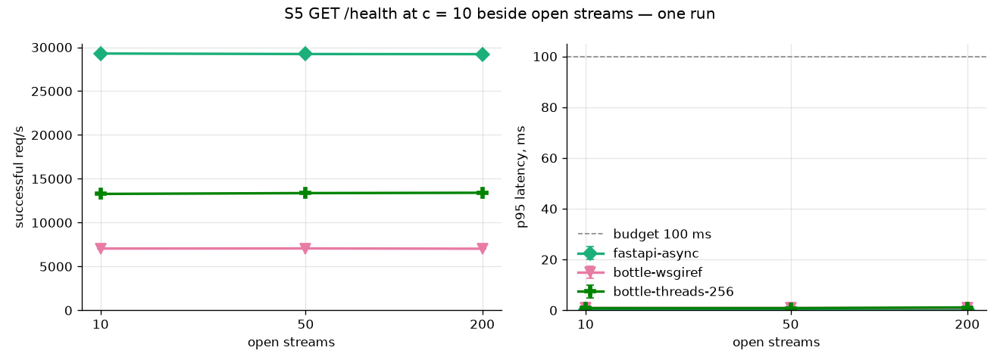

# Benchmark summary

Median of runs; (min–max) where shown. Errors include timeouts. RSS: the serving process.

Stub alone at c = 200: 3739 req/s, p50 52.9 ms, p99 63.2 ms

## S1 GET /health

| variant | c | req/s | p50 ms | p95 ms | p99 ms | errors % | CPU % | CPU ms/req | RSS MB |
| --- | --- | --- | --- | --- | --- | --- | --- | --- | --- |
| fastapi-async | 1 | 12923 (12923–12923) | 0.1 | 0.1 (0.1–0.1) | 0.1 | 0.0 (0.0–0.0) | 68.9 | 0.1 | 98.9 |
| fastapi-async | 10 | 28653 (28653–28653) | 0.3 | 0.4 (0.4–0.4) | 0.6 | 0.0 (0.0–0.0) | 99.9 | 0.0 | 99.0 |
| fastapi-async | 50 | 33960 (33960–33960) | 1.3 | 2.5 (2.5–2.5) | 2.7 | 0.0 (0.0–0.0) | 99.9 | 0.0 | 99.6 |
| fastapi-async | 200 | 34157 (34157–34157) | 5.6 | 7.0 (7.0–7.0) | 11.3 | 0.0 (0.0–0.0) | 99.9 | 0.0 | 102 |
| bottle-wsgiref | 1 | 6666 (6666–6666) | 0.1 | 0.2 (0.2–0.2) | 0.2 | 0.0 (0.0–0.0) | 98.9 | 0.1 | 75.2 |
| bottle-wsgiref | 10 | 7060 (7060–7060) | 0.8 | 0.9 (0.9–0.9) | 1.0 | 0.0 (0.0–0.0) | 98.9 | 0.1 | 75.7 |
| bottle-wsgiref | 50 | 7016 (7016–7016) | 0.8 | 0.9 (0.9–0.9) | 1.2 | 0.0 (0.0–0.0) | 98.9 | 0.1 | 75.7 |
| bottle-wsgiref | 200 | 6991 (6991–6991) | 0.8 | 0.9 (0.9–0.9) | 1.4 | 0.1 (0.1–0.1) | 98.9 | 0.1 | 76.2 |
| bottle-threads-256 | 1 | 12526 (12526–12526) | 0.1 | 0.1 (0.1–0.1) | 0.1 | 0.0 (0.0–0.0) | 99.8 | 0.1 | 72.8 |
| bottle-threads-256 | 10 | 13775 (13775–13775) | 0.7 | 1.1 (1.1–1.1) | 1.3 | 0.0 (0.0–0.0) | 99.9 | 0.1 | 74.2 |
| bottle-threads-256 | 50 | 14013 (14013–14013) | 3.5 | 4.9 (4.9–4.9) | 7.4 | 0.0 (0.0–0.0) | 99.9 | 0.1 | 75.7 |
| bottle-threads-256 | 200 | 13017 (13017–13017) | 15.0 | 21.8 (21.8–21.8) | 27.3 | 0.0 (0.0–0.0) | 99.9 | 0.1 | 82.9 |
- bottle-wsgiref at 50: timeout × 28
- bottle-wsgiref at 200: timeout × 265

## S2 GET /io, stub waits 50 ms

| variant | c | req/s | p50 ms | p95 ms | p99 ms | errors % | CPU % | CPU ms/req | RSS MB |
| --- | --- | --- | --- | --- | --- | --- | --- | --- | --- |
| fastapi-async | 1 | 17.9 (17.9–17.9) | 55.9 | 58.6 (58.6–58.6) | 59.7 | 0.0 (0.0–0.0) | 5.0 | 2.8 | 102 |
| fastapi-async | 10 | 166 (166–166) | 59.4 | 67.7 (67.7–67.7) | 69.9 | 0.0 (0.0–0.0) | 22.9 | 1.4 | 102 |
| fastapi-async | 50 | 697 (697–697) | 69.8 | 89.5 (89.5–89.5) | 104 | 0.0 (0.0–0.0) | 54.9 | 0.8 | 104 |
| fastapi-async | 200 | 380 (380–380) | 510 | 599 (599–599) | 782 | 0.0 (0.0–0.0) | 80.8 | 2.1 | 111 |
| bottle-wsgiref | 1 | 17.7 (17.7–17.7) | 56.2 | 60.0 (60.0–60.0) | 61.8 | 0.0 (0.0–0.0) | 5.0 | 2.8 | 76.3 |
| bottle-wsgiref | 10 | 142 (142–142) | 56.5 | 64.5 (64.5–64.5) | 1079 | 0.0 (0.0–0.0) | 20.9 | 1.5 | 76.8 |
| bottle-wsgiref | 50 | 656 (656–656) | 52.1 | 56.2 (56.2–56.2) | 1094 | 0.0 (0.0–0.0) | 35.5 | 0.5 | 82.4 |
| bottle-wsgiref | 200 | 1700 (1700–1700) | 52.1 | 55.2 (55.2–55.2) | 1308 | 0.2 (0.2–0.2) | 74.0 | 0.4 | 103 |
| bottle-threads-256 | 1 | 17.8 (17.8–17.8) | 56.0 | 58.9 (58.9–58.9) | 61.1 | 0.0 (0.0–0.0) | 5.0 | 2.8 | 85.8 |
| bottle-threads-256 | 10 | 174 (174–174) | 56.9 | 62.9 (62.9–62.9) | 65.7 | 0.0 (0.0–0.0) | 20.0 | 1.1 | 87.3 |
| bottle-threads-256 | 50 | 918 (918–918) | 53.8 | 59.2 (59.2–59.2) | 61.7 | 0.0 (0.0–0.0) | 36.9 | 0.4 | 88.7 |
| bottle-threads-256 | 200 | 2966 (2966–2966) | 64.8 | 84.5 (84.5–84.5) | 116 | 0.0 (0.0–0.0) | 99.9 | 0.3 | 92.9 |
- bottle-wsgiref at 200: timeout × 94

## S3 GET /cpu

| variant | c | req/s | p50 ms | p95 ms | p99 ms | errors % | CPU % | CPU ms/req | RSS MB |
| --- | --- | --- | --- | --- | --- | --- | --- | --- | --- |
| fastapi-async | 1 | 209 (209–209) | 4.7 | 5.0 (5.0–5.0) | 5.6 | 0.0 (0.0–0.0) | 98.9 | 4.7 | 111 |
| fastapi-async | 10 | 212 (212–212) | 46.3 | 50.9 (50.9–50.9) | 58.5 | 0.0 (0.0–0.0) | 99.8 | 4.7 | 111 |
| fastapi-async | 50 | 215 (215–215) | 203 | 397 (397–397) | 430 | 0.0 (0.0–0.0) | 99.8 | 4.6 | 112 |
| fastapi-async | 200 | 214 (214–214) | 554 | 584 (584–584) | 1122 | 2.3 (2.3–2.3) | 99.9 | 4.7 | 112 |
| bottle-wsgiref | 1 | 199 (199–199) | 4.9 | 5.5 (5.5–5.5) | 6.8 | 0.0 (0.0–0.0) | 99.9 | 5.0 | 99.4 |
| bottle-wsgiref | 10 | 205 (205–205) | 36.7 | 52.9 (52.9–52.9) | 1042 | 0.0 (0.0–0.0) | 99.9 | 4.9 | 99.4 |
| bottle-wsgiref | 50 | 207 (207–207) | 41.8 | 1103 (1103–1103) | 2526 | 0.3 (0.3–0.3) | 99.9 | 4.8 | 99.4 |
| bottle-wsgiref | 200 | 207 (207–207) | 43.0 | 1894 (1894–1894) | 3926 | 4.4 (4.4–4.4) | 99.9 | 4.8 | 99.4 |
| bottle-threads-256 | 1 | 200 (200–200) | 4.9 | 5.4 (5.4–5.4) | 5.9 | 0.0 (0.0–0.0) | 99.9 | 5.0 | 93.0 |
| bottle-threads-256 | 10 | 195 (195–195) | 49.0 | 93.0 (93.0–93.0) | 117 | 0.0 (0.0–0.0) | 99.8 | 5.1 | 93.0 |
| bottle-threads-256 | 50 | 202 (202–202) | 225 | 496 (496–496) | 653 | 0.0 (0.0–0.0) | 99.8 | 5.0 | 93.0 |
| bottle-threads-256 | 200 | 194 (194–194) | 884 | 2109 (2109–2109) | 2749 | 0.0 (0.0–0.0) | 99.8 | 5.1 | 93.0 |
- fastapi-async at 200: timeout × 152
- bottle-wsgiref at 50: timeout × 17
- bottle-wsgiref at 200: timeout × 284

## S4 POST /db, write then read

| variant | c | req/s | p50 ms | p95 ms | p99 ms | errors % | CPU % | CPU ms/req | RSS MB |
| --- | --- | --- | --- | --- | --- | --- | --- | --- | --- |
| fastapi-async | 1 | 965 (965–965) | 1.0 | 1.1 (1.1–1.1) | 1.4 | 0.0 (0.0–0.0) | 87.9 | 0.9 | 115 |
| fastapi-async | 10 | 1202 (1202–1202) | 8.1 | 9.3 (9.3–9.3) | 12.9 | 0.0 (0.0–0.0) | 99.9 | 0.8 | 115 |
| fastapi-async | 50 | 1134 (1134–1134) | 41.9 | 71.2 (71.2–71.2) | 90.4 | 0.0 (0.0–0.0) | 99.9 | 0.9 | 115 |
| fastapi-async | 200 | 1049 (1049–1049) | 187 | 352 (352–352) | 444 | 0.0 (0.0–0.0) | 99.9 | 1.0 | 119 |
| bottle-wsgiref | 1 | 1020 (1020–1020) | 1.0 | 1.1 (1.1–1.1) | 1.4 | 0.0 (0.0–0.0) | 78.9 | 0.8 | 103 |
| bottle-wsgiref | 10 | 1271 (1271–1271) | 7.6 | 9.6 (9.6–9.6) | 10.9 | 0.0 (0.0–0.0) | 99.9 | 0.8 | 103 |
| bottle-wsgiref | 50 | 1249 (1249–1249) | 12.7 | 19.0 (19.0–19.0) | 1050 | 0.0 (0.0–0.0) | 99.9 | 0.8 | 104 |
| bottle-wsgiref | 200 | 1238 (1238–1238) | 17.3 | 1035 (1035–1035) | 2095 | 0.5 (0.5–0.5) | 99.9 | 0.8 | 105 |
| bottle-threads-256 | 1 | 1116 (1116–1116) | 0.9 | 1.0 (1.0–1.0) | 1.3 | 0.0 (0.0–0.0) | 79.9 | 0.7 | 97.7 |
| bottle-threads-256 | 10 | 1402 (1402–1402) | 7.0 | 8.5 (8.5–8.5) | 10.0 | 0.0 (0.0–0.0) | 99.9 | 0.7 | 98.4 |
| bottle-threads-256 | 50 | 1346 (1346–1346) | 35.5 | 72.6 (72.6–72.6) | 98.9 | 0.0 (0.0–0.0) | 99.9 | 0.7 | 99.2 |
| bottle-threads-256 | 200 | 1317 (1317–1317) | 148 | 356 (356–356) | 496 | 0.0 (0.0–0.0) | 99.9 | 0.8 | 102 |
- bottle-wsgiref at 200: timeout × 170

## S5 GET /health at c = 10 beside open streams

| variant | streams | req/s | p50 ms | p95 ms | p99 ms | errors % | CPU % | CPU ms/req | RSS MB | answered |
| --- | --- | --- | --- | --- | --- | --- | --- | --- | --- | --- |
| fastapi-async | 10 | 29288 (29288–29288) | 0.3 | 0.4 (0.4–0.4) | 0.5 | 0.0 (0.0–0.0) | 99.9 | 0.0 | 117 | 10 |
| fastapi-async | 50 | 29229 (29229–29229) | 0.3 | 0.4 (0.4–0.4) | 0.5 | 0.0 (0.0–0.0) | 99.9 | 0.0 | 118 | 50 |
| fastapi-async | 200 | 29218 (29218–29218) | 0.3 | 0.4 (0.4–0.4) | 0.4 | 0.0 (0.0–0.0) | 99.9 | 0.0 | 118 | 200 |
| bottle-wsgiref | 10 | 7045 (7045–7045) | 0.8 | 0.9 (0.9–0.9) | 1.1 | 0.0 (0.0–0.0) | 98.9 | 0.1 | 104 | 10 |
| bottle-wsgiref | 50 | 7058 (7058–7058) | 0.8 | 0.9 (0.9–0.9) | 1.0 | 0.0 (0.0–0.0) | 98.9 | 0.1 | 105 | 50 |
| bottle-wsgiref | 200 | 7025 (7025–7025) | 0.8 | 0.9 (0.9–0.9) | 1.0 | 0.0 (0.0–0.0) | 98.9 | 0.1 | 110 |  |
| bottle-threads-256 | 10 | 13275 (13275–13275) | 0.7 | 0.9 (0.9–0.9) | 1.0 | 0.0 (0.0–0.0) | 99.9 | 0.1 | 102 | 10 |
| bottle-threads-256 | 50 | 13367 (13367–13367) | 0.7 | 0.8 (0.8–0.8) | 1.0 | 0.0 (0.0–0.0) | 99.9 | 0.1 | 102 | 50 |
| bottle-threads-256 | 200 | 13405 (13405–13405) | 0.7 | 1.1 (1.1–1.1) | 1.3 | 0.0 (0.0–0.0) | 99.9 | 0.1 | 103 | 200 |

