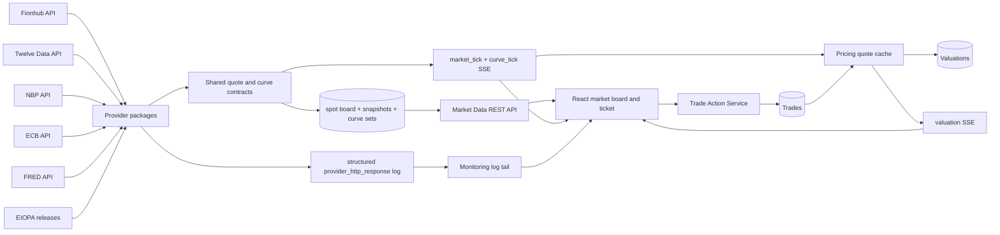

# Architecture — the base system

Six Python services, one Postgres, one React frontend, started by
`./scripts/docker-dev.sh up` (a guarded wrapper around Docker Compose).
Synthetic flows from the forked repository are gone, and market data comes from configured
real providers. Future capability sequencing lives in the
[implementation roadmap](implementation-roadmap.md).

## The system in seven steps

```text
1. market-data       external quotes+curves  → publishes ticks + curves (SSE)
2. trade-action      is the only writer      → intents from the ticket → queue → worker → trades table + audit row
3. pricing           reads active trades     → reprices on every tick → publishes valuations (SSE)
4. blotter           reads trades+valuations → serves the operational read model
5. books             owns book metadata      → guarded create/edit/retire
6. monitoring        watches everything      → health, audits, log collection
7. frontend          merges snapshot+stream  → screens that stay live without reloading
```

No message broker, and no service-to-service call about a trade — which is what the three rules
below replace.

## The three design rules

- **The database row is the handoff.** Trade-action inserts a trade; pricing re-queries
  `ACTIVE` trades every `TRADE_REFRESH_SECONDS` and swaps its working set wholesale; blotter
  polls on its own cadence. A restarting service rebuilds its world from one source of truth —
  no replay protocol, no liveness coupling. The cost is ~2 s propagation, invisible in a UI
  that already streams.
- **One writer per table.** Every mutation of `trades` goes through trade-action, even from the
  Books screen; books-service owns `books`; pricing owns `valuations`. When a destructive
  precondition cannot be verified (blotter unreachable during a book delete), the request
  is refused with `503`.
- **Freeze at the boundary.** A trade's economics are validated once at open and frozen into
  its `metadata` JSONB; every later process prices from the frozen terms and never looks
  anything up again. Adding the two OTC classes (options, IRS) required no migration.

## The market-data vertical in one diagram



- Only market-data-service connects to vendors; every other service consumes normalized
  rows or the normalized SSE stream.
- SSE distributes changes, but PostgreSQL remains the source of truth — consumers seed
  from a snapshot and reconcile after restart, because SSE has no replay.

## Code map

| Concern | Main files |
| --- | --- |
| Provider registry, normalized quote, freshness | `shared/providers.py`, `shared/quotes.py`, `shared/freshness.py` |
| Active provider-symbol set, watchlist | `shared/active_set.py`, `market-data-service/app/watchlist.py` |
| Provider interface and runtime registry | `market-data-service/app/providers/registration.py`, `providers/__init__.py`, `scheduler.py` |
| One source end to end | `market-data-service/app/providers/<provider>/` — client, normalizer/curve builder and feed wiring |
| Shared provider mechanics | `providers/base.py`, `provider_runtime.py`, `official_fixing_feed.py`, `curve_feed.py`, `poll_schedule.py`, `budget.py` |
| Curve ownership, domain and persistence | `shared/curves.py` (provider/currency/use catalog), `shared/curve_registry.py`, `curve_store.py` |
| FX resolver | `shared/fx.py` |
| Board, snapshots, history API | `quote_store.py`, `quote_service.py`, `retention.py`, `publisher.py`, `api.py` |
| Market UI | `useMarketFeed.js`, `useQuoteHistory.js`, `useWatchlist.js`, `MarketData.jsx` |
| Curve UI | `domain/curves.js`, `CurveSection.jsx`, `CurveChart.jsx` |
| Reporting-currency overlay | `useFxRates.js`, `useReportingCurrency.js`, `domain/fx.js`, `FxReport.jsx` |
| Ticket comparison | `domain/tradeActions.js`, `NewTradePanel.jsx`, `ProviderQuoteOption.jsx`, `TermFields.jsx` |
| Server execution | `trade_validation.py`, `trade_handlers.py`, `trade_processor.py`, `market_state.py`, `repository.py` |
| Asset pricing interface | `pricing-service/app/pricers/contract.py`, `pricers/registry.py`, `pricers/<asset>.py`, `shared/pricing/<asset>.py` |
| Provider-bound valuation | `pricing-service/app/cache.py`, `repository.py`, `market_data_client.py`, `valuation_engine.py` |

## Who owns what

| Service | Port | Owns | Publishes |
| --- | --- | --- | --- |
| market-data | 8001 | provider quotes and curves, provider polling and budgets | `GET /snapshot`, `GET /quotes` (+ `/<provider>/<symbol>/history`), `GET /curves` (+ `/<provider>`, `POST /curves/refresh`), `GET /providers` (+ `/<p>/health`), `POST /refresh`, SSE `/stream` |
| pricing | 8002 | valuations, book alpha/beta, scenario analysis | `GET /valuations`, `GET /book-risk`, SSE `/valuation-stream`, `POST /price`, `POST /scenario` |
| monitoring | 8003 | health polling, audit queries, log collection | `GET /status`, `GET /audits`, `GET /logs`, SSE `/logs/stream` |
| books | 8004 | book metadata and lifecycle | `GET/POST/PUT/DELETE /books` |
| blotter | 8006 | the operational read model over trades | `GET /trades/overview`, `/trades/{id}`, `/books/summary` |
| trade-action | 8008 | **every** mutation of `trades` | `POST /trade-actions` (202), `GET /queue/status`, `GET /instruments`, `GET /instruments/term-schemas` |
| frontend | 3000 | eight views over the above | — |

The browser only requests same-origin `/api/<service>/…` paths; Vite's dev-server proxy
forwards to the containers by name, so no service needs CORS and the frontend's URLs are
deployment-independent.

## Data model

- **`books`** — `book_id`, name, expected asset class, `is_active` (retirement is a soft
  delete).
- **`trades`** — identity, book, side, quantity, prices, lifecycle status, and `metadata JSONB`
  holding the frozen terms; `asset_class` is `TEXT`, not a database enum. Provenance columns
  are `market_data_provider`, `entry_price_timestamp`,
  optional `entry_snapshot_id` (FK when the exact board observation has a change snapshot),
  `client_seen_price`, `created_by_service`, plus matching close timestamp/snapshot fields —
  written by the execution gate on every trade the ticket creates.
- **`valuations`** — one row per repricing, plus the terminal row written at close; stamped
  with `market_data_provider` + `market_data_timestamp`.
- **`audit_logs`** — service, event type, severity, message, entity, `correlation_id`,
  timestamp. The audit trail is the business record; rotating log files plus monitoring's
  bounded in-memory buffers are the technical one.
- **The market store** (details in
  [market-data.md](market-data.md)): `market_data_spot_prices` — the latest quote board,
  unique (provider, symbol), upserted; `market_data_snapshots` — change-only quote history
  with raw payloads; `market_data_curves` / `market_data_curve_points` — curve sets
  (`curve_basis` naming how the numbers were derived, stored source evidence at set level)
  with per-point provenance;
  `watchlist_items` — the symbol master that replaced the static instrument catalog.

Migrations live in `db/versions/` (Alembic) and run as the one-shot `db-migrations` container
before any service starts.

## Shared runtime

- Every service boots through `shared/service_runtime.py`:
  `run_service(name, app, port, startup=…, background=…)` — startup hooks run to completion
  before background daemon threads start and the threaded server begins serving on the
  declared port. A default `/health` is installed unless the service defines a richer one.
- `os.environ` is read only in `shared/config.py` (`env_str` / `env_int` / `env_float` /
  `env_required`); each service's `app/config.py` holds its `SERVICE_NAME`, declared port, and
  service-local knobs. Rationale for every knob: [configuration.md](configuration.md).
- One image per service, all built from the single `docker/service.Dockerfile` template
  (python:3.14-slim, multi-stage, one shared dependency layer from the root
  `requirements.txt`) — the recipe is shared, the images, containers, and processes are not.
  The `db-migrations` compose entry reuses the market-data image for its one-shot
  `alembic upgrade head` job.
- Intents carry a client-minted `client_request_id` (`manual-open-…`, `manual-move-…`); it is
  the idempotency key (unique constraint) and the `correlation_id` that joins audit rows and
  log lines into one correlated trace.

## Conventions

- **No explanatory comments in code** — design rationale lives in the phase reports; code
  carries only constraint comments it cannot express itself.
- **Honest UI over fake data** — unavailable values render as real states (`PENDING`, `n/a`,
  `INSUFFICIENT_DATA`), never invented zeros.
- **Bounded everything** — every queue, buffer, and rendered table has an explicit cap.
- **Docs describe maintained capabilities** ([README.md](README.md)) — a document describes
  current behavior, its boundaries and how to validate it, or it does not exist.
