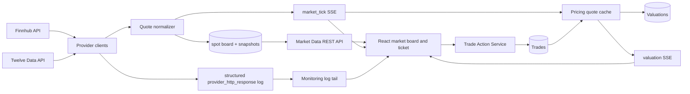
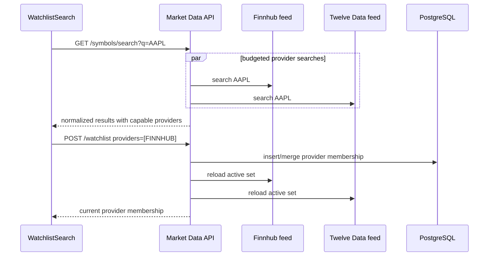
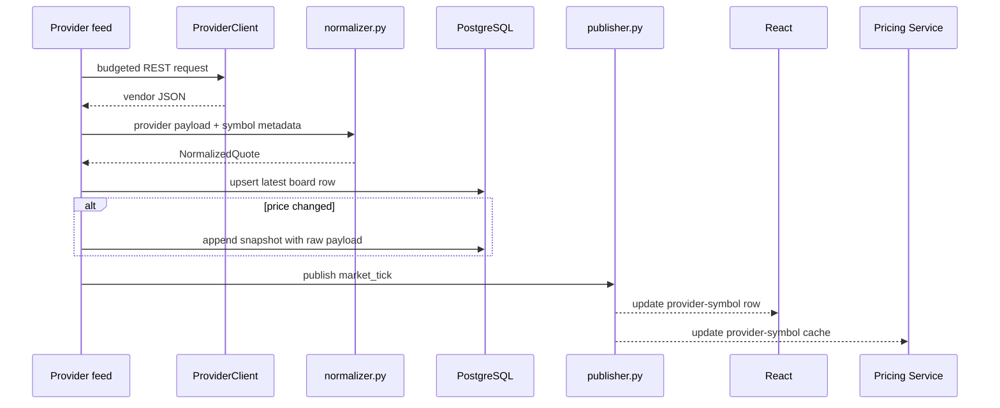
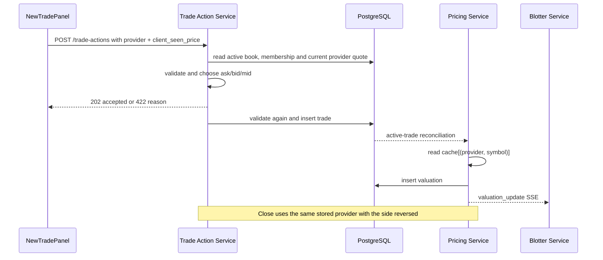
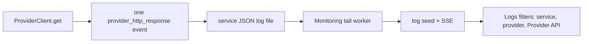

# Multi-provider market data and trading

This guide explains how Finnhub and Twelve Data move through the application: symbol
search, provider-specific watchlist membership, polling, the quote board, trade entry,
valuation, close and provider logs. It describes the current code and the reasons for the
few rules that cross service boundaries.

For exact environment defaults use [configuration.md](../configuration.md). For field and
provider reference use [market-data.md](../market-data.md). For hands-on verification use
[validation-runbook.md](../validation-runbook.md).

## Scope and guarantees

The implemented feature guarantees that:

- a symbol can be watched on Finnhub, Twelve Data or both;
- every quote remains identified by `(provider, symbol)`;
- the ticket compares the providers that are actually watching the selected symbol;
- the server chooses the execution price from the selected provider's current quote;
- the trade stores provider, provider timestamp and snapshot provenance;
- valuation and close continue to use the provider stored on the trade;
- upstream calls are visible in the existing structured Logs flow.

The feature does not fetch vendor backfill, add smart routing, ingest official rate curves
or implement exchange order queuing. A trade here is portfolio booking against a usable
quote, not an exchange order.

## The whole system in one diagram

There are two important ownership rules:

1. Only Market Data Service connects to vendors. Other services consume normalized rows or
   the normalized SSE stream.
2. SSE distributes changes, but PostgreSQL remains the source of truth. Consumers seed or
   reconcile after startup because SSE has no replay.

## Code map

Read one vertical flow instead of reading directories alphabetically.

| Concern | Main files |
| --- | --- |
| Provider facts and normalized quote | `shared/providers.py`, `shared/quotes.py`, `shared/freshness.py` |
| Active provider-symbol set | `shared/active_set.py`, `services/market-data-service/app/watchlist.py` |
| Vendor HTTP | `clients/base.py`, `clients/finnhub.py`, `clients/twelve_data.py` |
| Vendor payload mapping | `services/market-data-service/app/normalizer.py` |
| Polling and budgets | `finnhub_feed.py`, `twelve_data_feed.py`, `provider_runtime.py`, `budget.py` |
| Board, snapshots and observed-history API | `persistence.py`, `publisher.py`, `api.py` |
| Market UI | `useMarketFeed.js`, `useQuoteHistory.js`, `useWatchlist.js`, `MarketData.jsx` |
| Ticket comparison | `domain/tradeActions.js`, `NewTradePanel.jsx`, `ProviderQuoteOption.jsx` |
| Server execution | `trade-action-service/app/trade_processor.py`, `market_state.py`, `repository.py` |
| Provider-bound valuation | `pricing-service/app/cache.py`, `valuation_engine.py` |
| Provider log inspection | `clients/base.py`, `monitoring-service`, `Logs.jsx` |

## Flow 1: search and watch one provider

Search runs in these steps:

1. The UI waits for two characters and debounces typing, so it does not spend a provider
   request for every keypress.
2. The API normalizes the query once, then asks the two feeds in parallel. Parallelism only
   removes stacked network latency; each feed still checks and spends its own token/credit.
3. Each provider payload is converted at the edge to the same result shape. Provider notation
   such as `XAU/USD` becomes the internal `XAUUSD`; invalid internal symbols are discarded.
4. Each provider slice is deduplicated and ranked exact match, prefix, then shorter symbol.
   The merged list uses the same ranking, so an exact result is not buried by one provider's
   broader catalogue.
5. A provider data error or 404 contributes an empty slice and a structured log line; it does
   not fail the other provider's results or change provider-wide health. The merged answer is
   cached for ten minutes to conserve both budgets.

The watchlist write then runs in these steps:

1. The UI groups results by internal symbol, shows provider toggles, and posts only the
   selected providers.
2. `watchlist.py` validates symbol, class, currency, provider identity/capability and the
   watchlist size before writing.
3. One transaction inserts a symbol or merges new providers into its existing membership and
   writes the matching audit event.
4. The API reloads every feed's active-set view immediately. The board can show a MISSING
   placeholder until the first quote arrives; the normal poll then replaces it.
5. Removal deletes only the requested membership. If no trade or benchmark still needs that
   pair, `market_remove` tells every open tab to drop the row; otherwise `still_polled`
   explains why the quote remains.

`market_remove` is an internal cache-invalidation message, not a request to the quote
provider and not another business deletion. It is retained because browser sessions and
pricing hold the streamed board in memory; without it, a removed pair could remain cached
until reconnect even though the database row was already gone.

`watchlist_items` has one row per symbol and a JSON object containing only the chosen
providers. Capabilities are derived from `shared/providers.py`; they are not stored as user
choices. Adding Twelve Data later merges it into the same symbol row. Removing
`?provider=TWELVE_DATA` leaves Finnhub untouched.

The quote board uses the same visual hierarchy: one symbol group with provider subrows in a
stable order. Selecting or removing a subrow still targets its exact `(provider, symbol)`;
grouping changes presentation, not data identity.

The active set combines three reasons to keep polling:

- `watched_by`: explicitly selected on the watchlist;
- `held_by`: required by an active trade, using only that trade's frozen provider;
- `benchmark_by`: required for book risk.

This is why removing a watchlist provider may remove the board row immediately or may return
it in `still_polled`: an open position still needs it.

## Flow 2: vendor quote to board and consumers

The normalized shape keeps vendor-specific parsing at the edge. `bid`, `ask` and `last` are
never invented. `mid` is derived once: bid/ask midpoint when both exist, otherwise the
official reference value, otherwise last. `price_basis` records that choice.

The current board and the snapshot table answer different questions:

- `market_data_spot_prices`: what is the latest accepted quote for this provider-symbol?
- `market_data_snapshots`: which price changes and raw provider payloads did we observe?

The board is overwritten on every successful poll. A snapshot is appended only when a price
field changes. This avoids turning unchanged closed-market confirmation polls into thousands
of history rows.

Network failures are returned to the budget-aware feed loop; the HTTP client does not make a
hidden second attempt. This keeps the token bucket, daily-credit ledger and upstream calls in
agreement.

### Today change and snapshot history

Change today compares the latest normalized `mid` with the provider's `previous_close`.
The board presents that comparison directly alongside Last, market state and quote age.
Last tick is a separate, discrete comparison with the immediately previous accepted quote;
it does not imply any values between provider responses.

Snapshots remain an audit/provenance record of price changes observed while the service was
running. Selecting a board row reads the latest 60 snapshots for exactly that
`(provider, symbol)` and presents them newest-first as discrete observations. The initial
read is lazy, and subsequent reads are triggered only when the selected row receives a
price-field change. There is no timer and this path never calls a quote provider.

The tape is not rendered as a connected trend: coverage begins when ingestion starts and can
contain long gaps, so a line would imply a complete intraday market series. Previous close is
not inserted as a synthetic history point. Finnhub stock candles require Premium access, and
Twelve Data history alone would make equivalent provider rows show different kinds of data.

## Flow 3: selected provider to trade, valuation and close

The browser sends `client_seen_price`, not an execution price. The server reads the newest
board row and chooses:

- BUY: ask, falling back to normalized mid when the feed has no spread;
- SELL: bid, with the same fallback;
- CLOSE: the opposite side on the provider stored on the trade.

If the quote moved more than `TRADE_PRICE_TOLERANCE_PCT` from what the user saw, the request
is rejected. Validation runs once before the `202` response and again in the worker because
the market can move while the intent is queued.

The insert records `market_data_provider`, executed `trade_price`, `client_seen_price`,
`entry_price_timestamp`, optional `entry_snapshot_id` and `created_by_service`. Close records
the matching price timestamp and optional snapshot ID. A snapshot ID is present only when
the exact current board observation created a change-history row; unchanged confirmation
polls never reuse an older ID. The browser cannot choose any persisted provenance field.

Pricing caches quotes by `(provider, symbol)`. `value_trade()` first resolves the provider
on the trade and then reads only that cache key. A newer quote from another provider cannot
reprice the position. The same provider is included in the valuation payload and blotter
response so the choice remains visible end to end.

## Market state and closed-market booking

The state model separates session state from data failure:

| State | Meaning | New trade |
| --- | --- | --- |
| LIVE | Provider timestamp is inside the open-market freshness budget | allowed |
| CLOSED | Venue is closed and confirmation polls still arrive | allowed |
| STALE | Expected provider updates are no longer arriving | blocked |
| MISSING | Provider should serve the row but has no quote | blocked |
| UNSUPPORTED | Provider does not serve this asset class | not offered |

`CLOSED` is bookable because this application records portfolio transactions; it does not
queue exchange orders. The stored quote state, provider timestamp and snapshot make that
choice explicit. A future order-management feature would replace this rule with venue-hours
execution.

## Flow 4: provider calls to Logs

`ProviderClient` logs once after each completed response or error. The entry includes the
provider, public endpoint, safe symbol/search context, HTTP status, duration, result count,
outcome and the provider body as `response_json`. The Logs view pretty-prints that JSON.
Authentication parameters are added only when constructing the URL and are never included
in log fields.

Provider cards link to the existing Logs view with filters in the hash URL. No second log
store was added; provider inspection reuses the central log reader and SSE flow already
present in the application.

## Provider pacing and failure isolation

Finnhub and Twelve Data share the client error types, token bucket, runtime health model,
normalizer contract, persistence and publisher. Their feed loops remain separate because
their actual constraints differ:

| Provider | Polling shape | Binding budget |
| --- | --- | --- |
| Finnhub | one symbol per request; faster tier for held symbols and benchmark; slower watchlist tier; closed cadence | requests per minute |
| Twelve Data | multi-symbol quote request; one credit per symbol; flat cadence adjusted to active symbol count | minute burst plus daily credits |

An upstream failure changes only that provider runtime:

- 401/403: `AUTH_FAILED` cooldown;
- 429: `RATE_LIMITED`, honoring `Retry-After` when present;
- network/5xx: short `ERROR` backoff;
- HTTP 404 or one bad symbol in a Twelve Data batch: warning for that symbol while valid
  batch rows continue and provider health stays unchanged.

Provider health is returned by `/providers` and `/providers/<name>/health`. The UI renders
configured feeds with cadence, market session, last success and budgets. Unwired future
providers render only `NOT AVAILABLE`.

## Public boundaries

| Endpoint | Purpose |
| --- | --- |
| `GET /symbols/search?q=` | normalized, provider-tagged discovery |
| `GET/POST /watchlist` | list or merge provider membership |
| `DELETE /watchlist/<symbol>?provider=` | remove one provider membership |
| `GET /quotes` | current stored normalized board, filterable by provider/symbol/class |
| `GET /quotes/<provider>/<symbol>/history?limit=60` | latest change-only observations for one board row; database-only |
| `GET /snapshot` + `GET /stream` | seed and live normalized quote updates |
| `GET /providers` + `/providers/<name>/health` | provider runtime and budgets |
| `POST /refresh?symbol=&provider=` | immediate budgeted poll |
| `GET /instruments` | tradeable symbols and their provider choices |
| `POST /trade-actions` | provider-bound open/close intent |

The frontend uses `/api/market-data/...`; Vite removes that prefix before proxying to the
single service-root route for each endpoint.

## Data model additions

The single development migration adds only state needed by these flows:

- watchlist provider choices;
- board freshness/session fields, previous close and latest snapshot reference;
- trade provider, server execution provenance and the price seen by the client;
- valuation provider and market timestamp.

The foreign key from a trade to its entry snapshot has no cascade. Retention skips snapshots
referenced by trades and the current board, so audit provenance cannot be removed by cleanup.

## Verification route

Run [provider-trading.http](../../scenarios/provider-trading.http) and verify in the browser:

1. Search AAPL and add Finnhub only, then Twelve Data.
2. Confirm two independent board rows and remove only one provider.
3. Confirm the board shows Mark, last-tick and daily moves, market state and quote age; select
   either provider row and inspect its separate newest-first observation tape.
4. Open the ticket, compare provider rows and submit one usable LIVE or CLOSED quote.
5. Confirm Trades shows the chosen provider, quote time and server execution price.
6. Confirm valuation and close retain that provider.
7. Open a provider card and confirm Logs is filtered to completed upstream calls without API
   keys.
8. Exercise STALE, missing and moved-price rejection paths and confirm the user receives the
   exact reason.

See [validation-runbook.md](../validation-runbook.md) for cleanup and expected UI states.
