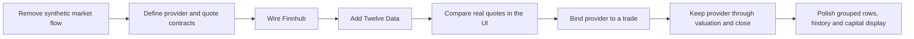
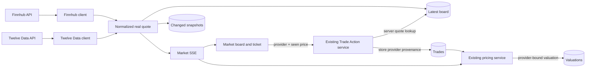
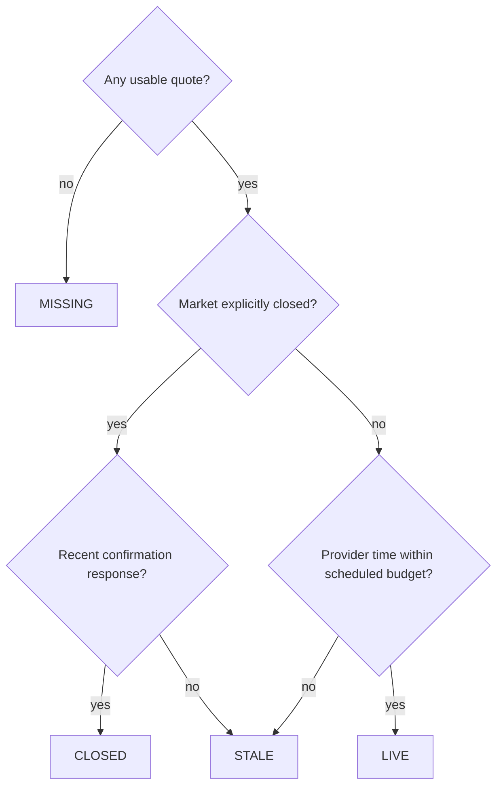
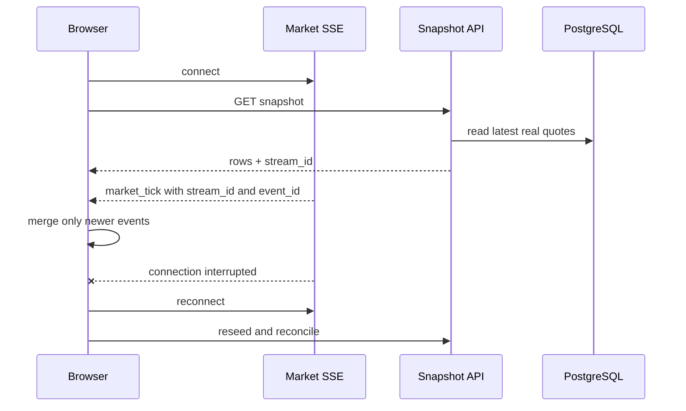
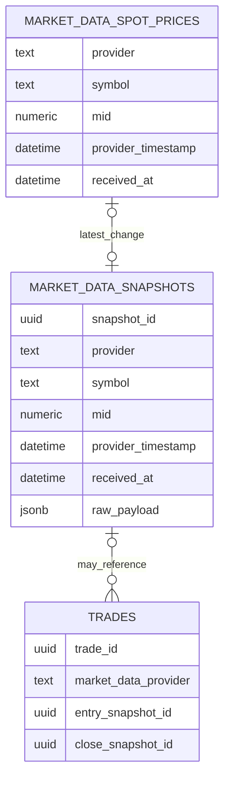
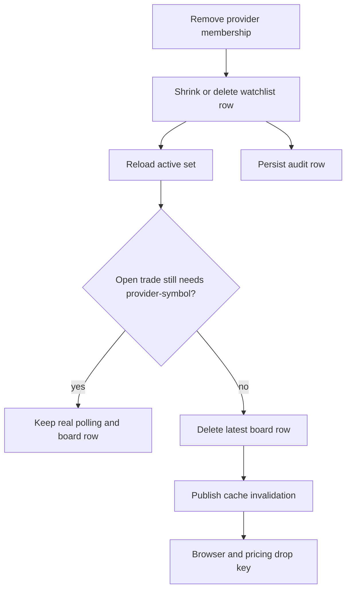
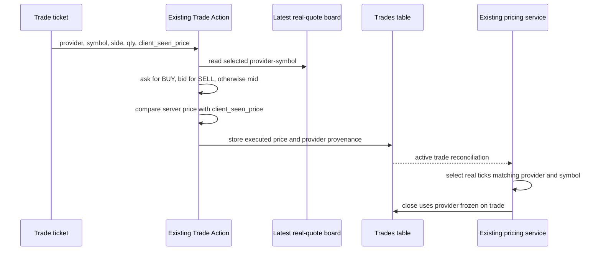
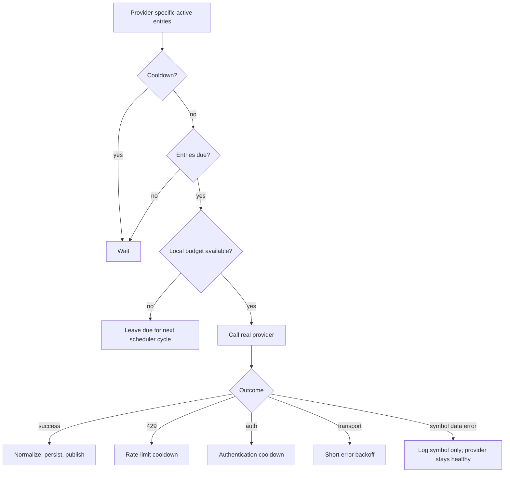

# Phase 3a — the two-provider vertical, review record

*Relocated from `docs/decisions.md` (2026-08-23) so every phase keeps its chronological
record in `phase-reports/`. Content unchanged below: the review boundary, walkthrough and
the eight decisions of the delivered Finnhub + Twelve Data workflow, as reviewed on
2026-08-21. The durable review method now lives in `../validation-runbook.md`; current
behavior is documented in `../implementation/multi-provider-trading.md`.*

## Review boundary



| Date | Recent change |
| --- | --- |
| Aug 18 | Removed the synthetic/static market-data path and introduced provider/quote contracts |
| Aug 19 | Completed the first real-provider slice with Finnhub |
| Aug 20 | Added Twelve Data, provider-specific watchlist/trading, provider operations UI and provider request logs |
| Aug 20 | Removed misleading incomplete trend charts, added last-tick change, grouped identical tickers and added discrete quote history |
| Aug 20 | Added capital invested and final UI/copy/accessibility polish |

The current branch is five commits beyond `main`; those commits contain the Aug 20
multi-provider integration and its correction/polish passes. The Aug 18–19 work is the immediate
base for that review, not an invitation to tour older application features.

### Current verdict

- **Ready to review:** the two-provider real-quote slice and its UI/data-flow decisions.
- **Not claimed complete:** the full brief requirements list. Alpha Vantage, NBP, ECB and FRED are not
  wired in this phase.
- **Not part of this review:** old books features, general queue design, prior valuation/risk
  features, generic monitoring architecture and older service scaffolding.

## Opening statement

> Over the last three days I replaced the synthetic market-data path with real quotes and
> completed an end-to-end slice for Finnhub and Twelve Data. The Market Data Service owns both
> external integrations and normalizes their different responses. The UI shows the same symbol
> as provider-specific rows, and the ticket requires the user to choose the source. That choice
> is stored on the trade and reused for valuations and close. The latest polish removes
> misleading charting, adds an observed-change tape, clarifies the two timestamps, supports
> provider-specific watchlist removal and shows gross capital invested.

## UI walkthrough

Follow one provider-specific real quote through the recent changes. The walkthrough should take
about six minutes.

### 1. Provider operations — show only the new provider information

On System Overview, go directly to **Market data providers**.

Show:

- Finnhub and Twelve Data as the two feeding providers;
- provider-specific status, active-symbol count and last successful quote;
- Finnhub's tiered schedule;
- Twelve Data's batch/daily-credit schedule;
- safe minute and daily budgets;
- the link from a provider card to its provider-filtered HTTP logs.

### 2. Market Data — explain grouped provider rows

Show one symbol available from both real sources.

- The symbol appears once as a visual group.
- Finnhub and Twelve Data remain separate selectable rows.
- Each row has its own Mark, Last tick, Today, Market state and Quote age.
- Provider labels are consistently human-readable, such as `TWELVE DATA`.
- Filtering by provider reduces the group without changing data identity.


### 3. Quote Detail — explain history and the two clocks

Select one provider row.

Show:

- current mark, last-tick change and today's change;
- bid, ask, last and the derived price basis;
- Provider time and Received;
- the newest-first **Observed price changes** tape.


There is no Refresh button in this panel. Selecting the row performs a database-only history
read. A new SSE tick triggers another history read only if bid, ask, last or normalized mark
changed. An unchanged confirmation tick does not.

### 4. Watchlist — add and remove a provider membership

Show:

- real symbol search with separate provider choices;
- adding one or both capable providers;
- removing only one provider row from a grouped symbol;
- the other provider row continuing normally.


### 5. New Trade — show the provider decision

Open New Trade and choose a symbol that has two provider rows.

Show:

- separate real provider quote options;
- each option's price and freshness;
- explicit provider choice;
- estimated position value.


### 6. Trades and Valuations — show only the new lineage

Do not explain the old blotter or general PnL engine. Show only the fields added or affected by
the real-data integration:

- provider on the trade row/detail;
- entry provider timestamp and snapshot provenance;
- the same provider on the live valuation;
- `Invested` per open position;
- `CAPITAL INVESTED` in the summary.

### 7. Provider logs — show only the recent enrichment

Open Logs through a provider card. Show a `provider_http_response` row with provider, endpoint,
status, duration, outcome and response JSON.


## The recent real-quote slice



The boxes labelled existing services are integration points, not features claimed as newly
built in this review.

## Decision 1 — provider is part of quote identity

The central recent decision is:

```text
quote identity = (provider, symbol)
```

| Layer | Recent implementation |
| --- | --- |
| Database | unique latest-board row per `(provider, symbol)` |
| Active set | provider-specific watchlist, held-trade and benchmark membership |
| SSE | every real tick contains provider and symbol |
| Pricing cache | spots keyed by `(provider, symbol)` |
| Browser state | key formatted as `provider:symbol` |
| UI | one visual symbol group containing independent provider subrows |

Why not key only by symbol?

- the last arriving provider would overwrite the other quote;
- provider timestamps and failure states would be mixed;
- the ticket could display a choice but pricing could not preserve it;
- PnL would no longer be attributable to one real source.

Primary code:

- [`shared/active_set.py`](../shared/active_set.py)
- [`shared/models.py`](../shared/models.py)
- [`services/pricing-service/app/cache.py`](../services/pricing-service/app/cache.py)
- [`frontend/src/domain/marketData.js`](../frontend/src/domain/marketData.js)
- [`frontend/src/components/marketdata/MarketTable.jsx`](../frontend/src/components/marketdata/MarketTable.jsx)

## Decision 2 — normalize without fabricating data

Finnhub and Twelve Data return different JSON, but downstream consumers receive one contract:

```text
provider, symbol, asset_class, currency
bid, ask, last, mid
price_basis, quote_grade
previous_close
provider_timestamp, received_at
raw_payload
```

The derived mark follows one explicit rule:

```text
if bid and ask exist:       mid = (bid + ask) / 2, basis = BID_ASK
else if reference exists:   mid = reference,       basis = REFERENCE_MID
else if last exists:        mid = last,            basis = LAST
else:                       reject unusable response
```

Both wired free equity endpoints normally provide last rather than bid/ask. The application
keeps bid and ask empty and marks the basis as `LAST`; it does not invent a zero spread.

`REALTIME` is quote-grade metadata describing provider capability. It does not mean the
specific row is currently fresh. LIVE/CLOSED/STALE/MISSING is calculated separately from the
timestamps and provider schedule.

Primary code:

- [`services/market-data-service/app/clients/base.py`](../services/market-data-service/app/clients/base.py)
- [`services/market-data-service/app/clients/finnhub.py`](../services/market-data-service/app/clients/finnhub.py)
- [`services/market-data-service/app/clients/twelve_data.py`](../services/market-data-service/app/clients/twelve_data.py)
- [`services/market-data-service/app/normalizer.py`](../services/market-data-service/app/normalizer.py)
- [`shared/quotes.py`](../shared/quotes.py)

## Decision 3 — two clocks and cadence-aware freshness

| Timestamp | Meaning | Used for |
| --- | --- | --- |
| `provider_timestamp` | When the provider says the market observation occurred | Open-market quote age and freshness |
| `received_at` | When this application accepted the response | Ingestion evidence and closed-market confirmation |



The freshness threshold follows the provider's actual cadence. A healthy 15-minute Twelve Data
row is not labelled stale by a Finnhub-sized threshold. `CLOSED` describes the market session,
not the trade lifecycle.

Primary code:

- [`shared/freshness.py`](../shared/freshness.py)
- [`services/market-data-service/app/finnhub_feed.py`](../services/market-data-service/app/finnhub_feed.py)
- [`services/market-data-service/app/twelve_data_feed.py`](../services/market-data-service/app/twelve_data_feed.py)
- [`frontend/src/domain/marketData.js`](../frontend/src/domain/marketData.js)

## Decision 4 — poll providers, stream internal changes

The architecture avoids redundant polling where an event stream already supplies changes.

| Recent flow | Mechanism | Why |
| --- | --- | --- |
| Finnhub/Twelve Data → Market Data | Controlled REST polling | External APIs are request/response and rate-limited |
| Market Data → browser/pricing | SSE `market_tick` | One normalized real poll is distributed immediately |
| Initial connect/reconnect | REST snapshot + SSE reconciliation | SSE has no replay; the database restores current truth |
| Selected quote history | REST DB read on selection and after a changed selected tick | It is a bounded query, not another live feed |
| Watchlist | Bounded REST reconciliation | Membership is low-frequency state and has no dedicated stream |
| Provider operations | Bounded REST polling while visible | Status/budget is sampled state, not a quote event |

The Quote Detail panel has no manual refresh. Re-reading its database history would not contact
a provider. The operational `POST /refresh` endpoint is different: it performs a real provider
request through the same budget and cooldown guards.



The frontend protects the seed/stream race by retaining events received after the seed began.
A new `stream_id` identifies a Market Data process restart.

Primary code:

- [`services/market-data-service/app/publisher.py`](../services/market-data-service/app/publisher.py)
- [`services/market-data-service/app/api.py`](../services/market-data-service/app/api.py)
- [`frontend/src/hooks/useSseStream.js`](../frontend/src/hooks/useSseStream.js)
- [`frontend/src/hooks/useStreamSeed.js`](../frontend/src/hooks/useStreamSeed.js)
- [`frontend/src/hooks/useMarketFeed.js`](../frontend/src/hooks/useMarketFeed.js)

## Decision 5 — latest board and observed changes are separate



- The board stores one current row per provider-symbol and is updated on every accepted response.
- History inserts only when bid, ask, last or mid changed.
- Repeated closed-market confirmation updates receipt/freshness without writing the same price.
- Quote Detail loads the newest 60 changes; the API caps the request at 200.
- Snapshots older than 90 days are swept unless referenced by the latest board or a trade.

Why a discrete tape instead of a line chart? These are sparse application observations, not
complete provider history. Connecting them would imply continuous coverage the application does
not possess. Removing the earlier trend chart was a correctness improvement.

Primary code:

- [`services/market-data-service/app/persistence.py`](../services/market-data-service/app/persistence.py)
- [`services/market-data-service/app/api.py`](../services/market-data-service/app/api.py)
- [`frontend/src/hooks/useQuoteHistory.js`](../frontend/src/hooks/useQuoteHistory.js)
- [`frontend/src/components/marketdata/QuoteHistoryPanel.jsx`](../frontend/src/components/marketdata/QuoteHistoryPanel.jsx)

## Decision 6 — provider-specific watchlist removal

The durable command and transient cache signal are different:

1. `DELETE /watchlist/<symbol>?provider=...` removes a provider membership.
2. `market_remove` tells connected caches to drop a provider-symbol key that is no longer active.

`market_remove` is not event-sourced deletion and does not delete historical snapshots.



Silence cannot tell an in-memory cache whether a row was removed or simply has not ticked. The
browser also removes the row immediately after the successful REST response, so the UX does not
depend on receiving its own SSE invalidation. Reconnect still seeds from database truth.

Primary code:

- [`services/market-data-service/app/watchlist.py`](../services/market-data-service/app/watchlist.py)
- [`services/market-data-service/app/api.py`](../services/market-data-service/app/api.py)
- [`services/market-data-service/app/publisher.py`](../services/market-data-service/app/publisher.py)
- [`frontend/src/hooks/useWatchlist.js`](../frontend/src/hooks/useWatchlist.js)
- [`frontend/src/views/MarketData/MarketData.jsx`](../frontend/src/views/MarketData/MarketData.jsx)

## Decision 7 — provider-bound execution and valuation



Important recent rules:

- New spot trades require a provider unless only one eligible quote exists.
- The provider must support the asset class and actively serve the symbol.
- LIVE and CLOSED quotes may open; STALE and MISSING quotes may not.
- The server owns the executed price.
- If displayed and server prices differ by more than 1%, the request is rejected.
- Entry and close persist provider, provider timestamp and optional exact snapshot FK.
- Pricing cache and trade selection use the same provider-symbol identity.

The existing validation, queue and PnL machinery is not the review topic. The new topic is how
real-provider identity and quote provenance were inserted into those paths without being lost.

Primary code:

- [`frontend/src/components/trades/NewTradePanel.jsx`](../frontend/src/components/trades/NewTradePanel.jsx)
- [`frontend/src/components/trades/ProviderQuoteOption.jsx`](../frontend/src/components/trades/ProviderQuoteOption.jsx)
- [`services/trade-action-service/app/market_state.py`](../services/trade-action-service/app/market_state.py)
- [`services/trade-action-service/app/trade_processor.py`](../services/trade-action-service/app/trade_processor.py)
- [`services/trade-action-service/app/repository.py`](../services/trade-action-service/app/repository.py)
- [`services/pricing-service/app/cache.py`](../services/pricing-service/app/cache.py)
- [`services/pricing-service/app/valuation_engine.py`](../services/pricing-service/app/valuation_engine.py)

## Decision 8 — gross capital invested

The recent Valuations addition is deliberately small:

```text
invested = abs(quantity) × entry_price × multiplier
return % = unrealized_pnl / invested × 100
```

A short position still has positive gross entry exposure. Entry price is used because the label
is **Invested**, not current market value. A mixed-currency portfolio total is suppressed because
adding unlike currencies without an FX conversion policy has no financial meaning.

Primary code:

- [`frontend/src/domain/valuations.js`](../frontend/src/domain/valuations.js)
- [`frontend/src/views/Valuations/Valuations.jsx`](../frontend/src/views/Valuations/Valuations.jsx)
- [`frontend/src/components/valuations/ValuationCell.jsx`](../frontend/src/components/valuations/ValuationCell.jsx)

## Provider rate limits

The real providers do not share one cadence because their constraints differ.

### Finnhub

- one symbol per quote request;
- tier 1 for open positions and SPY, tier 2 for watchlist-only symbols;
- slower confirmation polling while the US market is closed;
- safe minute budget derived from 90% of the configured limit.

### Twelve Data

- due symbols are batched in one request;
- credits are still counted per symbol;
- the daily allowance is more restrictive than the minute allowance;
- cadence spreads safe credits across the configured active window.



An empty local bucket is normal capacity management, not provider failure. Status and audits
change only for actual provider/runtime failures.

Current limitation: Twelve Data's daily credit ledger is process-local and resets when the
Market Data Service restarts. A production guard should persist or reconstruct daily use.
