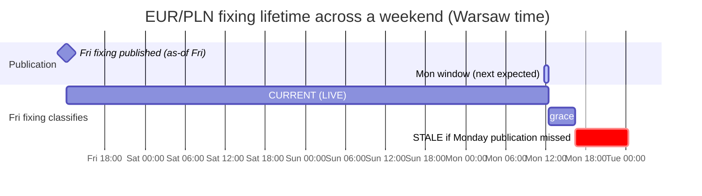
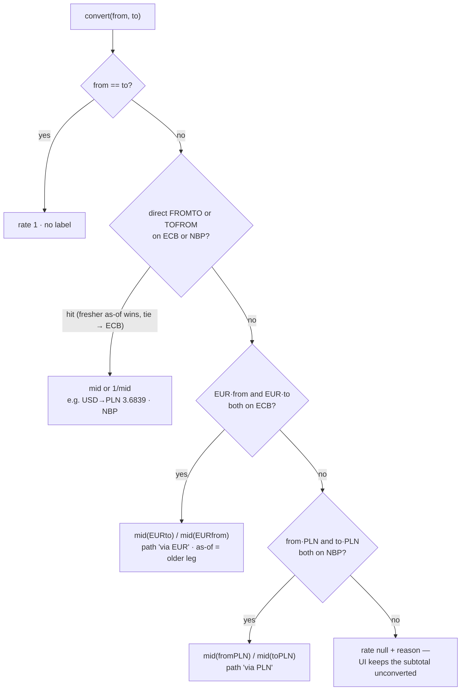

# Phase 4 — NBP/ECB reference FX and the reporting currency

Phase 4 wires the first two official sources — NBP FX fixings + gold and ECB euro
reference rates — through the same client/feed/board/SSE/ops boundary as the quote
providers, and puts the shared FX resolver behind `GET /fx/rates` so multi-currency books
report in one explicitly chosen currency with full provenance. Positions never convert;
reporting does. The phase opened by closing the 2026-08-21 demo findings (B1–B5) and
closed with a presentation review that reshaped several surfaces and answered four
domain questions with persisted evidence.

**Exit criterion, met:** NBP and ECB rows show the last official business-date fixing with
both clocks (the source's own as-of and our received-at) and raw provenance one drill away; the EUR/PLN NBP-vs-ECB cross-check reads in
bps; a USD+EUR portfolio shows per-currency subtotals and exactly one converted total only
after a reporting currency is chosen; reference rows can never be traded; a source failure
degrades only its own card.

Reading guide (the same structure phase-2's report used): the vocabulary defines every term the report
leans on; "the whole path" walks the running system twice — one fixing's journey and one
converted total's journey — so the steps land in a picture you already have. Steps open
with *Needed*, then what was built and why, quoting code where the code itself teaches.
The decisions table carries chose / rejected / why; evidence and the browser pass close
the report.

## The vocabulary

- **A fixing** — an official exchange rate one institution publishes **once per business
  day**: NBP's table A (average PLN rates, fixed around 11:00, published ~12:15 Warsaw
  time) and the ECB euro reference rates (14:15 CET concertation, published ~16:00 CET).
  A fixing has an **as-of date**, not an event time — it is a reference number, not a
  tradeable quote.
- **The reference universe** — which pairs each official feed keeps on the board:
  configured defaults ∪ the settlement currencies of ACTIVE trades. Everything else
  in the source's table still lands in the raw payload, just not as a board row.
- **The publication window** — the daily local-time interval in which a source is
  expected to publish (NBP 11:45–12:20 Warsaw, ECB 15:55–16:45 Berlin). Inside it the
  feed chases the new as-of every 5 min; outside it, an hourly confirmation poll keeps
  `received_at` honest.
- **`reference` origin** — the fourth board-row origin next to `watched`/`held`/
  `benchmark`. Reference rows render in the Official Rates panel, join `/quotes`
  and SSE like any row, and are excluded from the tradeable universe by construction.
- **CURRENT** — how the UI labels a REFERENCE-grade row in the LIVE state: "this is the
  latest fixing the source has published." Same classifier, calendar-derived threshold.
- **A resolution** — what the FX resolver returns for (from → to): rate, **path**
  (direct / inverse / via EUR / via PLN), provider, as-of — or an honest `reason` when no
  official path exists.
- **The overlay** — the browser-side conversion layer on Valuations and Books:
  per-currency subtotals are primary; choosing a reporting currency adds exactly one
  converted total, every contributing row labeled with its rate, source and as-of.
  Nothing converted is ever persisted.

## The whole path

### One fixing's journey (NBP EUR/PLN, a business day)

1. **11:45 Warsaw** — the calendar says the window is open and no fixing with today's
   as-of exists yet, so `ReferenceFeed` starts retrying every 5 minutes. *(Step 3, 4)*
2. **~12:10** — `NbpClient.table_a()` returns table `162/A/NBP/2026` with 32 rates;
   the shared transport logged one `provider_http_response` line. *(Step 2)*
3. **Normalize** — `normalize_nbp_rate` picks the EUR row, builds a quote with
   `reference_mid=4.3122`, grade REFERENCE, `provider_timestamp` = the as-of date at
   midnight UTC, and the **whole table as `raw_payload`**. *(Step 6)*
4. **Store + classify** — `store_quote` upserts the board row and appends one change-only
   snapshot; `stale_after_seconds` is computed from the calendar: next business day's
   window end + 4 h grace — a Friday fixing therefore spans the weekend. *(Steps 3, 4)*
5. **Publish** — one `market_tick` with `reference: true`; the Official Rates panel
   updates in place, the EUR/PLN cross-check chip recomputes against ECB. *(Steps 4, 9, 10)*
6. **Sleep** — the as-of advanced, so the feed drops to hourly confirmation until the
   next window. On Saturday nothing is expected and nothing is chased. *(Step 3)*
7. **Drill** — selecting the row opens the quote panel: mark, basis REFERENCE MID,
   "AS OF 2026-08-21 · official fixing date", RECEIVED clock, the one-entry-per-day tape,
   and the expandable **raw source response** (`history?raw=1`). *(Step 10)*

### One converted total's journey (a USD + PLN portfolio, reporting in PLN)

1. Valuations groups open positions by settlement currency: PLN 8,623.64 and USD 928.05
   capital — shown as **subtotals, not combined**, and the headline cards read
   `— · MIXED`: no number is invented before a target currency exists. *(Step 8)*
2. The user clicks the **PLN chip** (one click; clicking it again clears the choice).
   The browser fetches `GET /fx/rates?to=PLN` once (cached 60 s). *(Step 8)*
3. The resolver answers per currency from the reference board: PLN → identity 1;
   USD → **direct NBP `USDPLN` 3.6839, as-of 2026-08-21** (direct beats any cross);
   EUR → ECB 4.3078. *(Step 7)*
4. The overlay multiplies for display: 8,623.64 + 928.05 × 3.6839 = **12,042.50 PLN** on
   the `→ PLN` total row, the USD row labeled `USD→PLN 3.6839 · NBP · as of 2026-08-21` —
   and the headline cards now headline the same converted figure, the applied rates riding
   in their hover title. A currency with no official path stays an unconverted subtotal
   with the reason, and the headline falls back to `—`. *(Step 8)*
5. Nothing is written anywhere — close the tab and the only persisted numbers are still
   in settlement currency. *(Step 8)*

## The decisions this phase locked in

The policy layer; the steps and the table below carry the mechanics.

1. **A fixing is data, never an execution price** — reference rows join the board but not
   the tradeable universe; four independent guards enforce it. *(Step 9)*
2. **Polling follows the publication calendar, not a cadence** — chase inside the window,
   confirm hourly outside, expect nothing on weekends. *(Step 3)*
3. **Freshness is derived from the same calendar** — no new states; a Friday fixing is
   CURRENT until Monday's window + grace. *(Step 3)*
4. **The reference universe is bounded and self-extending** — defaults ∪ active-trade
   settlement currencies; the full source table survives in raw. *(Step 5)*
5. **One resolver owns conversion; a path never mixes sources** — direct → via EUR (ECB)
   → via PLN (NBP); provenance travels with the number. *(Step 7)*
6. **Conversion is a display overlay** — served rates, browser multiplication, nothing
   persisted. *(Step 8)*
7. **Keyless sources get the status machine, not fictional budgets.** *(Step 4)*
8. **The board reports the provider — even on a weekend** — Twelve Data's FX claims
   `is_market_open: true` on Sunday and the row honestly reads LIVE; the fixing panel
   beside it is the counterweight. *(Domain answers)*

### Decisions in full (chose / rejected / why)

| Decision | Chose | Rejected | Why |
| --- | --- | --- | --- |
| Reference rows are a fourth board origin | `reference` flag beside watched/held/benchmark; watchlist and search offer `shared/providers.QUOTE_PROVIDERS` only; `/instruments` stays watched ∪ held; trade-action refuses reference providers | Reference pairs as watchlist items | User-owned scope would mix with system-owned data — removing a watchlist row must never break conversion; a fixing is not a fillable price. Four independent guards (watchlist validation, search sources, instruments derivation, execution gate) mean no single regression makes a fixing tradeable. |
| Reference universe | Configured defaults (`NBP_REFERENCE_SYMBOLS`, `ECB_REFERENCE_SYMBOLS`) ∪ settlement currencies of ACTIVE trades, while the source publishes them | Ingesting the full ~32-row tables as board rows | The board stays signal, not noise; nothing is lost because every reference snapshot retains the complete raw table response. |
| Conversion is a display overlay | `GET /fx/rates` + browser-side multiplication on Valuations and Books; nothing converted persisted; no service calls another's API | Server-side enrichment in blotter/pricing | Converted numbers are only displayed; enriching read models would couple services or duplicate the resolver for display-only values. Positions keep their settlement currency — converting at write time would bake one day's rate into a position's book value. |
| NBP table C deferred | Table A mid only | Feeding C's bid/ask into the same rows | C's bid/ask would win `build_quote`'s BID_ASK precedence over A's `reference_mid` and silently change what the resolver reads. Revisit only if official buy/sell rates are asked for. |
| Registry split | `scheduler.wired_providers()` (streams, detail, history, refresh) vs `wired_quote_providers()` (watchlist, search) | One `wired` list for everything | The moment NBP registered as a wired feed, a single list would have made `POST /watchlist {providers:["NBP"]}` legal — precisely the fixing-becomes-tradeable hole the reference-origin decision exists to close. Verified: the add is refused 400 while `GET /market-data/stream/NBP` works. |
| Decode hook | One Template-Method extension on `ProviderClient`: `decode_body` (default `json.loads`), overridden by the ECB client to parse csvdata via stdlib `csv` | A parallel CSV transport path; a CSV branch in the base | The base algorithm (fetch → decode → classify → log) is one code path; each provider states only its own decode rule. |
| Keyless runtime | `ProviderRuntime(budget_per_minute=None, keyless=True)`: full status machine and cooldowns, no token bucket, no ledger caps, a calls-today counter | Inventing budgets for unlimited sources; a separate runtime class | The status machine and audit transitions are what failure isolation needs; gauges for a nonexistent limit would be fiction on the ops card. |
| Gold symbol `XAUPLN_G` | A non-pair symbol, labeled "PLN per gram" | `XAUPLN` | A six-letter XAU pair reads as per-troy-ounce by convention and would be wrong by ×31.1034768. The stored value stays exactly NBP's published per-gram price — stored as received, never adjusted at write time; the ounce conversion is a documented cross-check. |
| Fixing timestamp | `provider_timestamp` = the as-of date at midnight UTC; UI renders "as of 2026-08-21" | Stamping the publication time; leaving it NULL | The source publishes a date, not a time — midnight-UTC is the standard date-only convention and keeps the freshness classifier's provider-clock path working; inventing 12:15 as an event time would fabricate precision. |
| Direct-rate tie-break | Fresher as-of wins; tie goes to ECB, then NBP — deterministic | Preferring one source always; first-found | Both sources publish EURPLN. The resolver's path order (identity → direct → cross) says which *kind* of answer wins, but not which source wins a direct hit; freshest-then-ECB is deterministic and favors the source already serving as the cross hub. |
| Derived-rate rounding | Resolver output rounded to 8 significant digits; stored mids untouched | Full-precision Decimal expansion on the wire | `1/3.6839` is a 28-digit Decimal; a label reading "PLN→USD 0.2714514509…" implies false precision. Only derived ratios round; every stored mid stays exactly as the source published it. |
| Raw provenance drill | `history?raw=1` returns each observation's stored `raw_payload`; the quote panel requests it for REFERENCE rows and renders an expandable raw block | A separate snapshot-detail endpoint; linking to Logs only | Reference tapes are a handful of rows each carrying one small table — the marginal payload is trivial, and the drill lands on *persisted* provenance rather than a transient log line. |
| Blotter book currency | Derived from the book's trade currencies (one → it; several or none → null); the card label shows "—" when unknown | The previous hardcoded `"currency": "USD"` | Found during the browser pass: a EUR-settled book labeled USD would have been bucketed wrong by the conversion overlay — the hardcode was harmless while everything was USD and became a lie the moment multi-currency books existed. |
| Due-time stagger | After each batch, the chunk's next due-times spread across the following interval; per-symbol cadence converges back to the paced interval | Per-symbol independent timers; leaving lockstep | Batching stays (it saves round-trips; credits are per-symbol regardless), the board refreshes rolling, and one blocked batch no longer delays every row at once. The one-time cost is a single stretched interval per re-sync. |
| Benchmark card layout *(presentation review)* | Header row (eyebrow + session pill) over one compact stat row; LAST emphasized; LAST TICK rendered only when a tick was observed; age carries a clock-semantics tooltip | The 3-column grid with a 650 px stats track and the pill in a third column | At real widths the pill column collapsed off-canvas — the session state was invisible exactly when "Age 42h" needed it; a dangling "LAST TICK —" advertised absence; the stretched grid read as accidental empty space next to the dense rates panel. |
| Headline totals convert too *(presentation review)* | With mixed currencies the summary cards (CAPITAL INVESTED, UNREALIZED PNL) show `—` until a reporting currency is chosen; then both headline in it via the same `convertedTotalsOf` overlay, the applied rates in the card's hover title; any currency without a path → `—` again | Summing unlike currencies; a second conversion path per card | The pre-existing UNREALIZED PNL card *did* sum unlike currencies (PLN + USD read as one 0.00) — the standing rule that unlike currencies are never summed, and the overlay's provenance, now extend to the headline instead. One code path (`convertedTotalsOf`) serves rows, total and cards, so they can never disagree. |
| Reporting currency is a chip row *(presentation review)* | `FilterChipGroup` chips — every option visible, one click to switch, re-click clears; conversion labels sit left-aligned directly after the value columns; the identity row carries no marker | The `<select>` dropdown; rate labels pushed to a far-right `1fr` column | Two clicks and a dropdown to compare three currencies was friction for the panel's core act; the stretched column separated provenance from the numbers it explains at wide widths. Chips reuse the board's existing filter component (no new pattern) and the ≤900 px collapse now wraps labels under their row. |
| No purpose captions in the UI *(owner ruling, final)* | Panels communicate through title, labels, values, states and provenance tags; the *why* of a feature lives in `docs/`. A purpose sentence briefly shipped under the Official Rates header ("Central-bank fixings, one per business day — the reference for reporting-currency conversion. Not tradeable.") and was removed the same day; the rule is now codified in AGENTS.md. Hints stay one short imperative ("Choose a reporting currency for a combined total"); semantic explanations live only in hover tooltips (the freshness-hint pattern). | Explainer prose in panels | Documentation-style sentences in the app read as narration of the job done, not as an interface; the question they answer ("what is this for?") is a docs question, and this report's domain-answers section is where it is answered. |

## Step 1 — the gate re-run and the demo debrief

**Needed:** Phase 4 starts from a proven boundary, and the 2026-08-21 demo left five live
findings that had to be diagnosed **from existing logs, ops data and persisted rows before
any code changed**.

- The 3b gate ran first on a fresh isolated stack (evidence record below).
- **B1 — "Twelve Data age did not zero at the expected 15 min."** Three ranked hypotheses
  checked against live evidence. (1) *Silent cadence growth*: the paced interval is
  `max(900 s, active_window × symbols / daily_budget)` = 60 s/symbol at defaults — real,
  but needs >15 symbols; `provider_http_response` spacing showed 900±1 s at the demo's
  symbol count, so pacing held the knob. (2) *Synchronized due-times + minute-bucket
  contention*: all batched symbols shared one due-time forever, so the board aged and
  jumped in lockstep — and one blocked batch (searches spend the same 7-token bucket via
  `try_take(len(chunk))`) delayed every row at once. (3) *Age counts on the provider's
  clock*: reproduced — a successful poll of an unmoved symbol never zeroes the Age column,
  by design. The fix makes all three legible instead of smoothing them over: the strategy
  line now reads **"next batch in Xs · cadence Y min (N symbols on the daily ledger)"** on
  the board strip, the ops card and the Age/NO DATA tooltips; per-symbol due-times are
  staggered so the board refreshes rolling; age-vs-poll semantics are recorded in
  `market-data.md`.
- **B2 — the Tesla moment (cross-provider price differences).** Expected behavior,
  answered by the two clocks — each provider's own timestamp against our received-at
  showed the quotes were captured at different moments; the retained raw payload proves
  `"close": "309.35001"` is Twelve Data's own published string. Board display rounding
  (equities at 2 dp) removes the false-alarm reading; stored values stay exact.
- **B3 — a freshly added symbol showed no price.** A Twelve-Data-only add legitimately
  waited up to a full paced interval. Fix: `POST /watchlist` fires one targeted,
  budget-aware refresh per feed actually added, in a background thread
  through the same path as `POST /market-data/refresh`. Verified live: a TWELVE_DATA-only
  add quoted in ~4 s; when budget declines, the NO DATA tooltip says when the next batch
  is due.
- **B4/B5** landed with the UI work: unit labels everywhere a pair price renders, and
  search results saying "quoted in USD" — which kills exactly the misreading where a
  search-result currency was taken for a position's settlement currency.

## Step 2 — the decode hook and two thin clients

**Needed:** NBP speaks plain JSON; the ECB Data Portal's usable format is **SDMX-CSV**
(`format=csvdata` — the JSON variant nests values five levels deep). The base client
hard-coded `json.loads`, and the rule is one transport path, not two.

- **`ProviderClient` grew exactly one hook.** The Template Method now reads
  fetch → **`decode_body`** → `classify_body` → log; the base implementation *is* the old
  behavior:

  ```python
  def decode_body(self, body):
      return json.loads(body)
  ```

  The ECB client overrides it with the stdlib and nothing else:

  ```python
  def decode_body(self, body):
      text = body.decode("utf-8-sig")
      return {"format": "csvdata", "rows": list(csv.DictReader(io.StringIO(text)))}
  ```

  - A decoded rate row is `{"CURRENCY": "PLN", "OBS_VALUE": "4.3078",
    "TIME_PERIOD": "2026-08-21", …}` — no SDMX library needed. `utf-8-sig` matters:
    these exports lead with a BOM, and with plain `utf-8` the first column name would
    silently stop matching.
- **`NbpClient` is 17 lines**: `table_a()` (`/exchangerates/tables/a?format=json`) and
  `gold_price()` (`/cenyzlota?format=json`); `classify_body` is an explicit no-op — NBP
  reports failure through real status codes, and a 404 during the morning simply means
  "not published yet", which the error ladder already classifies as a data condition,
  never provider failure.
- **`EcbClient.exchange_rates(codes)`** builds one series key for all wanted currencies —
  `D.{PLN+USD+…}.EUR.SP00.A` with `lastNObservations=1` — one HTTP call per round for the
  whole ECB universe.

## Step 3 — the publication calendar

**Needed:** a fixing is not a feed. Polling it on a cadence either spams a source that
publishes once a day or reads STALE every weekend. Both the polling rhythm and the
freshness threshold had to come from the same calendar.

- **`PublicationCalendar`** is ~50 lines over `zoneinfo`: a source timezone
  (`Europe/Warsaw` / `Europe/Berlin`) and a daily window
  (`NBP_WINDOW_START/END = 11:45–12:20`, `ECB 15:55–16:45`).
  - Why `zoneinfo` and not a UTC offset: the windows are defined in *local civil time*,
    and CET↔CEST shifts twice a year — a hardcoded offset would silently move the window
    by an hour every DST change. (`tzdata` joined the slim images for exactly this.)
  - `in_window(now)` = business weekday ∧ window contains the source-local time;
    `next_window_seconds` walks to the next business day when needed. Source public
    holidays are deliberately not modeled — the honest cost is documented below.
- **Freshness derives from the calendar.** At store time:

  ```python
  def stale_after_seconds(self, as_of_date):
      as_of = datetime.combine(as_of_date, time(0, 0), tzinfo=timezone.utc)
      deadline = self._next_publication_end(as_of_date).astimezone(timezone.utc)
      return round((deadline - as_of).total_seconds()
                   + REFERENCE_PUBLICATION_GRACE_SECONDS)
  ```

  No new freshness states: the ordinary classifier walks the provider-clock path
  (`market_open` stays NULL) with a threshold that happens to span a weekend. A Friday
  fixing is CURRENT until Monday ~16:20 Warsaw time; STALE fires only when a publication
  was genuinely missed. (A holiday Monday reads STALE that evening — accepted and
  documented rather than half-fixed with a hardcoded holiday list.)



## Step 4 — one `ReferenceFeed`, composed twice

**Needed:** NBP and ECB behave identically at the orchestration level (window → fetch →
normalize → store → publish → sleep) and differently only in *facts*: timezone, window,
universe, fetch. The quote feeds solved a different problem (budgets, tiers, batches), so
neither copying `finnhub_feed` nor subclassing it fit.

- **`ReferenceFeed` is one class taking its differences as constructor arguments** —
  `ReferenceFeed(provider, runtime, calendar, universe_fn, fetch_fn)` — and each provider
  module is ~50 lines of facts plus module-level aliases
  (`poll_loop = _feed.poll_loop`, …) so `scheduler.FEEDS` sees the exact same duck-typed
  module protocol the quote feeds expose. Registration stayed one line per provider.
  - This is composition doing what inheritance would have obscured: the feed *has* a
    calendar and *has* a fetch function; it *is not* a kind of Finnhub feed.
- **The loop is three guarded questions per tick** (cooldown? universe stale? fetch
  due?), with the retry interval switching between `REFERENCE_WINDOW_RETRY_SECONDS`
  (5 min, only while the window is open *and* today's as-of has not arrived) and
  `REFERENCE_CONFIRM_SECONDS` (hourly otherwise).
- **Keyless runtime.** `ProviderRuntime` learned `budget_per_minute=None` (no token
  bucket — `try_take` degrades to "yes") and `keyless=True` for the ops card. The status
  machine, cooldowns and audit transitions are unchanged — which is why the NBP blackhole
  probe behaves exactly like a quote-provider failure, scoped to one card.
- **`refresh_table`.** `POST /market-data/refresh?provider=NBP` maps to a table-level
  refetch (a fixing source has no per-symbol request); `refresh_all` prefers it via
  `hasattr(feed, "refresh_table")` and per-symbol refresh still answers for one pair.

## Step 5 — the reference universe

**Needed:** the universe rule — bounded defaults, self-extending with the portfolio —
in one place both feeds and the board filter can read, so "which reference rows exist"
can never fork between them.

- **`reference_set.py`, complete logic:** `active_trade_currencies()` (one DISTINCT query
  over ACTIVE trades), `nbp_symbols()` = defaults ∪ `{code}PLN`, `ecb_symbols()` =
  defaults ∪ `EUR{code}`, and `reference_board_symbols()` returning the per-provider
  frozensets. The feeds re-read it every 60 s; the board payload and the stray-sweep read
  the same function, so "which reference rows exist" has exactly one owner.
- Defaults: NBP `EURPLN`, `USDPLN`, gold; ECB `EURUSD`, `EURPLN` — the pairs the
  cross-check and the PLN/USD/EUR reporting stories need. A TWD position would auto-add
  `TWDPLN`/`EURTWD` *if the source publishes them*; when it does not, the pair is skipped
  with a per-symbol log line and the resolver answers "no official path" — honest, not
  fabricated.

## Step 6 — normalizers and the gold symbol

**Needed:** three payload shapes (NBP table, NBP gold, ECB CSV rows) into the one
normalized quote, without inventing anything.

- All three build through the existing `build_quote` with **`reference_mid`** — basis
  `REFERENCE_MID`, grade REFERENCE from the registry, `provider_timestamp` =
  `as_of_timestamp(date_text)` (midnight UTC of the published date), and **the full
  source response as `raw_payload`** — one NBP snapshot carries all 32 table rates, which
  is what lets the board stay bounded without losing anything, and the reproducibility
  the brief requires.
- Per-symbol misses raise `ProviderDataError` and are logged per pair
  (`reference_rate_unpublished`) without touching provider health — the same
  one-bad-symbol-never-quarantines-the-feed rule the quote feeds follow.
- **Gold is `XAUPLN_G`, deliberately not a pair.** NBP publishes PLN per **gram**; a
  six-letter `XAUPLN` would read as per-troy-ounce by market convention and be wrong by
  ×31.1034768. The stored value is exactly NBP's published number; the UI labels it
  "GOLD (1 g) · PLN per gram"; the ounce conversion stays a documented cross-check for
  the Twelve Data XAU/USD row.

## Step 7 — the resolver

**Needed:** one owner for every conversion, full provenance, paths that never mix
sources, honest failure.

- **`shared/fx.py` reads the reference board** (provider ∈ {ECB, NBP}, asset class FX,
  six-letter symbols → `(mid, as_of)` per provider table) and resolves:
  1. identity;
  2. **direct or inverse** on either source — candidates ranked by
     `max((as_of, provider == ECB, …))`: freshest as-of first, tie to ECB. An inverse hit
     divides once (`1/mid`);
  3. **cross via EUR** entirely inside ECB (`mid(EUR→to) / mid(EUR→from)`);
  4. **cross via PLN** entirely inside NBP (`mid(from→PLN) / mid(to→PLN)`);
  5. otherwise `rate: None` + `reason` — the UI's unconverted-subtotal label.
- **Worked example, USD → PLN:** direct NBP `USDPLN` 3.6839 wins at step 2. Had it been
  absent, the ECB cross gives 4.3078 / 1.1699 = 3.6822 — **~5 bps away from NBP's
  direct**: two official institutions, two capture times. That difference is precisely
  why a path never mixes sources, and why every converted number carries its rate, source
  and as-of — a total built from a blend would be a number no institution ever published.



## Step 8 — `/fx/rates` and the overlay

**Needed:** the rates travel with provenance; the browser does display math;
nothing converted persists; no service calls another service.

- **`GET /fx/rates?to=PLN`** returns one resolution per currency the reference board
  knows (plus the target). Validation reuses the watchlist's currency pattern; an
  unknown-but-valid currency simply resolves to reasons.
- **Frontend composition:** `useFxRates` (fetch + 60 s refresh) → `domain/fx.js`
  (`currencySubtotalsOf` groups any item list by a currency key and sums metric columns;
  `convertedTotalsOf` multiplies and collects applied labels + excluded reasons) →
  `FxReport` (the chip row, subtotal rows, one `→ CCY` total) →
  `useReportingCurrency` (the choice, remembered per browser across Valuations and
  Books). Valuations feeds it open-position capital + unrealized — and reuses the same
  `convertedTotalsOf` result for the two headline cards; Books feeds the book-summary
  metrics.
  - **The 60 s TTL in `useFxRates` is the only cache, and that is deliberate.** The
    gateway does not cache `/fx/rates`: serving it is two small indexed reads off the
    reference board, the underlying mids change once per business day *per source at its
    own hour*, and a server cache would buy nothing measurable while adding an
    invalidation story (NBP refreshes ~12:15 Warsaw, ECB ~16:00 Berlin — a fixed TTL is
    wrong around exactly the minutes that matter). Services keep handing data to each
    other through database rows, not through each other's APIs; the browser's short TTL
    only smooths a user flipping between chips.
- The empty selection is a first-class state: subtotals stand unconverted, the headline
  cards read `— · MIXED`, and one short imperative hint ("Choose a reporting currency
  for a combined total") points at the chips — the standing never-sum-unlike-currencies
  rule, upgraded from a bare dash to a pointer at the next action.

## Step 9 — the board, the guards, the sweep

**Needed:** reference rows must render, stream and survive housekeeping — while staying
un-tradeable through every path a request could take.

- **`_board_payload`** branches on provider group: reference providers filter by the
  reference universe and stamp `{watched: false, held: false, benchmark: false,
  reference: true}`; quote providers keep the active-set filter. Snapshot, `/quotes`,
  filtered SSE and the UI all see the same origin flags.
- **The four guards** (each independently sufficient): watchlist validation accepts
  quote providers only (`wired_quote_providers`); symbol search queries quote feeds only;
  `/instruments` derives from watched ∪ held; trade-action's execution gate rejects an
  unknown/reference market-data provider with a 422 sentence. Probed live — a forged NBP
  intent on a watched EURPLN answers `unknown market data provider NBP` while three
  EURPLN rows coexist on the board (Twelve Data tradeable, NBP/ECB reference).
- **`sweep_board_strays`** learned the same branch, so the nightly sweep prunes reference
  rows that left the universe and never touches live ones; snapshot retention already
  keeps every referenced raw table.

## Step 10 — the visible surfaces

**Needed:** the phase's information had to *land* — and the presentation review
(2026-08-23) reshaped the two context cards, the FX report panel and the Valuations
summary cards after real-width screenshots showed each failing part of its job.

- **Official Rates panel:** pair, mid with unit ("4.31220 PLN per EUR", "532.41 PLN per
  gram"), source + as-of per row, CURRENT/STALE pill with REFERENCE-aware hover hints,
  the **EUR/PLN NBP-vs-ECB cross-check chip in bps** — and nothing else: no explainer
  prose. Every row drills into the quote panel: both clocks, the one-entry-per-day tape,
  the raw table.
- **Market Benchmark card:** a header row (eyebrow + session pill) over one compact stat
  row; LAST emphasized; LAST TICK rendered only when a tick was actually observed; QUOTE
  AGE carries the clock-semantics tooltip ("counts on the provider's last-trade clock —
  it keeps growing while the venue is closed"). Weekend reading:
  **CLOSED · 765.72 · Age 42h** — expected, not broken.
- **FX report panel:** the reporting currency is a **chip row** (one click to switch,
  re-click to clear), conversion labels sit directly after the value columns, and on
  Valuations the summary cards read `— · MIXED` until a currency is chosen, then
  `CAPITAL INVESTED · EUR 4,173.95` with the applied rates in the hover title. Rows,
  total and headline all read from one `convertedTotalsOf` call — which is also what
  fixed the UNREALIZED PNL card that had been silently summing PLN and USD.
- **Ops cards:** NBP/ECB with a keyless badge, the window schedule
  ("fixings 11:45–12:20 Warsaw time, business days"), next-window countdown and last
  as-of; the Twelve Data card and board strip carry the cadence line from the B1
  diagnosis ("next batch in 66 s · cadence 15 min (3 symbols on the daily ledger)").
- **Search results** label their quote currency and FX rows everywhere name their unit —
  the B4/B5 fixes from the demo debrief.


## The domain answers (the review's four questions, with evidence)

**Why do the two EUR/PLN rows differ (4.31220 vs 4.30780)?** Two institutions, two
methodologies, two capture times: NBP's table A is its own ~11:00 fixing procedure,
published ~12:15 Warsaw time; the ECB reference rate is the 14:15 CET ESCB concertation,
published ~16:00. Three-plus hours apart on a moving pair, ~10 bps is normal — the chip
exists to make that spread a *measured number* instead of a doubt — and 10 bps sits well
inside the <0.3 % cross-source agreement the pre-build endpoint probes measured.

**Why these five rows?** The configured defaults: the pairs conversion and the cross-check need
(EUR/USD/PLN triangle + gold), self-extending with any settlement currency the portfolio
actually holds. The full 32-currency tables live in every snapshot's raw payload.

**What are official rates *for*, when trades execute on Twelve Data?** Three jobs, none
of them execution: (1) they are the conversion reference the reporting overlay uses —
fixings are the standard for daily reporting precisely because they are official,
published once and citable ("converted at NBP's 2026-08-21 fixing"), where a live
consolidated feed is none of those; (2) they are an independent yardstick beside the
market feed — Twelve Data's EUR/PLN 4.31182 sat ~1 pip from NBP's 4.31220 on review day,
which is the kind of agreement that validates both; (3) they are Phase 5's on-ramp — the
same reference-source boundary carries the curves next. A fixing is not a fillable
price, so the ticket never offers one.

**Why do FX rates move on a weekend?** Because the *market feed's* provider says so —
verified Sunday 14:38 UTC in the persisted raw payload: `"is_market_open": true`, fresh
`last_quote_at`, close drifting 4.31225 → 4.31182. Institutional spot FX is conventionally
closed Friday ~22:00 UTC to Sunday ~21:00 UTC; Twelve Data's consolidated retail feed
(weekend-active venues, indicative pricing) publishes through it, and the board's standing
rule is to report the provider's claim rather than overrule it with a hardcoded calendar —
the moment we "correct" a provider, the board stops being evidence of what the provider
actually said. The
Official Rates panel beside it — frozen at Friday's as-of — is the counterweight, and the
two panels on one screen *are* the consolidated-feed-versus-official-fixing lesson.
(Fact-sheet note added in `market-data.md`.)

## Code map

| Concern | Main files |
| --- | --- |
| Clients + decode hook | `clients/base.py` (`decode_body`), `clients/nbp.py`, `clients/ecb.py` |
| Calendar + feed engine | `reference_calendar.py`, `reference_feed.py`, `nbp_feed.py`, `ecb_feed.py` |
| Reference universe | `reference_set.py`, `config.py` (`*_REFERENCE_SYMBOLS`, windows, grace) |
| Normalizing + gold | `normalizer.py` (`normalize_nbp_rate/_gold`, `normalize_ecb_rate`, `as_of_timestamp`) |
| Keyless runtime | `provider_runtime.py` (`budget_per_minute=None`, `keyless`) |
| Board origin + guards + sweep | `api.py` (`_board_payload`, `/fx/rates`, add-refresh thread), `persistence.py` (`sweep_board_strays`, `history raw`), `scheduler.py` (`wired_providers` vs `wired_quote_providers`, `refresh_table`) |
| Resolver | `shared/fx.py` |
| Overlay UI | `hooks/useFxRates.js`, `hooks/useReportingCurrency.js`, `domain/fx.js`, `components/fx/FxReport.jsx`, `views/Valuations`, `views/Books`, `components/books/BookCard.jsx` |
| Official rates + benchmark | `components/marketdata/OfficialRates.jsx`, `components/marketdata/MarketBenchmark.jsx`, `domain/marketFormat.js` (units, as-of), `_official-rates.scss`, `_market-data.scss` |
| Scenario | `scenarios/reference-fx.http` |

## Evidence — 2026-08-23 (US market closed; weekend for both fixing sources)

**3b gate re-run**, Compose project `trading-desk-review`, fresh volume, alembic head
`f4a8c1d27b3e`, commit `1ebd994`:

```text
provider-symbol and both observed clocks:
  FINNHUB:AAPL      309.35    prov 2026-08-21T20:00:00Z  recv 2026-08-23T12:04:29Z  CLOSED
  TWELVE_DATA:AAPL  309.35001 prov 2026-08-21T19:59:00Z  recv 2026-08-23T12:04:29Z  CLOSED
canonical vs alias snapshot keys equal; unknown provider detail/stream -> 404, 404
filtered SSE after TD-then-FH refresh on /market-data/stream/FINNHUB -> FINNHUB event only
opened trades -> ee3f46c0 (FINNHUB), d0c42cbd (TWELVE_DATA); duplicate request id -> 404 lookup
probes: forged provider NBP -> 422 "unknown market data provider NBP";
        seen price 999 -> 422 "price moved 222.94% ... (limit 1.0%)"
closes 202/202, frozen providers retained, final=true both; double close -> 422 "trade is not open"
reset: watchlist memberships removed, book deactivated, review volume destroyed
```

**Phase evidence**, normal stack:

```text
market session: US CLOSED (Sunday); NBP/ECB last publication Friday 2026-08-21
reference rows and both clocks:
  NBP:EURPLN    4.3122   REFERENCE_MID  as-of 2026-08-21  recv 2026-08-23T12:28:24Z  LIVE→CURRENT
  NBP:USDPLN    3.6839   as-of 2026-08-21  stale_after 310800 s (= Mon 16:20 Warsaw)
  NBP:XAUPLN_G  532.41   PLN per gram   as-of 2026-08-21
  ECB:EURPLN    4.3078   as-of 2026-08-21   ·  ECB:EURUSD 1.1699
cross-check: EUR/PLN NBP vs ECB = 10.2 bps (chip verified on screen)
raw provenance: history?raw=1 row carries table "162/A/NBP/2026" with all 32 rates
resolver: to=PLN {EUR 4.3078 ECB direct, USD 3.6839 NBP direct};
          to=USD {EUR direct ECB, PLN 0.27145145 inverse NBP};
          to=GBP {every row rate null + "no official … rate is published"}; to=ZLOTY -> 400
guards: watchlist {providers:["NBP"]} -> 400 "unknown provider: NBP";
        forged NBP intent on watched EURPLN -> 422 "unknown market data provider NBP";
        /instruments carries no reference row; three EURPLN rows coexist
        (TWELVE_DATA REALTIME tradeable · NBP/ECB REFERENCE not)
failure probe: /etc/hosts blackhole of api.nbp.pl -> NBP ERROR + PROVIDER_FETCH_FAILED,
        FINNHUB/TWELVE_DATA/ECB stayed OK; restore -> refresh 200 + PROVIDER_RECOVERED
B3 probe: TWELVE_DATA-only add quoted in ~4 s via the add-refresh
open questions: source public-holiday calendars unmodeled (documented limitation);
        NBP date-addressed misses return 400 (fact sheet updated)
```

**Presentation-review round (same day, afternoon) — live conversion scenario through the
running services**, driven from the browser through the Vite proxy:

```text
weekend market-feed proof (persisted raw payload, TWELVE_DATA EURPLN):
  14:23:16Z  close "4.31225"  is_market_open true  last_quote_at 14:23:00Z
  14:38:17Z  close "4.31182"  is_market_open true  last_quote_at 14:38:00Z
  board row: LIVE, provider_timestamp 14:38:00Z, stale_after 2700 s  -> provider-truth display
ops strategies: NBP "fixings 11:45–12:20 Warsaw time · next window in 19h 02m — hourly confirmation"
                ECB "fixings 15:55–16:45 Berlin time · next window in 23h 12m"
                TWELVE_DATA "next batch in 461s · cadence 15 min (3 symbols on the daily ledger)"
NBP table refresh -> {refreshed: EURPLN, USDPLN, XAUPLN_G; skipped: []}
scenario: books EQ-SCEN/FX-SCEN (201/201);
  BUY 3 AAPL @ FINNHUB (CLOSED, bookable) -> 202 b7908391…
  BUY 2000 EURPLN @ TWELVE_DATA (LIVE)    -> 202 c93be9ee…
Valuations overlay: subtotals PLN 8,623.64 · USD 928.05, no combined number;
  reporting = PLN -> one total 12,042.50 PLN;
  USD row labeled "USD→PLN 3.6839 · NBP · as of 2026-08-21";
  total labeled "converted with official reference rates"
  (check: 928.05 × 3.6839 = 3,418.86; + 8,623.64 = 12,042.50 ✓)
NBP EUR/PLN drill: CURRENT · basis REFERENCE MID · AS OF 2026-08-21 "official fixing date"
  · RECEIVED clock · tape "first observed value" · RAW SOURCE RESPONSE block
cleanup: closes 202/202; books deactivated 200/200; zero console errors the whole session
```

**Second scenario (same day, evening) — headline conversion + chip switching**, again
live through the running services:

```text
scenario: books EQ-HEAD/FX-HEAD (201/201);
  BUY 2 AAPL @ FINNHUB 309.35 (USD) -> 202 · BUY 1000 EURPLN @ TWELVE_DATA 4.3115 (PLN) -> 202
mixed state: subtotals PLN 4,311.50 · USD 3,712.20; headline cards "— · MIXED";
  hint "Choose a reporting currency for a combined total"
EUR chip: CAPITAL INVESTED · EUR 4,173.95, hover title
  "PLN→EUR 0.23213705 · ECB · as of 2026-08-21; USD→EUR 0.85477391 · ECB · as of 2026-08-21"
  (check: 4,311.50 × 0.23213705 = 1,000.86; 3,712.20 × 0.85477391 = 3,173.09; sum ✓)
PLN chip (one click from EUR): headline and → PLN total row agree at 17,987 PLN;
  identity PLN row unmarked; USD row "USD→PLN 3.6839 · NBP · as of 2026-08-21"
re-click PLN: selection clears -> subtotals only, cards back to "— · MIXED", hint returns
cleanup: closes 202/202 with close_reason SCENARIO_CLEANUP — the EURPLN leg closed
  against a live Sunday snapshot and realized +0.64 PLN (entry 4.3115 -> close 4.31214:
  the same weekend feed the domain answers describe, here moving a real PnL number);
  books deactivated 200/200; zero console errors
```

## Browser pass

Every touched view exercised with **zero console errors or warnings** — first at
1600×1000 during the build, re-run after each presentation-review change (the chip-row
round verified one-click EUR↔PLN switching, re-click-to-clear, headline/total agreement
and the ≤900 px collapse):
Market Data (official rates panel with chip + unit labels, redesigned
benchmark card with visible session pill, strategy line, search labels, reference drill
with raw table; tape scroll contract re-verified), the ticket (provider options are
quote providers only — FX shows FINNHUB N/A + TWELVE DATA priced with its unit), Valuations
(subtotals → one converted total, live against real opened positions), Books (honest
per-book currencies + the same overlay, reporting choice remembered across views),
System Overview (keyless NBP/ECB cards with window schedule and next window; FRED still
NOT AVAILABLE), Logs (NBP/ECB filter chips; `provider_http_response` expands to the full
raw table).

Screenshots: [board + official rates](assets/phase-4/phase4-market-data.png) ·
[benchmark card v2](assets/phase-4/phase4-benchmark-v2.png) ·
[reference drill](assets/phase-4/phase4-nbp-detail.png) ·
[raw table drill](assets/phase-4/phase4-raw-drill.png) ·
[FX ticket](assets/phase-4/phase4-ticket-fx.png) ·
[no combined number until chosen](assets/phase-4/phase4-valuations-unset.png) ·
[converted total](assets/phase-4/phase4-valuations-pln.png) ·
[books overlay](assets/phase-4/phase4-books-pln.png) ·
[ops cards](assets/phase-4/phase4-ops-cards.png) ·
[NBP logs](assets/phase-4/phase4-logs-nbp.png) ·
[search quote-currency labels](assets/phase-4/phase4-search-labels.png)

## Checks

- `python3 -m compileall -q shared services db`
- `cd frontend && npm run lint` · `npm run build` · `npm run deadcode`
- fresh `docker compose -p trading-desk-review up --build -d` → full 3b gate
- `scenarios/reference-fx.http` executed end to end (curl equivalents, statuses recorded)
- NBP blackhole/recovery probe; B3 add-refresh probe; three-row EURPLN coexistence
- live conversion scenario opened, verified and cleaned through the running services
- second live scenario (mixed headline → EUR/PLN chip switching) opened, verified, cleaned
- browser pass over Market Data, ticket, Valuations, Books, System Overview, Logs, Trades
- `git diff --check`

## What Phase 4 does not do

- **No curves and no FRED** — Phase 5 (`/curves*`, the chart, curve-priced classes).
- **No NBP table C** (official bid/ask) — deferred with its precedence question
  (decisions table above).
- **No best-rate routing** — comparison stays display-only; execution stays bound to the
  trade's chosen provider.
- **No persisted converted values** — the overlay is the whole feature.
- **No holiday calendars** — a source holiday reads STALE after grace until the next
  fixing; accepted and documented above.
- **No FX market calendar of our own** — the board reports each provider's own session
  claim, weekends included; the official panel is the deliberate counterpoint.
- **Reference symbols have no intraday tape** — a fixing changes once a day; the
  observation tape simply has one entry per publication.
