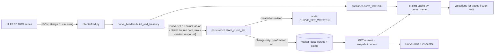
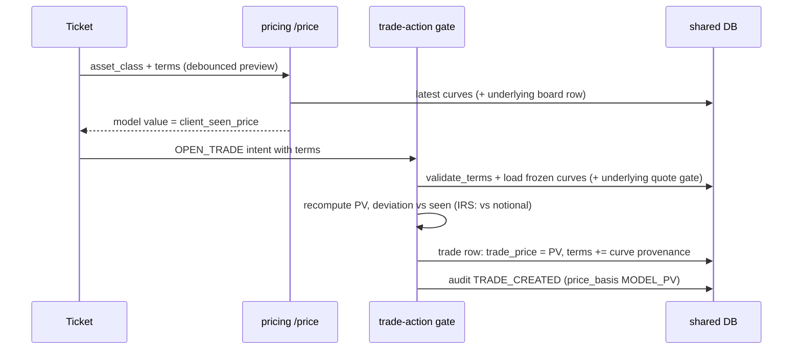
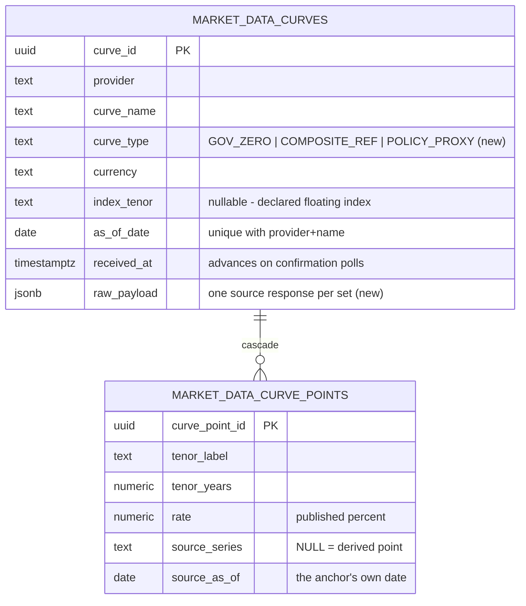

# Phase 5 — real rate curves, the curve chart, and model-priced execution

*Completed 2026-08-24. Delivered on the roadmap's T5.1–T5.6 plan: the curve schema
completed (raw source response + curve type), FRED wired as the sixth provider, ECB
yield curves and the two PLN constructs assembled with per-point provenance, the
`/curves*` routes and `curve_tick` stream live, the hand-rolled SVG curve chart with a
point inspector on Market Data, the three curve-priced classes (BOND, IRS,
EUROPEAN_OPTION) opened for model-priced trading behind currency and index-tenor
guards, the Quote Detail session block, and the official-fixing history backfill.*

Development ran in a remote environment with two hard constraints, recorded here because
they shaped the evidence: the environment has no Docker daemon (services ran as local
processes against a real PostgreSQL 16), and its egress policy blocks the provider hosts
(only package registries are reachable). Everything that needs no external HTTP ran
**live** — the full stack, migrations, the NBP proxy curve end to end, model-priced
execution, SSE, the browser pass. Provider HTTP paths were exercised at the client
boundary with recorded response shapes, and the blocked network itself became a probe:
every wired source degraded to an honest `ERROR`/`DISABLED` card, nothing invented data.
The first run on the developer machine with real keys re-verifies the live fetch paths;
`scenarios/curves.http` is that run's script.

## The vocabulary

- **Curve set** — one provider's term structure for one as-of date: metadata (name,
  `curve_type`, currency, optional declared `index_tenor`), ordered points, and the raw
  source response that produced it. The board equivalent is "latest set per curve name".
- **Curve type** — a small documented vocabulary: `GOV_ZERO` (government curve whose par
  yields the desk deliberately treats as zero rates), `COMPOSITE_REF` (assembled from
  unlike official reference series), `POLICY_PROXY` (flat at a configured policy rate).
- **Anchor vs derived point** — an anchor carries `source_series` + `source_as_of` (the
  series' own publication date); a derived point has NULL series and exists only by
  interpolation between anchors. The chart draws anchors filled and derived points
  hollow; the inspector says "derived between anchors".
- **Percent vs fraction** — stored and displayed rates are the source's published
  percent values (`4.28`); pricing consumes flattened `tenors`/`rates` arrays in years
  and decimal fractions (`0.0428`). One boundary, crossed exactly once, in
  `wire_curve` / `curve_registry.load_curve`.
- **Model value** — the server-computed present value of a curve-priced instrument
  (`bond_pv`, `irs_pv`, `european_option_pv` over the stored curves). It plays the role
  the board price plays for spot: the ticket previews it, the server recomputes it,
  `client_seen_price` is checked against it, and it becomes `trade_price`.

## The whole path

### One curve's journey (USD_TREASURY, a business day)



The same pipeline serves all five curves; only the builder differs. ECB's two curves are
one csvdata request each; `PLN_REF` is two FRED requests plus interpolation;
`PLN_NBP_BASE` is assembled locally from configuration and never touches HTTP.

### One IRS's journey (the PLN swap the evidence uses)

1. The ticket loads `GET /instruments/term-schemas` → `{schemas, curves}`. Picking
   settlement currency PLN filters the curve pickers to the two PLN constructs, each
   labeled `name · currency · index tenor · as of`.
2. Each completed change to the terms previews `POST /price` (debounced); the returned
   model value renders as MODEL VALUE and becomes the intent's `client_seen_price`.
3. `POST /trade-actions` → the gate validates terms through the shared
   `validate_terms` (schema fields + curve guards), loads the frozen curve names from
   the registry, recomputes the PV itself, checks the deviation (against **notional**
   for an IRS), and writes the trade with `trade_price` = the server's PV,
   `price_basis` `MODEL_PV` in the audit payload, and the curve provenance frozen into
   terms: `discount_curve_as_of`, `discount_curve_provider`, projection likewise.
4. Pricing revalues the swap on every `curve_tick` for either frozen curve and on the
   2 s trade poll; the valuation stamps the discount curve's provider and as-of.
5. Close recomputes the model value from the current stored sets of the same frozen
   curve names — realized PnL is the PV difference.

## The decisions this phase locked in

| Decision | One line |
| --- | --- |
| SSE event name `curve_tick` | the pricing consumer shipped in Phase 1 already handles `curve_tick`; the roadmap's `curve_update` label lost to the code contract |
| `COMPOSITE_REF`, not `INTERBANK_REF` | PLN_REF's anchors are an interbank 3M **and** a gov-bond 10Y — naming it interbank would claim more than the data is |
| Set as-of = oldest source date | a curve is only as current as its stalest anchor — the same min-leg rule the FX resolver applies to crosses |
| Percent stored, fraction wired | stored-as-received survives; pricing math gets what `discount_factor` actually needs; the boundary is crossed once |
| Raw payload at set level, keyed by series | one fetch = one raw response; a multi-request set stores `{series_id: response}` — still one drill per set (D31) |
| Execution PV computed in trade-action | via `shared/pricing_math` + `shared/curve_registry` over the shared DB — server-priced (D12) without a cross-service API call |
| IRS deviation measured against notional | a new swap's PV is near zero, so a relative-to-PV tolerance would reject economically meaningless differences |
| `market_data_provider` NULL for IRS/BOND | there is no quote feed behind them; options carry the underlying's provider — no fake provenance |
| IRS submits as side BUY | the economic direction lives in the `direction` term; a SELL would double-negate it, so it is refused with the reason |
| BOND term schema added | the third curve-priced class got its fields (face value, coupon, schedule) so "curve-priced classes unblock" means all three |
| Boot warm-up = the hourly confirmation poll | curves fetch on the first loop tick regardless of window; no separate boot path to maintain |
| The NBP proxy build is `local` | it spends no HTTP and therefore never records provider success — a config rebuild must not mask a fixings outage |
| Backfill runs after the first live round | so the latest fixing is already stored and the backfill stays strictly older — no duplicate head observation |
| Tenor axis on a √years scale | 1M–30Y on a linear axis crushes the short end where most points live; √ keeps both ends readable with labeled tenor ticks |
| Curve history is not retention-swept | ≤ one set per source per day — years of history fit in megabytes, and curve provenance should outlive quote retention |
| Snapshot carries curves | pricing seeds spots **and** curves from one `/market-data/snapshot` read; SSE stays the update path |

### Decisions in full (chose / rejected / why)

- **`curve_tick` on the existing stream.** *Chose:* publish curves as `curve_tick`
  events on the same SSE stream, provider-filterable like quote ticks. *Rejected:* the
  roadmap's `curve_update` name (pricing's stream consumer has matched `curve_tick`
  since the placeholder landed — renaming both sides buys nothing) and a separate curve
  stream (a second connection to manage for ~40 events a day).
- **Composite honesty.** *Chose:* `PLN_REF` as `COMPOSITE_REF` with a declared 3M
  `index_tenor`, two sourced anchors, three hollow derived points, monthly as-ofs on
  display. *Rejected:* presenting it as an observed PLN yield curve, and widening the
  tenor grid with more derived points (each one would be an invented number with no new
  information).
- **Where execution pricing lives.** *Chose:* trade-action computes the PV itself from
  shared inputs — the same `pricing_math` functions and the same stored curves pricing
  uses, so the two services can only disagree if the data changed between reads, which
  is exactly what the seen-price tolerance absorbs. *Rejected:* trade-action calling
  pricing's `/price` (a synchronous cross-service dependency inside the execution gate —
  the architecture's "no service-to-service call about a trade" rule exists precisely
  here) and trusting the client's previewed value (unauditable, D12's original sin).
- **Deviation scale per class.** *Chose:* |server PV − seen| ÷ notional for IRS, ÷ |PV|
  for BOND and options; a zero model value skips the check. *Rejected:* one relative
  rule for all classes — a par swap's PV hovers near zero and the division explodes;
  the rejection message names which scale was used.
- **Curve guards in shared code.** *Chose:* `validate_terms` owns the currency and
  index-tenor guards, so pricing previews and trade-action executions reject
  identically, with the same sentence. *Rejected:* client-side-only filtering (the API
  is also a contract — `curves.http` proves the server refuses what the UI never
  offers) and validating in trade-action only (the preview would price what execution
  refuses).
- **Session fields end at the Quote Detail.** *Chose:* nullable stored-as-received
  extras on the board row + tick, rendered in one session block with per-field n/a.
  *Rejected:* new board columns (the table is a quote board, not a fundamentals sheet)
  and snapshot columns (history rows are price provenance; the raw payload already
  retains the session data of every changed observation).

## Step 1 — verify, and what "fresh stack" meant here

The phase-4 gate was re-run in the adapted form the environment allows: the full
migration chain onto an empty PostgreSQL 16 (`upgrade head` → `downgrade -1` →
`upgrade head`, clean), all six services booted through `shared/service_runtime.py`,
reference rows + resolver verified (`/fx/rates?to=PLN` answered direct ECB/NBP rates
with provenance), and the official-rates panel + conversion labels exercised in the
browser pass below. The live NBP/ECB fetch paths themselves were blocked by the
environment's egress policy and are re-verified by the first local `docker compose up`.

## Step 2 — the migration (T5.1)

`a9c4e5f61b27` adds `curve_type TEXT NOT NULL` and `raw_payload JSONB NOT NULL` to
`market_data_curves` — without defaults, which is safe because nothing wrote the table
before this revision — and seven nullable session columns to the spot board. Snapshots
are untouched. The phase-1 gauntlet re-ran on a fresh database: full chain up, one down,
up again.

## Step 3 — the FRED client and the errors that hide in status codes

FRED is JSON with two quirks the client owns. Observation values are strings and a
missing value is the literal `"."` — the builders fetch a small `sort_order=desc`
lookback (7 for daily series, 4 for monthly) and take the first real value, which is
also what absorbs the documented 1–2 business-day lag without a special case. And a
bad or unregistered key answers **HTTP 400** with `api_key` named in the body — the
client overrides the status hook to classify that as `AUTH_FAILED` (a 400 would
otherwise read as a generic error and retry forever against a key that will never
work). The 120/min published limit derives a 108/min bucket through the shared 90%
ceiling; a full curve round costs 13 requests, so the bucket only matters against
manual-refresh storms.

## Step 4 — assembling five curves from three kinds of source

`curve_builders.py` is the one place a source response becomes a `CurveSet`:

- **USD_TREASURY** — eleven independent DGS series; a series with no usable value in
  the lookback is skipped (its slot in the raw dict records that) rather than failing
  the set; the set's as-of is the **minimum** of the anchors' dates.
- **EUR_GOV_AAA / EUR_GOV_ALL** — one csvdata request each against the verified YC keys
  (`B.U2.EUR.4F.{G_N_A|G_N_C}.SV_C_YM.` + eleven `SR_*` tenor codes joined with `+`);
  the ECB client's existing decode hook parses it with the stdlib, and each row's full
  `KEY` becomes the point's `source_series`.
- **PLN_REF** — the two live OECD anchors, linear interpolation between them:

```text
rate(t) = r_3M + (r_10Y − r_3M) · (t − 0.25) / (10 − 0.25)      t ∈ {1, 2, 5}
```

  Derived points carry NULL series — the schema's way of saying "this number is ours,
  not theirs". The set's as-of is the older anchor month.
- **PLN_NBP_BASE** — flat at `NBP_REFERENCE_RATE_PERCENT`, `raw_payload` records the
  parameter name, value, and the reason it is config-sourced (NBP publishes the rate on
  nbp.pl but not through the API). Its as-of is the Warsaw date, and its `POLICY_PROXY`
  label is what keeps a configuration value from ever being mistaken for market data.

Why linear and only three derived tenors: with two real anchors, any smoother
interpolation (splines, Nelson-Siegel) would manufacture curvature the data cannot
support; the write-up's promise is a *labeled* composite, not a pretty one.

## Step 5 — the curve feed, and a bug the environment found

`CurveFeed` reuses the publication-calendar pattern: 5-minute retries inside the
source's window while the as-of has not advanced, hourly confirmation otherwise, per
curve; `PLN_REF` carries a 7-day `min_refetch_seconds` after a success (monthly series,
weekly check) but retries hourly after a failure. Because every curve is also due
immediately at boot, a fresh stack has all five sets within one loop tick — there is no
separate warm-up path.

The environment then earned its keep: NBP's fixings feed sat in `STARTING` for what
would have been an hour. `ReferenceFeed` initialized `_last_fetch = 0.0` and compared
`time.monotonic() - _last_fetch` against the hourly interval — but `monotonic()` counts
from machine boot, and on a freshly booted machine it *is* small, so the guard silently
deferred the first fetch. Long-lived Docker hosts never show this; a rebooted laptop
or VM would. The quote feeds already guarded this (`if not last_set_refresh or …`);
the fix makes `None` the sentinel and fetches immediately. `CurveFeed` was born with
`_next_due.get(name, 0)`, which is immune. Lesson recorded because it is the
monotonic-clock counterpart of the two-clock discipline: a monotonic timestamp of
zero is a real instant, not "never".

## Step 6 — storage, change-only, and the audit row

`store_curve_set` upserts by (provider, curve_name, as_of_date). A confirmation poll
that changes nothing only advances `received_at` — the read-time honesty of "when we
last read the source" — while a new or revised set rewrites points + raw and audits
`CURVE_SET_WRITTEN` (D33) with provider, name, type, as-of and point count. Curve rows
are exempt from retention: at ≤ one set per source-day they grow by kilobytes, and a
trade's frozen `discount_curve_as_of` should keep resolving to its stored set long
after quote snapshots aged out.

## Step 7 — the registry and the shared guards

`shared/curve_registry.py` answers two questions from the shared database: "what curves
exist" (`latest_curve_sets` — metadata, JSON-safe, for schemas and pickers) and "give me
one to price with" (`load_curve` — pricing arrays). On top of it,
`shared/term_schemas.py` grew the three schemas' curve fields and the guards:

- settlement currency must be a currency some wired curve serves (its choices *are*
  that set);
- discount and projection curves must match the settlement currency — the rejection is
  the roadmap's sentence: *"a PLN IRS cannot discount on USD_TREASURY — it is a USD
  curve"*;
- a projection curve that declares an index tenor must match the leg's
  `floating_rate_index_tenor`: *"the floating leg pays a 6M index but PLN_REF is a 3M
  index curve"*. A curve with no declared tenor (the gov-zero curves) may project any
  leg — free data supplies no tenor-differentiated curves, and the write-up says so
  instead of silently narrowing the mechanism.

Because both pricing (`/price`) and trade-action call the same function with the same
registry rows, the preview and the execution gate cannot disagree about validity.

## Step 8 — model-priced execution



The spot execution path is untouched; the curve path branches after book/terms
validation. Options remain half-spot: the underlying must pass the ordinary freshness
gate on its chosen quote provider at open (stale/missing underlying refuses the
ticket), its provider and snapshot become the trade's provenance, and the model input
is the underlying's mid — D11's rule that valuation-style numbers use mid, which a
model value is. For IRS and BOND, `entry_price_timestamp` is the discount curve's
as-of: the market observation time actually backing the number.

Close is the same computation on the *current* stored sets of the frozen curve names.
That is deliberately not "the set frozen at open": the position is marked where the
market (or its proxy) now is, and the frozen as-ofs in terms keep the original inputs
reconstructable.

## Step 9 — pricing follows the frozen curves

`market_inputs` resolves `discount_curve` (falling back to the legacy `curve` key),
loads the projection curve when the terms name one — and refuses to price an IRS whose
frozen projection curve is missing rather than silently projecting off the discount
curve. `trades_for_curve` matches a `curve_tick` against every curve a trade froze, so
a PLN_REF revision revalues swaps projecting on it even when they discount elsewhere.
Valuations for curve-only trades stamp the discount curve's provider and as-of and name
both curves in the payload; `trades_for_quote` now skips quote-feed matching for
IRS/BOND entirely, which also removed a `trade_provider_defaulted` warning per tick per
swap. The pricing cache seeds curves from the snapshot beside spots, so a pricing
restart prices swaps before any curve republishes.

## Step 10 — the chart that is a deliverable

`CurveChart.jsx` is ~150 lines of hand-rolled SVG (D15 — the dependency count stays
zero). The choices that make it usable rather than decorative:

- **√years tenor axis.** 1M–30Y linearly means the entire money-market end occupies a
  few pixels; log(years) is undefined at the short end's scale and over-stretches it.
  √years keeps 3M…2Y separated *and* 10Y…30Y readable; ticks land on the standard
  tenor labels, not raw numbers.
- **Anchors filled, derived hollow** — the visual claim matches the provenance claim.
- **The inspector is the drill.** Selecting a point (click or keyboard — every point is
  focusable) shows tenor, published percent rate, source series, the source's own
  as-of, the set's as-of, provider, ingest time, and a lazy raw-response drill that
  fetches `?raw=1` only when opened.
- **Legend chips toggle curves** — EUR AAA vs ALL, or the two PLN constructs, compare
  on one pair of axes; hiding everything renders an explicit empty state, not a blank.

The Market Data view hosts the section under the board; curve state lives in the same
market-feed hook (snapshot seed + `curve_tick` merge, ordered by event time), so the
chart updates without polling.

## Step 11 — the ticket grows terms

`NewTradePanel` keeps the spot flow byte-identical and branches for curve-priced books:
schema-driven term fields (`TermFields.jsx`), curve pickers filtered by the chosen
settlement currency and labeled `name · currency · index tenor · as of provider`, an
instrument-name input prefilled from the terms (`IRS-PLN-5Y`) until the trader edits
it, the underlying provider comparison reused as-is for options, and a debounced model
preview whose failure renders the server's sentence (the tenor guard shows up here,
before submit). The IRS ticket hides side and quantity — direction is a term, notional
is a term — and the submit button says what will happen: *"OPEN IRS-PLN-5Y at model
value +23,884 PLN"*. The trade detail panel renders the frozen terms, curve provenance
included, from the blotter's new `terms` field.

## Step 12 — the session block and the fixing tape

The session enrichment (D35) cost zero provider requests: the normalizer stopped
discarding Finnhub's `o/h/l` and Twelve Data's `open/high/low`, `fifty_two_week`,
`volume`, `average_volume`; the board row, wire tick and Quote Detail carry them; and a
field a feed does not publish renders `n/a — not published on this feed` (Finnhub
volume — the UNSUPPORTED lesson one level down). Zero remains a real value for volume:
the normalizer nulls zero *prices* (Finnhub's missing-value convention) but keeps zero
*counts*.

The backfill gives the reference drill its history: on the first live round per pair
with at most one stored observation, the feed fetches the source's own range endpoints
and inserts change-only snapshots — `provider_timestamp` the fixing's as-of,
`received_at` the backfill moment, raw the day's slice. The tape reads as a real daily
series because a fixing series is complete by construction — one value per business
day — unlike the sparse quote tapes, which remain application observations. The pass
below caught the one bug in this: all backfilled rows share one `received_at`, and the
history query ordered by `received_at` alone returned them jumbled; the provider clock
now breaks the tie.

## The curves/points data model



## Evidence — 2026-08-24 (remote dev environment; providers policy-blocked)

Stack: six services as processes over PostgreSQL 16 (pgserver), migration chain
`243f3be5acf5 → a9c4e5f61b27` up/down/up clean. Live paths: full service boot,
PLN_NBP_BASE built by its feed loop (stored, audited, served, streamed), model-priced
execution, SSE to pricing, the browser. Provider fetch paths: recorded response shapes
through the real clients/builders/normalizers; the blocked hosts left NBP/ECB in
`ERROR` (`Tunnel connection failed: 403`) and key-less FINNHUB/TWELVE_DATA/FRED in
`DISABLED` — every card honest, no invented data.

- `/market-data/curves` served five sets; `PLN_NBP_BASE` wire shape:
  points `3M…10Y` at `4.25` percent, `tenors [0.25…10.0]`, `rates [0.0425…]`,
  `curve_type POLICY_PROXY`, as-of `2026-08-24`.
- IRS preview → open: `POST /price` answered `23883.826264686184` PLN (pay-fixed 4.5%
  vs a 4.86–5.43% projection — positive for the payer, sane); the intent with that
  `client_seen_price` produced trade `1c38bfc2` with `trade_price` equal to the
  server's recomputation, `entry_price_timestamp 2026-08-24T00:00Z` (discount as-of),
  provider NULL, and frozen terms
  `{discount_curve: PLN_NBP_BASE @ 2026-08-24 (NBP), projection_curve: PLN_REF @
  2026-06-01 (FRED)}`.
- Guards, verbatim: `a PLN IRS cannot discount on USD_TREASURY — it is a USD curve`;
  `the floating leg pays a 6M index but PLN_REF is a 3M index curve` — both audited
  as `ACTION_REJECTED`.
- BOND `BOND-USD-10Y` (5% coupon, 10Y, semiannual) priced `1065.328…` off
  `USD_TREASURY` (premium over par against a ~4.3% curve); valuation fair value
  `10653.28` for quantity 10 — the headline equals its rows' arithmetic.
- Valuations for both trades stamped the curve provider/as-of and named the curves in
  the payload; PnL at inception `0`.
- Close of `1c38bfc2` recomputed the same PV (curves unchanged) → realized 0, close
  timestamp = curve as-of.
- `POST /market-data/curves/refresh?curve=PLN_NBP_BASE` republished and pricing's
  event counter advanced — the `curve_tick` path live end to end.
- Audit sequence retained: `CURVE_SET_WRITTEN` → `TRADE_CREATED` ×2 →
  `ACTION_REJECTED` ×2.
- `/fx/rates?to=PLN`: EUR→PLN `4.3078` (ECB, direct), USD→PLN `3.7211` (NBP, direct),
  as-of `2026-08-21` — the phase-4 resolver over the fixture fixings.

## Browser pass

Driven end to end against the running stack with a realistic scenario: AAPL on both
quote providers (closed-market session data), five official fixing pairs with 40
business days of backfilled history, all five curves, an EQUITY/IRS/BOND book each,
and the IRS opened through the ticket — cleaned up by close-all afterwards. Zero
console errors or warnings across every view; the single console entry in the whole
pass was the browser's native log of a **deliberately** rejected preview request
(HTTP 400 — the tenor guard doing its job).

Behavior checks, not just rendering: the summary cards equal their rows' arithmetic
(1 symbol / 2 feeds / 2 CLOSED); the EUR/PLN cross-check chip read 10.2 bps against
the two fixings' own values; the chart's 43 points split 35 filled / 8 hollow exactly
matching the anchors-vs-derived count of the five sets; the session block's numbers
equal the fixture payloads (TD volume `38,553,210`, Finnhub volume honestly `n/a`);
the reference tape descends strictly by as-of (the ordering bug found and fixed in
this pass); the ticket's preview equals the server's fill to the shown precision;
the FRED card reads `DISABLED · 2 curves · awaiting first set` and NBP/ECB `ERROR`
under the blocked network — degradation stayed scoped per provider.

Screenshots: [curve chart over the board](assets/phase-5/phase5-curve-chart.png) ·
[quote detail with session block + inspector](assets/phase-5/phase5-quote-detail-session.png) ·
[the IRS ticket](assets/phase-5/phase5-irs-ticket.png) ·
[the tenor-guard rejection at preview](assets/phase-5/phase5-tenor-reject.png) ·
[the backfilled fixing tape](assets/phase-5/phase5-reference-tape.png) ·
[frozen terms on the trade detail](assets/phase-5/phase5-trade-terms.png)

(The phase-4 report's screenshot links point at `assets/phase-4/` files that were never
committed — they exist only in the local working copy; committing them would repair
those links.)

## Checks

- Migration gauntlet on fresh PostgreSQL 16: chain up, down one, up — clean.
- All six services import and boot; pricing seeds `spots 7, curves 5` from one
  snapshot read.
- Builders exercised against recorded response shapes: 11/11 DGS points with `"."`
  fallback, ECB tenor rows with one absent tenor tolerated, PLN interpolation verified
  against the closed-form value, proxy set idempotent (`store` → created, confirm →
  no-op, revision → changed).
- Frontend: `npm run lint` clean, `npm run build` clean, `npm run deadcode` clean.
- `git diff --check` clean.

## What Phase 5 does not do

- **No licensed term structures.** WIBOR 3M/6M and Euribor curves stay out; the tenor
  mechanism exists (declared `index_tenor`, leg matching) and the write-up states what
  free data cannot supply instead of narrowing the ask.
- **No bootstrapping or splines** — par-treated-as-zero and linear interpolation are
  documented simplifications, visible in `curve_type` and hollow points.
- **No stale-curve acknowledgement flow.** Curve as-ofs are displayed everywhere
  (picker, chart, frozen terms) but an aged curve does not yet demand an explicit ack
  the way a STALE quote blocks the spot ticket — candidate for the Phase 7 audit pass.
- **An option's underlying must stay watched.** The active set covers trade symbols,
  not term-referenced underlyings: removing the underlying from the watchlist stops
  its polling and stalls the option's valuation. Known limitation, documented here.
- **Source holiday calendars** (FRED/ECB) remain unmodeled, same as the fixing feeds.
- **Candles/intraday series, depth, open interest** — unchanged post-acceptance gates
  (D35).
