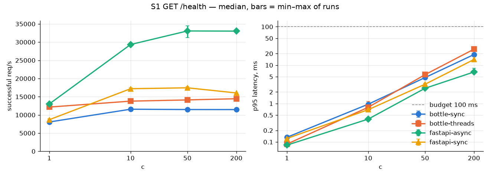
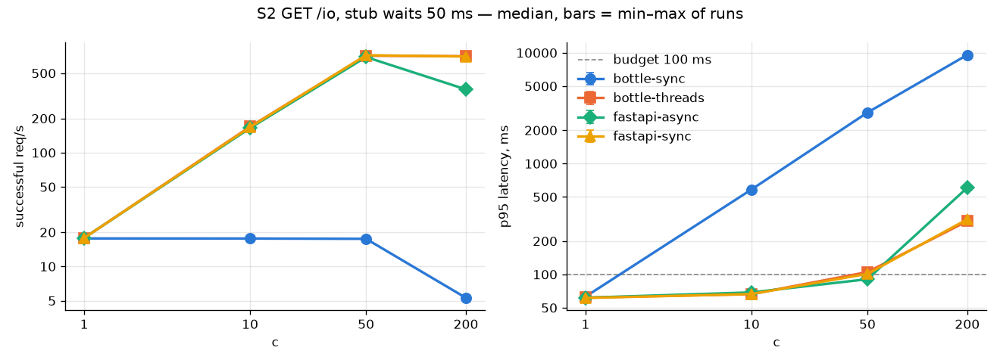
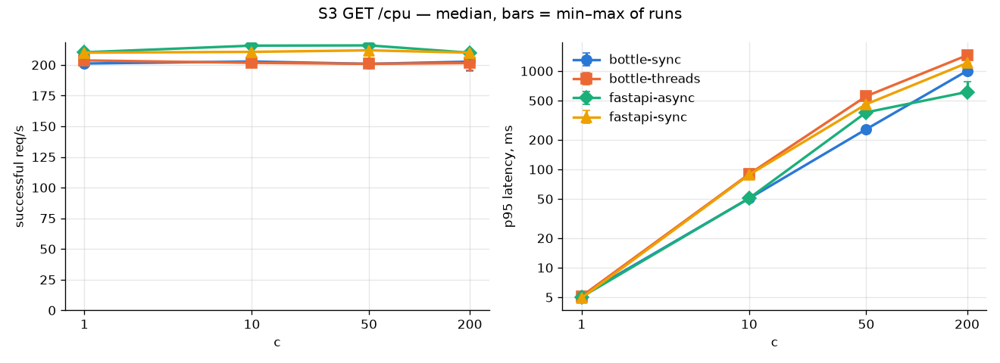
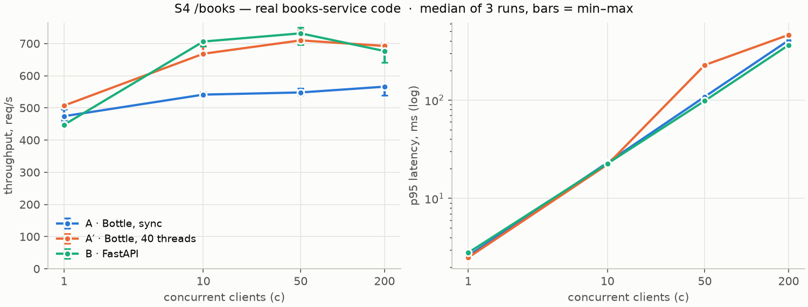

# Migrating the Trading Desk backend from WSGI (Bottle) to ASGI (FastAPI)

| | |
| --- | --- |
| Repository | `trading-desk`, branch `hw-5.5-asgi-migration` |
| Development | Apple M3, 8 cores, 16 GB, Docker Desktop 29.4.3 |
| Benchmark host | cloud VM, Intel Xeon 2.1 GHz, 4 vCPU, 15 GB, Ubuntu 24.04 (section 3) |
| Versions | Python 3.14.7, Bottle 0.13.4, SQLAlchemy 2.0.52, psycopg 3.3.4, PostgreSQL 18.6 |

---

## 1. Summary

*Written last, after Stage 2 (go / no-go decision).*

---

## 2. System inventory (Stage 0)

Six Bottle services in Docker Compose, one PostgreSQL database, one React frontend. Each
service is one process in one container, served by a small threaded server from `desk-runtime`
(`wsgiref` with one thread per connection, `service_runtime.py`), using a synchronous
database driver (SQLAlchemy + psycopg). There are no automated tests.

Every service is **I/O-bound**: handlers wait on the database or on another service, never
on computation. Endpoint details are in appendix A.

The load is small. One browser polls a few endpoints every 2–10 s and holds three SSE streams;
monitoring calls every `/health` every 5 s; pricing and blotter each hold one internal stream.
No service has more than about five requests in flight at once.

### 2.1 Services

**market-data-service** · 8001

| | |
| --- | --- |
| Does | Polls 7 external providers, stores quotes and curves, streams updates to clients |
| Endpoints | 19 — quotes, curves, watchlist, FX, search, providers, `/snapshot`, `/stream` |
| Depends on | PostgreSQL, 7 external APIs |
| Load | Handlers read the DB. Provider calls — the slow part — run in background threads |
| Runs as | 1 process, polling threads, SSE subscribers in memory |

**pricing-service** · 8002

| | |
| --- | --- |
| Does | Revalues active trades from the market stream, streams valuations to clients |
| Endpoints | 7 — `/valuations`, `/book-risk`, `POST /price`, `POST /scenario`, `/valuation-stream` |
| Depends on | PostgreSQL, market-data-service (stream + snapshot) |
| Load | Reads serve memory. The work is the incoming stream and a periodic DB refresh |
| Runs as | 1 process, stream consumer thread, prices and valuations in memory |

**monitoring-service** · 8003

| | |
| --- | --- |
| Does | Checks the health of every service and the DB, tails the log files |
| Endpoints | 5 — `/status`, `/audits`, `/logs`, `/logs/stream` |
| Depends on | PostgreSQL, all five other services (`/health` every 5 s), log files |
| Load | Its own health polling is most of its work |
| Runs as | 1 process, six polling threads, log buffers in memory |

**books-service** · 8004

| | |
| --- | --- |
| Does | Stores trading books; refuses to close a book that still has open trades |
| Endpoints | 6 — `GET/POST /books`, `GET/PUT/DELETE /books/<id>` |
| Depends on | PostgreSQL only |
| Load | One or two DB queries per request, nothing else |
| Runs as | 1 process, **no background threads, nothing in memory** |

**trade-action-service** · 8008

| | |
| --- | --- |
| Does | Validates trade orders, acknowledges them, executes them from a queue |
| Endpoints | 6 — `POST /trade-actions` (+ `/batch`, `/close-all`), `/queue/status`, `/instruments/term-schemas` |
| Depends on | PostgreSQL only |
| Load | Validation queries the DB in the request; the write happens on a worker thread |
| Runs as | 1 process, one worker thread, queue in memory |

**blotter-service** · 8006

| | |
| --- | --- |
| Does | Shows trades with their latest valuations, book summaries, audit history |
| Endpoints | 7 — `/trades`, `/trades/overview`, `/trades/<id>` (+ valuations, audit), `/books/summary` |
| Depends on | PostgreSQL, pricing-service (stream + snapshot) |
| Load | Several DB queries per request, joined with a valuation cache |
| Runs as | 1 process, stream consumer thread, trades and valuations in memory |

Five services keep live data only in their own memory: pricing holds the latest valuations,
trade-action holds its order queue, and so on. Running two copies of such a service would
split that data between them — a request to one copy would not see what the other holds. So
these five can only ever run as one copy each. books-service keeps nothing in memory; several
copies of it would behave exactly like one. That matters for the benchmark, which the PDF
runs with several worker processes: for books-service that setup is real, for the others it
could not exist.

### 2.2 Benchmark sample: books-service

A benchmark builds the same thing twice, in Bottle and in FastAPI. Everything except the
framework must be identical, or the comparison measures something else. books-service is
the easiest service to hold identical:

- **No background threads** — nothing runs beside the handlers to add noise.
- **Nothing in memory** — no cache or queue to fake before measuring.
- **No other services** — only the database is needed to run it.

What remains is what every service here does: take a request, run one or two synchronous
database queries, return JSON.

The others fail one of these tests. blotter and pricing serve caches that only exist while
their streams run; market-data's `/snapshot` pulls in most of the domain library;
monitoring's `/logs` needs the log collector.

### 2.3 Scenarios

The PDF prescribes a small sample app, built in both frameworks, with a few endpoints. Three
are artificial on purpose — each isolates one property — and one uses the real books code.

| # | Endpoint | Does | Answers |
| --- | --- | --- | --- |
| S1 | `GET /health` | Returns tiny JSON, no I/O | Bare cost of the framework and server |
| S2 | `GET /io` | Calls a stub service that waits 50 ms | Waiting for another service — where ASGI should win |
| S3 | `GET /cpu` | 20 000 rounds of SHA-256 | Pure computation — where ASGI cannot help. A control |
| S4 | `GET /books` | Real books-service code: one query, 20 books as JSON | What migration does to *this* system. No gain expected; shows nothing breaks |

Each scenario runs at c = 1, 10, 50 and 200 against three variants: Bottle on sync workers,
Bottle on threaded workers and FastAPI. The variants, the thresholds and the reason the
threaded Bottle variant is included are in `docs/decision_criteria.md`.

Held SSE connections are not measured. One browser and two internal consumers hold five
streams in total — a load no server here notices.

---

## 3. Benchmark method

The criteria were committed on their own (`237fd81`) before any benchmark code existed.
Everything below is in `benchmark/` and runs with one command, `benchmark/run_benchmark.sh`;
`benchmark/README.md` says how to reproduce it.

**Sample.** One small app written twice, with the same four endpoints (2.3). `sample_wsgi`
is Bottle; its `/books` is the real books-service app merged in unchanged. `sample_asgi` is
FastAPI; its `/books` calls the same repository function and the same JSON serializer. S2
calls a stub that sleeps 50 ms: Bottle with `requests`, FastAPI with one shared
`httpx.AsyncClient` created in the lifespan — the PDF's appendix A, unchanged.

**Variants.** Handler types follow the rule the migration would follow: `async def` only
where the I/O does not block.

| Variant | Server | S1 | S2 | S3 | S4 |
| --- | --- | --- | --- | --- | --- |
| A | gunicorn, 1 sync worker | def | def | def | def |
| A′ (`A-threads`) | gunicorn, 1 worker × 40 threads | def | def | def | def |
| B | uvicorn, 1 worker, plain install (asyncio loop, h11 parser) | `async def` | `async def` + httpx | def (thread pool) | def (thread pool) |

**Grid.** 4 scenarios × c = 1, 10, 50, 200 × 3 variants × 3 runs = 144 measurements. Each is
10 s of warm-up, discarded, then 30 s with `hey -z 30s -c <c> -t 10`. The three variants run
one after another at every point, so a slow moment on the machine hits all of them. A
monitor samples CPU and RSS of the server once a second.

**Fairness rules from the PDF (5.1).**

| Pitfall | Here |
| --- | --- |
| Bottle's development server | never used — gunicorn for A and A′ |
| debug, reload, console access log | none on either side |
| no warm-up, short or single runs | 10 s warm-up, 30 s runs, 3 repetitions, median and min–max |
| client on the same cores as the server | server pinned to core 0; client, stub and database on cores 1–3 |
| blocking calls inside `async def` | only S1 and S2 are `async`; S3 and S4 are `def` |
| different process counts | one worker everywhere |
| default client timeout hiding failures | `-t 10`; errors reported next to latency, > 1 % loses the point |
| a stub that is itself the bottleneck | checked alone at c = 200 before the grid |

**Two changes from the PDF's example, both found in the smoke test.**

1. *One worker, not four.* Every service runs as one process today, so N = 1 is the
   representative setting. And with `--workers` above 1, uvicorn 0.53 creates its socket
   without the TCP protocol number, so asyncio never turns on `TCP_NODELAY`. Each keep-alive
   request then waits about 40 ms for a delayed ACK: `/health` at c = 1 had p95 0.3 ms with
   one worker and 44 ms with two. Measuring that would compare a socket option, not WSGI
   and ASGI.
2. *One stub process, not two* — the same defect added 40 ms to every call from B's
   keep-alive `httpx` client, and to none from A's `requests`, which opens a new connection
   each time.

**Hardware and versions.** A cloud VM, not the development laptop: Intel Xeon 2.1 GHz,
4 vCPU, 15 GB, Ubuntu 24.04. Python 3.14.7, Bottle 0.13.4, gunicorn 26.2.0, FastAPI 0.141.1,
uvicorn 0.53.0, httpx 0.28.1, SQLAlchemy 2.0.52, psycopg 3.3.4, hey 0.1.5. PostgreSQL 16.13 on
the same VM. Full list: `benchmark/requirements.txt`.

**Limitations.**

- One core per server makes the numbers small. Ratios between variants matter here, not
  absolute throughput; on the laptop they will be larger.
- The load generator, the stub and PostgreSQL share three cores. At a few thousand requests
  per second they compete with each other, though never with the server.
- A shared cloud VM has noisy neighbours. The min–max bars show how much that mattered.
- PostgreSQL 16 instead of the project's 18.6. S4 reads 20 rows with one simple query,
  which behaves the same on both.

## 4. Results

144 measurements on 2026-09-22, 22:26–00:10 UTC. Median of three runs, min–max in brackets.
The only errors in the whole grid are A's timeouts in S2 at c = 200. Full tables with p50,
p99, CPU and RSS: `benchmark/results/summary.md`; raw hey output: `benchmark/results/`.

| Scenario | c | A · Bottle sync | A′ · Bottle 40 threads | B · FastAPI |
| --- | --- | --- | --- | --- |
| S1 `/health` | 10 | 4990 req/s · p95 2.9 ms | **6569** req/s · p95 2.2 ms | 5656 req/s · p95 2.4 ms |
| S2 `/io` (50 ms wait) | 10 | 18 req/s · p95 548 ms | 182 req/s · p95 57 ms | 181 req/s · p95 58 ms |
| S2 `/io` | 50 | 18 req/s · p95 2724 ms | **723** req/s · p95 77 ms | 451 req/s · p95 153 ms |
| S2 `/io` | 200 | 19 req/s · 78 % timeouts | **723** req/s · p95 293 ms | 225 req/s · p95 1026 ms |
| S3 `/cpu` | 10 | 164 req/s · p95 72 ms | 165 req/s · p95 108 ms | 160 req/s · p95 120 ms |
| S4 `/books` | 10 | 541 req/s · p95 23 ms | 668 req/s · p95 22 ms | **706** req/s · p95 23 ms |
| S4 `/books` | 50 | 548 req/s · p95 108 ms | 710 req/s · p95 227 ms | 732 req/s · p95 **98** ms |

Memory barely differs: 103 MB (A), 113 MB (A′), 118 MB (B) at the highest load.

**Gates** (computed by `benchmark/analyze.py` from the rules in `docs/decision_criteria.md`):

| Gate | Point | Result | Verdict |
| --- | --- | --- | --- |
| 1 | S1, c = 10 | B −14 % throughput against A′ | fail |
| 1 | S3, c = 10 | no difference | pass |
| 1 | S4, c = 10 | B +6 % against A′ | pass |
| 2 | S2, c = 50 | B against A′: p95 +99 %, throughput −38 % | fail |
| 3 | cost ≤ 40 h | Stage 2 | see 6 |
| 4 | S2, c = 10 | no difference | fail |

## 5. Interpretation

**Waiting (S2) is where WSGI and ASGI really differ, and the numbers follow simple
arithmetic.** A sync worker holds one request for its whole 54 ms, so it serves
1 / 0.054 = 18 requests a second at any concurrency; everyone else queues, and p95 grows as
c × 54 ms: 548 ms at c = 10, 2.7 s at c = 50, timeouts at c = 200. Threads remove that limit
up to their number: A′ matches B at c = 10 (182 vs 181 req/s = 10 / 0.055 s), and at c = 50
it stops at 40 threads / 0.055 s ≈ 727 req/s — measured 723. That is the textbook WSGI
problem, and one server flag solves it for this range.

**The event loop waits for free, but each request still costs CPU.** B has no thread limit,
yet at c = 50 it did 451 req/s with its core at 89 %: about 2.0 ms of CPU per `/io` request,
against 1.3 ms for A′. On one core the CPU ran out before the unlimited waiting could pay
off. The extra cost sits in the pure-Python layers of B — the `httpx` client, the h11 parser
and the asyncio loop of a plain uvicorn install. Above c = 50 B lost throughput (225 req/s at
c = 200) while A′ held 723. The likely cause is `httpx`'s default pool of 100 connections:
the other requests queue inside the client, and its bookkeeping eats the core. Stage 4
repeats S1–S4 with `uvicorn[standard]` (uvloop, httptools) to check how much of this is the
installation rather than ASGI.

**Computation (S3) is the control, and it behaves.** Every variant does ~160 req/s — one
core, ~6 ms of hashing per request. No server helps with that. Tails differ: A serves
requests one after another (p95 72 ms at c = 10); in A′ and B threads share the GIL and every
request is stretched (108 and 120 ms).

**The real code (S4) shows neither a gain nor a loss.** B is 6 % ahead of A′ at c = 10,
equal at c = 50 and 200, and keeps a shorter tail under saturation (p95 98 ms against A′'s
227 ms at c = 50). With a synchronous database driver FastAPI runs the handler in a thread
pool, exactly like A′ — so there is nothing for async to win, which is what the plan
predicted.

**The bare framework (S1)** is fastest on threaded gunicorn. B beats sync Bottle by 13 % but
trails A′ by 14 %, failing Gate 1 at that point.

**Uncertainty.** Spreads are mostly 1–5 % of the median (the widest: B in S2 at c = 50,
418–454 req/s). Every difference the gates rely on is many times the spread, except where the
table says *no difference*. The verdict would not change with a 10 % error in either
direction.

**What the results do not say.** They are one core per server on a shared cloud VM, so the
absolute numbers are small; the ratios are the result. They do not cover an asynchronous
database driver, several processes, or FastAPI on uvloop (Stage 4 adds the last one). And
they measure one sample service — the other five would add streams and background threads,
not new kinds of work.

**Surprises.** The `TCP_NODELAY` defect in multi-worker uvicorn (section 3) would have added
40 ms to every B request had the smoke test not caught it. And in the one scenario B was
expected to win, it lost to threaded Bottle above c = 10 — by running out of CPU, not threads.

## 6. Criteria and decision (ADR)

### ADR-001: Keep Bottle (WSGI); do not migrate to FastAPI (ASGI)

**Date:** 2026-09-23. **Status:** accepted.

**Context.** Six Bottle services, one process each, synchronous database driver, no tests
(section 2). The load is one browser, health checks and two internal streams — at most about
five requests in flight per service. The question is the one teams ask regularly: should we
move to FastAPI?

**Decision criteria.** Four gates, committed on their own in `237fd81` before any benchmark
code existed (`docs/decision_criteria.md`). GO needs all four.

**Cost estimate (Gate 3).** From the inventory, per service. Assumptions: contract tests
0.25 h per endpoint (none exist, and GO requires them); porting 0.5 h per endpoint (Pydantic
models in and out, the old status codes and `{"error": …}` format); 2 h per served SSE
stream; 1.5 h per service with background threads or in-memory state (lifespan, ordering).

| Service | Endpoints | Tests | Port | Streams | Threads, state | Hours |
| --- | --- | --- | --- | --- | --- | --- |
| market-data | 19 | 4.75 | 9.5 | 2 | 1.5 | 17.75 |
| pricing | 7 | 1.75 | 3.5 | 2 | 1.5 | 8.75 |
| monitoring | 5 | 1.25 | 2.5 | 2 | 1.5 | 7.25 |
| books | 6 | 1.5 | 3 | — | — | 4.5 |
| trade-action | 6 | 1.5 | 3 | — | 1.5 | 6 |
| blotter | 7 | 1.75 | 3.5 | — | 1.5 | 6.75 |
| shared: desk-runtime 4 h, Docker and README 2 h, after-benchmark 2 h | | | | | | 8 |
| **Total** | **50** | **12.5** | **25** | **6** | **7.5** | **59** |

Even at half the porting time (0.25 h per endpoint) the total is 46.5 h, above the 40 h limit.

**Data.**

| Gate | Measured | Verdict |
| --- | --- | --- |
| 1 — nothing gets worse | S3 no difference; S4 B +6 %; S1 B −14 % against threaded Bottle | fail (S1) |
| 2 — gain where it should | S2, c = 50: B 451 req/s, p95 153 ms; threaded Bottle 723 req/s, p95 77 ms | fail |
| 3 — cost ≤ 40 h | 59 h (46.5 h if porting is twice as fast) | fail |
| 4 — the system needs it | S2, c = 10: 181 vs 182 req/s, p95 58 vs 57 ms — no difference | fail |

Spreads are 1–5 %; no verdict sits near its threshold. The top three risks (section 7) are
blocking calls on the event loop, silent contract changes and the absence of tests.

**Options considered.**

| Option | For | Against | Cost |
| --- | --- | --- | --- |
| 1. Full migration to FastAPI | Pydantic validation instead of hand-written checks; OpenAPI; ready for WebSocket and many streams | no measured gain at this load; every handler stays `def` until the database driver changes; 12 risks; `asyncio` to learn | 59 h |
| 2. Stay on WSGI, fix the server | threaded gunicorn was the best variant in S1 and S2; production server instead of `wsgiref`; one file changes | no automatic validation or OpenAPI; a fixed pool of 40 threads | 2–3 h, measured in Stage 4 |
| 3. Partial or deferred: books-service only, or wait for a trigger | keeps the FastAPI option warm | two runtimes to maintain (risk 10); still no gain | 4.5 h for books |

**Decision.** **NO-GO.** All four gates fail, and the decisive one is Gate 4: at the
concurrency this system actually has, FastAPI and threaded Bottle measure the same (181 vs
182 req/s). Where async should shine — many clients waiting at once — threads already cover
up to 40 in flight, and FastAPI ran out of CPU before it could pass them. Pydantic and
OpenAPI are real benefits but do not buy back 59 hours of work with no measured gain.

**Consequences.**

- Code: `desk-runtime` moves from `wsgiref` to gunicorn with threads (Stage 4B). Services
  keep Bottle and synchronous handlers; nothing about their endpoints changes.
- Operation: a bounded pool of 40 threads per service. Every open SSE stream holds one, so
  a few dozen browser tabs would starve the rest — a revisit condition below.
- Team: no `asyncio` to learn; hand-written request validation stays.
- The FastAPI sample stays in `benchmark/sample_asgi/` as a proof of concept for a future
  revision.

**Revisit when** any of these happens:

- a service regularly has more than about 40 requests in flight — the thread limit where
  threaded Bottle's p95 starts to grow in S2;
- more than about 20 SSE clients per service, or WebSocket;
- an asynchronous database driver is adopted — only then can FastAPI handlers stop using the
  thread pool;
- a service needs more than one process.

## 7. Risk analysis

*Stage 3 (risk matrix).*

## 8. Refactor (GO) or alternative plan (NO-GO)

*Stage 4A after GO, Stage 4B after NO-GO.*

## 9. Conclusions and lessons

*Written last.*

---

## 10. Appendices

### A. Endpoints

All responses are JSON. Errors are `{"error": "..."}` with the HTTP status — also for
unknown routes (404), wrong methods (405) and unhandled exceptions (500). SSE endpoints
return `text/event-stream`.

**market-data-service**

| Method | Path | Params | Codes | Body |
| --- | --- | --- | --- | --- |
| GET | `/stream`, `/stream/<provider>` | — | 200, 404 | SSE: `market_tick`, `curve_tick`, `market_remove` |
| GET | `/snapshot` | — | 200 | `{stream_id, event_id, spots, curves}` |
| GET | `/curves`, `/curves/<provider>` | `raw` | 200, 404 | list of curves |
| GET | `/curves/<provider>/<curve>/<as_of>` | `raw` | 200, 400, 404 | one curve |
| POST | `/curves/refresh` | `curve`, `provider` | 200, 404 | `{refreshed, skipped}` |
| GET | `/quotes` | `symbol`, `asset_class`, `provider` | 200 | list of quotes |
| GET | `/quotes/<provider>/<symbol>` | — | 200, 404 | one quote |
| GET | `/quotes/<provider>/<symbol>/history` | `limit` 1–200, `raw` | 200, 400, 404 | list of snapshots |
| GET | `/watchlist` | — | 200 | list of items |
| POST | `/watchlist` | JSON body | 201, 400, 404, 409, 422 | item |
| DELETE | `/watchlist/<symbol>` | `provider` | 200, 404, 409 | removal result |
| GET | `/fx/rates` | `to` | 200, 400 | `{to, rates}` |
| GET | `/symbols/search` | `q` (≥ 2 chars) | 200, 400, 503 | `{query, results, provider_errors}` |
| GET | `/providers`, `/providers/<name>/health` | — | 200, 404 | provider status |
| POST | `/refresh` | `symbol`, `provider` | 200, 404, 422 | tick |
| GET | `/health` | — | 200 | `{service, status}` |

**pricing-service**

| Method | Path | Params | Codes | Body |
| --- | --- | --- | --- | --- |
| GET | `/valuations` | — | 200 | list of valuations |
| GET | `/valuations/<trade_id>` | — | 200, 404 | one valuation |
| GET | `/book-risk` | — | 200 | list of book-risk records |
| POST | `/price` | JSON body | 200, 400, 404, 409, 503 | priced instrument |
| POST | `/scenario` | JSON body | 200, 400, 404 | scenario result |
| GET | `/valuation-stream` | — | 200 | SSE: `valuation_update`, `book_risk_update` |
| GET | `/health` | — | 200 | `{service, status, …}` |

**monitoring-service**

| Method | Path | Params | Codes | Body |
| --- | --- | --- | --- | --- |
| GET | `/status` | — | 200 | health of every target |
| GET | `/audits` | `limit`, `since`, `severity`, `service`, `event_type`, `correlation_id`, `entity_id` | 200 | list of audit rows |
| GET | `/logs` | `level`, `since_id`, `run_id`, `service`, `q`, `limit` | 200, 400 | `{lines, meta}` |
| GET | `/logs/stream` | — | 200 | SSE: `run`, `log_line` |
| GET | `/health` | — | 200 | `{service, status}` |

**books-service**

| Method | Path | Params | Codes | Body |
| --- | --- | --- | --- | --- |
| GET | `/books` | — | 200 | list of books |
| GET | `/books/<book_id>` | — | 200, 404 | one book |
| POST | `/books` | `name`, `expected_asset_class`, `description` | 201, 400, 409 | created book |
| PUT | `/books/<book_id>` | partial body | 200, 400, 404, 409 | updated book |
| DELETE | `/books/<book_id>` | — | 200, 404, 409 | deactivated book |
| GET | `/health` | — | 200 | `{service, status}` |

**trade-action-service**

| Method | Path | Params | Codes | Body |
| --- | --- | --- | --- | --- |
| GET | `/instruments/term-schemas` | — | 200 | `{instruments, schemas, curves}` |
| POST | `/trade-actions` | JSON intent | 202, 400, 422, 503 | acknowledgement |
| POST | `/trade-actions/batch` | JSON array | 202, 400, 413, 422, 503 | `{accepted, rejected}` |
| POST | `/trade-actions/close-all` | optional body | 202, 400, 503 | acknowledgement |
| GET | `/queue/status` | — | 200 | counters |
| GET | `/health` | — | 200 | `{service, status}` |

**blotter-service**

| Method | Path | Params | Codes | Body |
| --- | --- | --- | --- | --- |
| GET | `/trades`, `/trades/overview` | `limit` 1–500, `offset`, `book_id`, `asset_class`, `status`, `symbol` | 200, 400 | list of trades / `{trades, books}` |
| GET | `/trades/<trade_id>` | — | 200, 404 | `{trade, latest_valuation, valuation_history, audit_logs}` |
| GET | `/trades/<trade_id>/valuations`, `…/audit-logs` | — | 200, 404 | list |
| GET | `/books/summary` | — | 200 | list of book summaries |
| GET | `/health` | — | 200 | `{service, status, …}` |
