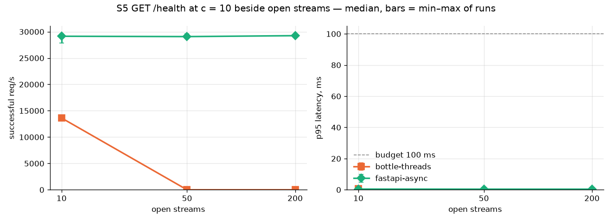

# Migrating the Trading Desk backend from WSGI (Bottle) to ASGI (FastAPI)

| | |
| --- | --- |
| Repository | `trading-desk`, branch `hw-5.5-asgi-migration` |
| Machine | Apple M3, 8 cores, 16 GB |
| Stack | Python 3.14, Bottle 0.13.4, SQLAlchemy 2.0.52, psycopg 3.3.4, PostgreSQL 18.6, Docker Compose |

---

## 1. Summary

*Written last, after Stage 2.*

---

## 2. System inventory (Stage 0)

Six Bottle services, one PostgreSQL database, a React UI behind the Vite proxy. Endpoints:
appendix A.

### 2.1 How the services run

| | |
| --- | --- |
| Server | `wsgiref`: a new thread per connection, no limit; HTTP/1.0; listen queue of 5. A development server |
| Processes | One per container. Five services keep live data in memory, so each runs as one process only (books-service could run more) |
| Database | SQLAlchemy ORM, synchronous sessions (54 call sites), psycopg 3, pool of 5 + 10 connections |
| Calls to other services | `urllib`: blocking, with timeouts |
| Bottle used in | each service's `api.py` and `desk_runtime` (`http.py`, `service_runtime.py`); domain logic does not depend on it |
| Errors | JSON `{"error": "…"}` for every status |
| Tests | None; checked by hand in the UI |
| Containers | One image, a healthcheck per service |

### 2.2 Services

| Service (port, endpoints) | Does | Depends on | In the background |
| --- | --- | --- | --- |
| market-data (8001, 19) | Polls seven market-data APIs, stores quotes and curves, streams updates | PostgreSQL; 7 external APIs | provider polling, retention sweep |
| pricing (8002, 7) | Revalues trades on every market update; valuations and book risk | PostgreSQL; market-data stream | stream consumer, trade refresh |
| monitoring (8003, 5) | Checks every service, collects and streams logs | PostgreSQL; other services' `/health`; log files | pollers every 1–5 s |
| books (8004, 6) | Trading books | PostgreSQL | nothing |
| trade-action (8008, 6) | Validates and executes trade orders | PostgreSQL | order worker |
| blotter (8006, 7) | Trades with valuations, book summaries, audit history | PostgreSQL; pricing stream | stream consumer, trade refresh |

### 2.3 Load character

- **All six are I/O-bound** (from the code and 61 000 provider calls in the logs).
- **Request handlers**: short database queries. The only computation: pricing's `POST /price`
  and `POST /scenario`.
- **Long waits run in background threads** (external APIs, other services' streams, health
  polling). The framework does not change them.
- **External APIs inside a request**: only market-data's `GET /symbols/search`, `POST /refresh`,
  `POST /curves/refresh`; they answer in 83–378 ms at the median, up to 1.8 s at p95.
- **Streams to the UI**: market-data, pricing, monitoring; every open UI holds two or three.
- **Today's load is small**: one UI polling every 2–10 s. No service has a performance problem,
  so the benchmark asks how the backend scales.
- **A migration can change only**: database waits in handlers, the UI streams, market-data's
  in-request API calls.

### 2.4 Benchmark sample

**books-service** and a stub standing in for another service.

- **Identical in both frameworks**: no background threads, nothing in memory, only the database.
- **Representative**: request → synchronous database access → JSON, like nearly every handler.
- **The stub adds the missing case**: waiting on another service.

### 2.5 Scenarios

| # | Request | Shows | In this system |
| --- | --- | --- | --- |
| S1 | `GET /health` | framework and server overhead | every request |
| S2 | `GET /io`: the stub waits 50 ms | waiting on another service — where ASGI should help | market-data's symbol search and refreshes |
| S3 | `GET /cpu`: 20 000 × SHA-256 | computation — where ASGI cannot help | pricing's `POST /price` |
| S4 | insert a book, read it by id | synchronous database work | most handlers |
| S5 | `GET /health` beside 10, 50, 200 open streams | whether open streams block other requests | the UI streams |

- Real external APIs are not called: rate limits and variable latency make runs irreproducible;
  only the wait matters, not who answers.
- S4 uses a separate database, emptied before each point.

Variants, parameters and thresholds: `docs/decision_criteria.md`.

---

## 3. Benchmark method

| Variant | Server | Handlers and clients |
| --- | --- | --- |
| `bottle-sync` | gunicorn, sync worker | one request at a time |
| `bottle-threads` | gunicorn, 40 threads | `requests`, sync database driver |
| `fastapi-async` | uvicorn | `async def`, httpx, async database driver |
| `fastapi-sync` | uvicorn | `def` in a 40-thread pool, `requests`, sync database driver |

- **Sample**: books-service code and a stub (2.4), behind Bottle and FastAPI; identical responses.
- **Load**: c = 1, 10, 50, 200; S5: 10, 50, 200 open streams.
- **One point**: 10 s warm-up, 30 s measured, 3 runs, variants alternating; client timeout 10 s.
- **Setup**: one process per variant, server on its own CPU; separate PostgreSQL, emptied
  before each S4 point.
- **Metrics**: successful req/s; p50, p95, p99; errors and timeouts; server CPU and memory (RSS).
- **Load generator**: oha — listed in the assignment, reports percentiles and error types; used
  a quarter of one core at 31 000 req/s.
- **Fair comparison** (PDF 5.1): same host, N and Python; production mode; same generator;
  pinned versions.
- **Run**: `benchmark/run_benchmark.sh`, Docker only, about 2 h 45 min. Commands and
  versions: appendix B.

### 3.1 Fixes made during the measurement

| Problem | Fix |
| --- | --- |
| httpx spent 20 % of the CPU on a missing package (`sniffio`) | package installed |
| httpx with an unlimited connection pool collapsed at c = 200 | default pool |
| Warm-up requests still running during the measurement | warm-up waits for them |
| Load generator ran out of ports: `bottle-sync` closes every connection | port reuse; first full run discarded |
| Database pool kept reopening connections, FastAPI 2–4× more often | 15 connections kept open; S4 measured again |

### 3.2 Limitations

- One laptop; macOS decides whether the server's CPU is a fast or a slow core.
- Each client waits for its answer before the next request: overload latency is understated.
- The stub waits a fixed 50 ms; the real external APIs take 83–378 ms.
- The sample has no background threads and no in-memory state.

## 4. Results

Median of 3 runs. Spread: typically 1–7 % of the median, S4 up to 25 %; min–max bars on the
charts, every range in `benchmark/results/summary.md`.

### 4.1 Target load: c = 50 (S5: 50 open streams)

Successful req/s / p95 in ms (budget 100 ms):

| | `bottle-sync` | `bottle-threads` | `fastapi-async` | `fastapi-sync` |
| --- | --- | --- | --- | --- |
| S2 `/io` | 17 / 2 886 | 711 / 105 | 693 / 90.5 | 719 / 101 |
| S3 `/cpu` | 201 / 256 | 201 / 555 | 216 / 380 | 212 / 460 |
| S4 `/db` | 1 117 / 48.5 | 1 343 / 120 | 1 094 / 73.2 | 1 343 / 57.6 |
| S5 `/health` | – | 0 / all timeouts | 29 074 / 0.4 | – |

- **Errors**: none, except `bottle-threads` in S5.
- **CPU per request**: `/health` 0.03–0.08 ms · `/io` 0.43 ms (`requests`), 0.73 ms (httpx) ·
  `/cpu` ~5 ms · `/db` 0.7 ms (sync driver), 0.8–1.0 ms (async driver).
- **Memory**: Bottle 77–87 MB, FastAPI 110–117 MB.

### 4.2 Other loads

- **c = 1**: all variants within 2 ms of each other.
- **c = 200, S2**: `fastapi-async` 360 req/s, `bottle-threads` 705; `bottle-sync` 71 % timeouts.
- **c = 200, S3**: `fastapi-async` 3.8 % timeouts.
- **S1, c = 50**: `fastapi-async` 33 000 req/s, the others 11 500–17 400.

### 4.3 Charts

Throughput and p95 against concurrency.




## 5. Interpretation

- **S1, framework overhead** — lowest in FastAPI async; every variant answers in 0.1 ms at
  c = 1, so it does not matter at this system's load.
- **S2, waiting on another service** — equal up to 40 concurrent requests. Bottle threads and
  FastAPI `def` both stop at 40 threads (≈ 710 req/s). FastAPI async has no thread limit: p95
  90.5 vs 105 ms at c = 50; at c = 200 it is slower, because httpx costs 70 % more CPU per call.
- **S3, computation** — same throughput on one core; only the order of service changes p95.
- **S4, database** — a short query is CPU work (0.7 ms): FastAPI `def` = Bottle threads. The
  async driver is slower: nothing to overlap, extra CPU.
- **S5, open streams** — Bottle threads serve nothing from 40 open streams; FastAPI async is
  unaffected. Bottle with 256 threads (checked once) also served `/health` in 1.1 ms beside 200.
- **Longer waits** favour async: at the real APIs' 200 ms, 40 threads stop at 200 req/s.

## 6. Criteria and decision (ADR)

*Stage 2 (go / no-go decision), against the thresholds in `docs/decision_criteria.md`.*

## 7. Risk analysis

*Stage 3 (risk matrix).*

## 8. Refactor (GO) or alternative plan (NO-GO)

*Stage 4A after GO, Stage 4B after NO-GO.*

## 9. Conclusions and lessons

*Written last.*

---

## 10. Appendices

### A. Endpoints

All responses are JSON. Errors are `{"error": "..."}` with the HTTP status — also for
unknown routes (404), wrong methods (405) and unhandled exceptions (500). SSE endpoints
return `text/event-stream`.

**market-data-service**

| Method | Path | Params | Codes | Body |
| --- | --- | --- | --- | --- |
| GET | `/stream`, `/stream/<provider>` | — | 200, 404 | SSE: `market_tick`, `curve_tick`, `market_remove` |
| GET | `/snapshot` | — | 200 | `{stream_id, event_id, spots, curves}` |
| GET | `/curves`, `/curves/<provider>` | `raw` | 200, 404 | list of curves |
| GET | `/curves/<provider>/<curve>/<as_of>` | `raw` | 200, 400, 404 | one curve |
| POST | `/curves/refresh` | `curve`, `provider` | 200, 404 | `{refreshed, skipped}` |
| GET | `/quotes` | `symbol`, `asset_class`, `provider` | 200 | list of quotes |
| GET | `/quotes/<provider>/<symbol>` | — | 200, 404 | one quote |
| GET | `/quotes/<provider>/<symbol>/history` | `limit` 1–200, `raw` | 200, 400, 404 | list of snapshots |
| GET | `/watchlist` | — | 200 | list of items |
| POST | `/watchlist` | JSON body | 201, 400, 404, 409, 422 | item |
| DELETE | `/watchlist/<symbol>` | `provider` | 200, 404, 409 | removal result |
| GET | `/fx/rates` | `to` | 200, 400 | `{to, rates}` |
| GET | `/symbols/search` | `q` (≥ 2 chars) | 200, 400, 503 | `{query, results, provider_errors}` |
| GET | `/providers`, `/providers/<name>/health` | — | 200, 404 | provider status |
| POST | `/refresh` | `symbol`, `provider` | 200, 404, 422 | tick |
| GET | `/health` | — | 200 | `{service, status}` |

**pricing-service**

| Method | Path | Params | Codes | Body |
| --- | --- | --- | --- | --- |
| GET | `/valuations` | — | 200 | list of valuations |
| GET | `/valuations/<trade_id>` | — | 200, 404 | one valuation |
| GET | `/book-risk` | — | 200 | list of book-risk records |
| POST | `/price` | JSON body | 200, 400, 404, 409, 503 | priced instrument |
| POST | `/scenario` | JSON body | 200, 400, 404 | scenario result |
| GET | `/valuation-stream` | — | 200 | SSE: `valuation_update`, `book_risk_update` |
| GET | `/health` | — | 200 | `{service, status, …}` |

**monitoring-service**

| Method | Path | Params | Codes | Body |
| --- | --- | --- | --- | --- |
| GET | `/status` | — | 200 | health of every target |
| GET | `/audits` | `limit`, `since`, `severity`, `service`, `event_type`, `correlation_id`, `entity_id` | 200 | list of audit rows |
| GET | `/logs` | `level`, `since_id`, `run_id`, `service`, `q`, `limit` | 200, 400 | `{lines, meta}` |
| GET | `/logs/stream` | — | 200 | SSE: `run`, `log_line` |
| GET | `/health` | — | 200 | `{service, status}` |

**books-service**

| Method | Path | Params | Codes | Body |
| --- | --- | --- | --- | --- |
| GET | `/books` | — | 200 | list of books |
| GET | `/books/<book_id>` | — | 200, 404 | one book |
| POST | `/books` | `name`, `expected_asset_class`, `description` | 201, 400, 409 | created book |
| PUT | `/books/<book_id>` | partial body | 200, 400, 404, 409 | updated book |
| DELETE | `/books/<book_id>` | — | 200, 404, 409 | deactivated book |
| GET | `/health` | — | 200 | `{service, status}` |

**trade-action-service**

| Method | Path | Params | Codes | Body |
| --- | --- | --- | --- | --- |
| GET | `/instruments/term-schemas` | — | 200 | `{instruments, schemas, curves}` |
| POST | `/trade-actions` | JSON intent | 202, 400, 422, 503 | acknowledgement |
| POST | `/trade-actions/batch` | JSON array | 202, 400, 413, 422, 503 | `{accepted, rejected}` |
| POST | `/trade-actions/close-all` | optional body | 202, 400, 503 | acknowledgement |
| GET | `/queue/status` | — | 200 | counters |
| GET | `/health` | — | 200 | `{service, status}` |

**blotter-service**

| Method | Path | Params | Codes | Body |
| --- | --- | --- | --- | --- |
| GET | `/trades`, `/trades/overview` | `limit` 1–500, `offset`, `book_id`, `asset_class`, `status`, `symbol` | 200, 400 | list of trades / `{trades, books}` |
| GET | `/trades/<trade_id>` | — | 200, 404 | `{trade, latest_valuation, valuation_history, audit_logs}` |
| GET | `/trades/<trade_id>/valuations`, `…/audit-logs` | — | 200, 404 | list |
| GET | `/books/summary` | — | 200 | list of book summaries |
| GET | `/health` | — | 200 | `{service, status, …}` |

### B. Benchmark commands and versions

| | Command |
| --- | --- |
| `bottle-sync` | `gunicorn -w 1 sample_wsgi.app:app` |
| `bottle-threads` | `gunicorn -w 1 -k gthread --threads 40 sample_wsgi.app:app` |
| `fastapi-async` | `uvicorn sample_asgi.app:app --no-access-log` |
| `fastapi-sync` | `uvicorn sample_asgi.app:sync_app --no-access-log` |
| Stub | `uvicorn downstream_stub.app:app --no-access-log` (one process) |
| Load, per point | `oha -z 10s -w -c <c> -t 10s <url>` (warm-up), then `oha -z 30s -c <c> -t 10s --output-format json <url>` |

```sh
benchmark/run_benchmark.sh                            # full grid, about 2 h 45 min
SCENARIOS=s4 benchmark/run_benchmark.sh               # one scenario again
docker compose -f benchmark/infra/compose.yml down    # removes the benchmark database
```

- **Versions**: Python 3.14.7, Bottle 0.13.4, gunicorn 26.2.0, FastAPI 0.141.1, uvicorn 0.53.0
  (uvloop 0.22.1, httptools 0.8.0), httpx 0.28.1, requests 2.34.2, SQLAlchemy 2.0.52,
  psycopg 3.3.4, PostgreSQL 18.6, oha 1.16.0. All pins: `benchmark/infra/requirements.txt`.
- **Machine**: Apple M3 (4 fast + 4 efficient cores), 16 GB, macOS 27.0, mains power; Docker
  Desktop 29.4, VM with 8 CPUs and 8 GB. Server on CPU 7, stub 6, PostgreSQL 4–5, load 0–3.
- **Benchmark settings** (`benchmark/infra/compose.yml`): 15 database connections kept open,
  log level WARNING, load generator may reuse closed ports.
