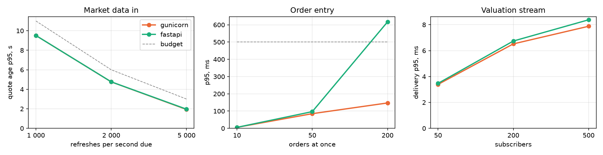
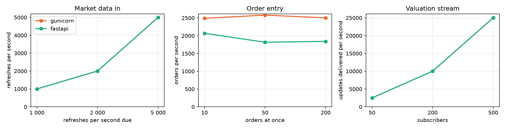
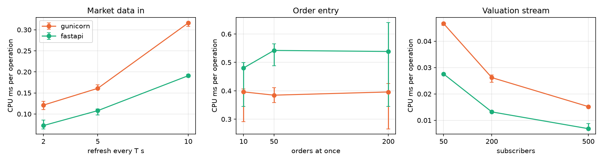

# Migrating the Trading Desk backend from WSGI (Bottle) to ASGI (FastAPI)

| | |
| --- | --- |
| Repository | `trading-desk`, branches `hw-5.5-asgi-migration` (Part 1) and `hw-5.5-part2-core-flows` (Part 2) |
| Machine | Apple M3 (4 fast + 4 efficient cores), 16 GB, macOS 27.0, mains power |
| Docker | Docker Desktop 29.4, Linux VM with 8 CPUs and 8 GB |
| Image | `python:3.14.7-slim`: Debian 13, Python 3.14.7 |
| Stack | Bottle 0.13.4, gunicorn 26.2.0, SQLAlchemy 2.0.52, psycopg 3.3.4, PostgreSQL 18.6, Docker Compose |
| Candidate | FastAPI 0.141.1, uvicorn 0.53.0 |

---

## 1. Summary

> **Decision: NO-GO. All six services stay on gunicorn; no FastAPI.**

- **Part 1** (a books-service sample): the framework alone brings nothing; threads and open
  streams set the limit. gunicorn replaced the `wsgiref` development server: p99 from about 1 s
  to 62 ms, clean stops.
- **Part 2** (the desk's core at 10 000 instruments and 1 000 000 positions): both variants stay
  within every budget at the target load; no difference a user would see.
- **Revisit** when one process must refresh more than about 30 000 instruments every few seconds
  or stream valuations to more than about 1 000 subscribers.

---

## 2. System

Six Bottle services, one PostgreSQL database, a React UI behind the Vite proxy. 43 endpoints:
appendix A.

### 2.1 How the services run

| | |
| --- | --- |
| Server | gunicorn, one gthread worker per service; before it, `wsgiref`, a development server |
| Threads | `SERVER_THREADS`, default 40: one thread per request or open stream; in production market-data, pricing and monitoring serve streams and use 256 |
| Processes | One worker per service: services keep live state in memory |
| Database | SQLAlchemy ORM, synchronous sessions, psycopg 3; 15 connections per service (6 × 15 = 90, under PostgreSQL's default 100) |
| Calls to other services | `urllib`: blocking, with timeouts |
| Errors | JSON `{"error": "…"}` for every status |

| Service (port) | Endpoints | Does |
| --- | --- | --- |
| market-data (8001) | 14 | Polls market-data APIs, stores quotes and curves, streams updates |
| pricing (8002) | 8 | Revalues trades on every market update; valuations, book risk, previews |
| monitoring (8003) | 5 | Checks every service, collects and streams logs |
| books (8004) | 6 | Trading books |
| blotter (8006) | 7 | Trades with valuations, book summaries, audit history |
| trade-action (8008) | 3 | Validates and executes trade orders, one transaction per action |

### 2.2 Load character

- **All six are I/O-bound** (from the code and 61 000 provider calls in the logs).
- **Request handlers**: short database queries. The only computation: pricing's `POST /price`
  and `POST /scenario`.
- **Long waits run in background threads** (external APIs, other services' streams, health
  polling). The framework does not change them.
- **External APIs inside a request**: market-data's `GET /symbols/search` and `POST /refresh`;
  they answer in 83–378 ms at the median, up to 1.8 s at p95.
- **Streams to the UI**: market-data, pricing, monitoring; every open UI holds two or three.
- **A migration can change only**: database waits in handlers, the UI streams, market-data's
  in-request API calls.

### 2.3 Dependencies under ASGI

No library needs WSGI; only our own code blocks an async migration.

| Dependency | Under ASGI |
| --- | --- |
| Bottle 0.13 | replaced by FastAPI |
| SQLAlchemy 2.0 | async sessions in `sqlalchemy.ext.asyncio`; needs greenlet, already installed |
| psycopg 3 | async connections built in |
| structlog | request context lives in `contextvars`; async code keeps it per task |
| Alembic | runs migrations in its own container, outside the services |
| desk-pricing | pure Python, no dependencies |
| **Our code** | blocking `urllib` calls; streams fed by background threads; handlers use Bottle's global `request` and `response` |

---

## 3. Method

Rules for both parts:

- **Criteria committed before the first run**: [`docs/decision_criteria.md`](decision_criteria.md).
- **Machine**: one laptop (header); services, load and database in Docker on the same VM.
- **Pinned versions**: every package in `requirements.txt`; appendix B.
- **Production mode**: no reload, no debug, no access log.
- **Variants interleaved** within each run.
- **Each point = median of 3 runs; spread = max − min.**
- **A difference counts only if larger than the larger spread.**
- **More than 1 % errors or timeouts → the variant loses the point.**

### 3.1 Part 1: the sample

**books-service** code and a stub standing in for another service, behind Bottle and FastAPI;
identical responses. Request → short database query → JSON, like nearly every handler; no
background threads, nothing in memory.

| Variant | Server | Handlers and clients |
| --- | --- | --- |
| `bottle-sync` | gunicorn, sync worker | one request at a time |
| `bottle-threads` | gunicorn, 40 threads | `requests`, sync database driver |
| `bottle-threads-256` † | gunicorn, 256 threads | as `bottle-threads` |
| `bottle-wsgiref` † | `wsgiref`, the server before gunicorn | as `bottle-threads` |
| `fastapi-async` | uvicorn | `async def`, httpx, async database driver |
| `fastapi-sync` | uvicorn | `def` in a 40-thread pool, `requests`, sync database driver |

| # | Request | Shows | In this system |
| --- | --- | --- | --- |
| S1 | `GET /health` | framework and server overhead | every request |
| S2 | `GET /io`: the stub waits 50 ms | waiting on another service | market-data's symbol search and refresh |
| S3 | `GET /cpu`: 20 000 × SHA-256 | computation | pricing's `POST /price` |
| S4 | insert a book, read it by id | synchronous database work | most handlers |
| S5 | `GET /health` at c = 10 beside 10, 50, 200 open streams | whether open streams block other requests | the UI streams |

- **Load**: c = 1, 10, 50, 200; target c = 50. Latency budget p95 ≤ 100 ms (S3 none).
- **One point**: 10 s warm-up, 30 s measured; client timeout 10 s; load generator oha.
- **Setup**: one process per variant, server on its own CPU; S4 on a separate PostgreSQL,
  emptied before each point.
- **Metrics**: successful req/s; p50, p95, p99; errors and timeouts; server CPU and RSS.

### 3.2 Part 2: the desk's core flows

One test app in two variants with identical responses, built on the desk's own code
(`desk_pricing` Black–Scholes, `desk_runtime` stream hub). It runs the three core flows, each
measured alone. PostgreSQL holds 10 000 instruments × 100 books = 1 000 000 positions.

| Variant | Serving | Provider calls | Database |
| --- | --- | --- | --- |
| gunicorn (today) | gunicorn gthread, 1 worker, serving the Bottle app as in the services; a thread per request and per open stream | `urllib3` from a thread pool | synchronous |
| FastAPI | uvicorn, 1 worker, everything on the event loop | `aiohttp` | asynchronous |

| Flow | Resource | Service | What happens | Levels | Target | Budget |
| --- | --- | --- | --- | --- | --- | --- |
| Market data in | waiting on a provider | market-data | every instrument refreshed every T s on its own staggered schedule; the provider answers in 200 ms | T = 10 / 5 / 2 s (1 000 / 2 000 / 5 000 calls/s) | T = 5 s | ≥ 98 % refreshes on time; quote age p95 ≤ T + 1 s |
| Order entry | database transaction | trade-action | insert an order and update its position in one transaction | 10 / 50 / 200 orders at once | 50 | p95 ≤ 500 ms |
| Valuation stream | open connections | pricing | K subscribers hold a stream; the server pushes 50 Black–Scholes valuations per second to each | K = 50 / 200 / 500 | 200 | delivery p95 ≤ 1 s |

**Business volumes behind the levels**

| | Our app today | A desk of this type | Test |
| --- | --- | --- | --- |
| Instruments | a few watched | 10 000–50 000 | 10 000 |
| Provider latency | median 186 ms (Finnhub, our logs) | 100–300 ms (vendor REST) | constant 200 ms |
| Refresh | every 15–60 s per symbol | every few seconds | every 10 / 5 / 2 s |
| Positions | 9 | 100 000 – 10 000 000 | 1 000 000 |
| Open valuation streams | 1 (one browser tab) | 10–50 per desk, ~200 per floor | 50 / 200 / 500 |
| Updates per stream | on every price tick | a book of ~3 000 positions revalued once a minute | 50 per second |
| Orders | a few per day | bursts at market open | 10 / 50 / 200 at once |

- **Provider clients**: each variant uses its standard client. A shared `httpx` pool cost 8–11 ms
  of CPU per call, threads and async alike (section 6).
- **One point**: fresh server container; warm-up 10 s (market data 10 s + T); measured 60 s
  (market data) or 30 s. CPU = the server's process tree, sampled every second.
- **Revaluation** is not a flow (Part 1: the framework does not change computation); one sizing
  number instead.

---

## 4. Part 1: the sample (books-service)

Successful req/s / p95 ms at c = 50 (S5: 50 open streams). p99 in brackets where the tail is the
result.

| | `bottle-sync` | `bottle-threads` | `bottle-threads-256` † | `bottle-wsgiref` † | `fastapi-async` | `fastapi-sync` |
| --- | --- | --- | --- | --- | --- | --- |
| S1 `/health` | 11 479 / 4.7 | 14 116 / 5.7 | 14 013 / 4.9 | 7 016 / 0.9 | 33 064 / 2.5 | 17 447 / 3.2 |
| S2 `/io` | 17.5 / 2 886 | 711 / 105 | 918 / 59.2 | 656 / 56.2 (p99 1 094) | 693 / 90.5 | 719 / 101 |
| S3 `/cpu` | 201 / 256 | 201 / 555 | 202 / 496 | 207 / 1 103 (p99 2 526) | 216 / 380 | 212 / 460 |
| S4 `/db` | 1 117 / 48.5 | 1 343 / 120 | 1 346 / 72.6 | 1 249 / 19.0 (p99 1 050) | 1 094 / 73.2 | 1 343 / 57.6 |
| S5 `/health` | – | 0 / all timeouts | 13 367 / 0.8 | 7 058 / 0.9 | 29 074 / 0.4 | – |
| S2, c = 200 | 5.3, 71.5 % errors ✗ | 705 / 302 | 2 966 / 84.5 | 1 700 / 55.2 (p99 1 308) | 360 / 606 | 700 / 314 |
| S3, c = 200 | 203 / 1 004 | 202 / 1 445 | 194 / 2 109 | 207 / 1 894, 4.4 % errors ✗ | 210 / 613, 3.8 % errors ✗ | 210 / 1 206 |

† One run, 24 September. The others: median of 3 runs; spread typically 1–7 % of the median,
S4 up to 25 %. Every range: `benchmark/results/summary.md`, `benchmark/results/threads-check/summary.md`.
`–`: not measured. ✗: more than 1 % errors, the variant loses the point.

**Observations**

- **Open streams exhaust a fixed thread pool**: beside 50 streams `bottle-threads` (40) answers
  nothing; with 256 threads 13 367 req/s at 0.8 ms; `fastapi-async` 29 074 req/s at 0.4 ms.
- **Waiting is limited by threads, not by the framework**: at 40 threads Bottle and FastAPI `def`
  both stop near 710 req/s (711, 719); with 256 threads Bottle reaches 918 req/s at p95 59.2 ms,
  and 2 966 req/s at c = 200, where `fastapi-async` gives 360.
- **`wsgiref` has a 1 s tail**: p99 1 094 ms in S2 and 1 050 ms in S4 at c = 50, from c = 10
  (S2 p99 1 079 ms); its listen queue of 5 drops connections, which retry after 1 s. p95 hides it.
- **Computation is the same everywhere**: S3 201–216 req/s on one core; only the order of service
  changes p95 (256 to 555 ms).
- **A short database request gains nothing from async**: S4 FastAPI `def` = Bottle threads
  (1 343 req/s each); `fastapi-async` 1 094.
- **FastAPI async has the lowest framework overhead**: S1 33 064 req/s vs 11 479–17 447; every
  variant answers in 0.1 ms at c = 1.
- **Memory**: Bottle 77–87 MB, FastAPI 110–117 MB.

**Result of Part 1: NO-GO for a full migration**

| Gate | Result |
| --- | --- |
| 1. No regression in S3, S4 | **FAIL**: S3 p95 FastAPI 380 ms, Bottle 256 ms |
| 2. Real gain in S2 or S5 | **PASS**: S5, Bottle answers nothing beside 50 streams |
| 3. Cost | not scored |
| 4. Need: Bottle over budget, FastAPI within | **PASS** at 40 threads; **FAIL** at 256 threads (S2 p95 59.2 ms) |

- **What Part 1 could not say**: whether ASGI's one win, open streams, matters at the desk's
  real volume (Part 2).


All charts, S1–S5: [`benchmark/results/charts/`](../benchmark/results/charts/) (3 runs, min–max bars) and
[`benchmark/results/threads-check/charts/`](../benchmark/results/threads-check/charts/) (†).

**Limitations**

- One laptop; macOS decides whether the server's CPU is a fast or a slow core.
- Each client waits for its answer before the next request: overload latency is understated.
- The stub waits a fixed 50 ms; the real external APIs take 83–378 ms.
- The sample has no background threads and no in-memory state.

---

## 5. Part 2: the desk's core flows

**At the target level** (median of 3 runs; the CPU ranges of the two variants do not overlap)

| Flow, target | gunicorn | FastAPI | CPU per operation, gunicorn → FastAPI | Rule outcome (section 7) |
| --- | --- | --- | --- | --- |
| Market data in, every 5 s | 100 % on time, quote age 4.76 s | 100 %, 4.76 s | 0.16 → 0.11 ms (**−33 %**) | GO |
| Order entry, 50 at once | p95 85 ms | p95 97 ms | 0.38 → 0.54 ms (**+41 %**) | NO-GO |
| Valuation stream, 200 subscribers | delivery p95 6.5 ms | 6.7 ms | 0.026 → 0.013 ms (**−50 %**) | GO |

**Every level** (median of 3 runs; dashed line = budget; every range:
`benchmark/results/core/summary.md`)





- **Errors**: 0 in all 54 points; every point ≥ 99 % of refreshes on time; no dropped stream.

**Observations**

- **Every flow stays within budget at the target in both variants**: no difference a user would
  see; quote age and delivery times are the same.
- **Waiting and fan-out cost less on the event loop**: −33 % CPU per refresh, −50 % per delivered
  valuation. At 5 000 refreshes per second: 0.36 vs 0.61 cores.
- **Database transactions cost more on async**: +41 % CPU per order; at 50 at once one core takes
  1 817 orders per second instead of 2 579.
- **Overload hits FastAPI's orders first**: at 200 at once p95 617 ms (360–705) against 147 ms.
  gunicorn queues extra orders before the app; FastAPI admits all and they wait for the database
  pool.
- **The order server is CPU-bound from 10 orders at once**, in both variants: one process, one core.
- **Revaluation is cheap**: 0.83 µs per position (0.82–1.02); 1 000 000 positions per minute
  need 0.014 cores.

**Limitations**

- Flows are measured one at a time; in production they share one process per service.
- In the sample, quotes and valuations stay in memory; in production market-data and pricing also
  write to the database, where the order-entry cost applies.
- The provider answers in a constant 200 ms; the real p95 is 1.2 s, which keeps more calls in
  flight.
- One laptop; other programs used a median of 2.5 of its 8 cores. Memory was not recorded.

---

## 6. CPU cost

Cloud cost follows cores.

**Per request** (Part 1, c = 50): CPU ms per request = cores one service needs for 1 000 requests
per second.

| | Bottle, 40 threads | FastAPI `def` | FastAPI async |
| --- | --- | --- | --- |
| S1 `/health`: framework only | 0.07 | 0.06 | **0.03** |
| S2 `/io`: waits on a service | 0.45 | 0.43 | **0.73** (httpx) |
| S3 `/cpu`: computation | 4.97 | 4.71 | 4.62 |
| S4 `/db`: database | 0.74 | 0.74 | **0.91** (async driver) |

- **Async libraries cost more per request**: +63 % CPU when a request waits on a service, +23 %
  on the database.

**Per provider call, by client library** (one run per point, 10 s; the stub answers in 200 ms)

| Client | Model | Calls/s at 400 / 1 000 in flight | CPU ms per call | 10 000 instruments every 5 s (calculated) |
| --- | --- | --- | --- | --- |
| `httpx`, shared pool | threads | 133 / 159 | 10.5 / 9.7 | 21 cores |
| `httpx`, shared pool | async | 124 / 240 | 10.0 / 8.2 | 20 cores |
| `requests` | threads | 1 960 / 3 528 | 0.33 / 0.34 | 0.65 cores |
| `urllib3` (gunicorn variant) | threads | 1 960 / 4 934 | 0.21 / 0.17 | 0.42 cores |
| `aiohttp` (FastAPI variant) | async | 1 932 / 4 872 | 0.09 / 0.06 | 0.18 cores |

- **The client library changes the cost up to a hundredfold**: a shared `httpx` pool stalls below
  250 calls/s at 8–11 ms of CPU per call; the other clients reach the possible 2 000 / 5 000
  calls/s (in flight ÷ 200 ms).
- **The async client is the cheapest per call**: `aiohttp` 0.06–0.09 ms against 0.17–0.21 ms for
  `urllib3`; in the full app: −33 % CPU per refresh.

**In business units** (Part 2)

| | gunicorn | FastAPI |
| --- | --- | --- |
| 10 000 instruments refreshed every 5 s | 0.32 cores | 0.22 cores |
| 200 subscribers (screens, risk tools) with live valuations | 0.26 cores | 0.13 cores |
| 1 000 orders per second | 0.38 cores | 0.54 cores |
| Revaluing 1 000 000 positions per minute | 0.014 cores | same computation |
| One process at one core (calculated) | about 40 000 instruments every 5 s or 1 300 subscribers | about 70 000 instruments or 2 900 subscribers |

- **At the desk's volume the saving is about 0.2 of a core** for market-data and pricing
  together; orders would cost more.
- **Computation is not the limit**: 10 000 000 positions per minute (extrapolated) need
  0.14 cores.

---

## 7. Decision (ADR)

**ADR-002 · Serving the desk's core: gunicorn or FastAPI · 30 September 2026**

> **Decision: NO-GO. All six services stay on gunicorn; no FastAPI.**

**Why**

- **No need**: at the desk's volume every core flow stays within budget on gunicorn; one process
  has room for about 40 000 instruments every 5 s or 1 300 subscribers.
- **Little to gain**: FastAPI saves about 0.2 of a core where the server waits or fans out, and
  uses 41 % more CPU per order.
- **Scale is not a framework question**: beyond one process the desk needs its state out of
  memory (a shared cache), several processes or pods behind a load balancer and a message bus for
  the streams. Either framework needs that refactor.

**Context**: Part 1 ended in NO-GO for a full migration (section 4); gunicorn serves all six
services. Part 2: does a full async stack carry the core flows better or cheaper at real volume?

**Criteria and data**: [`docs/decision_criteria.md`](decision_criteria.md), Part 2, committed
before the first run. The rule gives GO for market data (−33 % CPU) and the valuation stream
(−50 %), NO-GO for orders (+41 %); CPU spread 4–8 %, the ranges do not overlap. In cores the
saving does not pay for porting 22 endpoints.

**Options**

| Option | For | Against |
| --- | --- | --- |
| 1. **Stay on gunicorn (chosen)** | within every budget; one framework | a thread per open stream |
| 2. FastAPI for market-data and pricing | less CPU where the server waits or fans out | 22 endpoints to port; database writes slower |
| 3. Full migration | one framework | orders slower, over budget at 200 at once |

---

## 8. Risks

Top 3 for each option. P = probability, I = impact: L / M / H.

**Staying on gunicorn (chosen)**

| Risk | P | I | Mitigation | Warning signal |
| --- | --- | --- | --- | --- |
| **One process reaches one core**: market-data at about 40 000 instruments every 5 s, pricing at about 1 300 subscribers (calculated) | L | H | shared cache and several processes behind a message bus | service CPU above 70 % of a core |
| **Symbol search and manual refresh wait for providers inside the request**: up to 1.8 s at p95, 10 s timeout; the user waits for the answer anyway, background polling does not wait | L | M | keep them synchronous; lower the timeout; search results are cached for 10 minutes | request p95 above 1 s during searches |
| **Real provider latency needs more calls in flight**: the test used a constant 200 ms, Finnhub's p95 is 1.2 s | M | M | size the provider pool from p95, not the median | more than 2 % refreshes missed |

**Migrating to FastAPI**

| Risk | P | I | Mitigation | Warning signal |
| --- | --- | --- | --- | --- |
| **Database writes get slower**: +41 % CPU per order, over budget at 200 orders at once | H | M | keep database handlers synchronous (`def`) | order p95 above gunicorn's at the same load |
| **The migration is done imprecisely**: a blocking call left in `async def` freezes the whole service; error responses change (`{"detail": …}`, 422); no contract tests exist | M | H | contract tests on Bottle before the first change; blocking work stays in threads | p99 jumps while CPU is low; error responses without an `error` key |
| **The migration stops halfway**: 22 endpoints and their background threads to port; two frameworks side by side | M | M | one service at a time; a stop point agreed in advance | under half the endpoints done at half the planned time |

---

## 9. gunicorn: before and after

Implemented after Part 1's NO-GO: gunicorn gthread, one worker per service, threads from
`SERVER_THREADS`, 5 s graceful stop, a stream heartbeat every 5 s.

| What the desk gets | Before (`wsgiref`) | After (gunicorn) |
| --- | --- | --- |
| Market-data answers while 200 screens stream prices | 1 121 req/s, p95 12.7 ms | 6 393 req/s, p95 2.4 ms |
| Threads of closed screens | kept until the next event (after 200 screens: 395 threads, 112 MB) | freed within 5 s |
| Restart or deploy (`docker stop`) | 10.23 s, killed mid-request | 0.41–0.83 s, clean; 5.31–5.40 s with open streams |
| Waiting on another service (Part 1 sample, S2 at c = 50) | 656 req/s, p99 1 094 ms | 918 req/s, p99 61.7 ms (256 threads) |

- **Measured** 27 September on the running services, one run each; ranges span the six services.
- **Cost**: 10–13 MB more memory per container; one service holds up to 255 open screens (256
  threads), then new ones wait.

---

## 10. Conclusions

| # | Question | Answer |
| --- | --- | --- |
| 1 | Does the problem exist? | No, neither at today's load nor at a desk's volume: gunicorn keeps every core flow within budget. |
| 2 | What do the scenarios measure? | Part 1: one request type at a time on a books-service sample. Part 2: the three core flows, one resource each, at desk volumes (3.2). |
| 3 | How large is the uncertainty? | 3 runs; CPU spread 4–8 %; every difference used in the decision is larger than the spread. |
| 4 | What decided, what would change it? | A saving of about 0.2 of a core against porting 22 endpoints. Changes above about 30 000 instruments or 1 000 subscribers per process; even then the first step is a shared cache and several processes. |
| 5 | Top 3 risks | Section 8, for both options. |
| 6 | Cost against the estimate (GO) | Not applicable: nothing was migrated. |
| 7 | What instead, and its effect (NO-GO) | gunicorn in all six services: faster answers beside open screens, freed resources, clean restarts (section 9). |
| 8 | Lessons | Below. |

- **Benchmarks**: run a smoke test before the grid; one client library (a shared `httpx` pool,
  8–11 ms per call) can dominate the result. Count CPU per operation and turn it into cores.
- **Async**: cheaper for waiting and fan-out, costlier for database transactions; at a desk's scale
  neither justifies a framework change.

---

## Appendix A. Endpoints

All responses are JSON. Errors are `{"error": "..."}` with the HTTP status — also for unknown
routes (404), wrong methods (405) and unhandled exceptions (500). SSE endpoints return
`text/event-stream`. `/health` answers `{service, status}`; pricing and blotter add counters.

**market-data-service** (14)

| Method | Path | Params | Codes | Body |
| --- | --- | --- | --- | --- |
| GET | `/stream` | — | 200 | SSE: quote and curve updates |
| GET | `/snapshot` | — | 200 | `{stream_id, event_id, spots, curves}` |
| GET | `/curves`, `/curves/<provider>` | `raw` | 200, 404 | list of curves |
| GET | `/curves/<provider>/<curve>/<as_of>` | `raw` | 200, 400, 404 | one curve |
| GET | `/quotes/<provider>/<symbol>/history` | `limit` 1–200, `raw` | 200, 400, 404 | list of snapshots |
| GET | `/watchlist` | — | 200 | list of items |
| POST | `/watchlist` | JSON body | 201, 400, 409, 422 | item |
| DELETE | `/watchlist/<symbol>` | `provider` | 200, 404, 409 | removal result |
| GET | `/fx/rates` | `to` | 200, 400 | `{to, rates}` |
| GET | `/symbols/search` | `q` (≥ 2 chars) | 200, 400 | `{query, results, provider_errors}` |
| GET | `/providers` | — | 200 | provider status |
| POST | `/refresh` | `symbol`, `provider` | 200, 404, 422, 429, 502, 503 | tick, or `{refreshed, skipped}` without `symbol` |
| GET | `/health` | — | 200 | `{service, status}` |

**pricing-service** (8)

| Method | Path | Params | Codes | Body |
| --- | --- | --- | --- | --- |
| GET | `/curves/<curve>/at` | `maturity_years`, `index_tenor` 3M/6M or `payments_per_year` | 200, 400, 404 | zero rate, discount factor, par rate |
| GET | `/valuations` | — | 200 | list of valuations |
| GET | `/valuations/<trade_id>` | — | 200, 404 | one valuation |
| GET | `/book-risk` | — | 200 | list of book-risk records |
| POST | `/price` | JSON body | 200, 400, 404, 409, 503 | priced instrument |
| POST | `/scenario` | JSON body | 200, 400, 404 | scenario result |
| GET | `/valuation-stream` | — | 200 | SSE: valuation and book-risk updates |
| GET | `/health` | — | 200 | `{service, status, …}` |

**monitoring-service** (5)

| Method | Path | Params | Codes | Body |
| --- | --- | --- | --- | --- |
| GET | `/status` | — | 200 | health of every target |
| GET | `/audits` | `limit`, `since`, `severity`, `service`, `event_type`, `correlation_id`, `entity_id` | 200, 400 | list of audit rows |
| GET | `/logs` | `level`, `service`, `q`, `limit` (1–10 000) | 200, 400 | `{lines, meta}` |
| GET | `/logs/stream` | — | 200 | SSE: `run`, then log lines |
| GET | `/health` | — | 200 | `{service, status}` |

**books-service** (6)

| Method | Path | Params | Codes | Body |
| --- | --- | --- | --- | --- |
| GET | `/books` | — | 200 | list of books |
| GET | `/books/<book_id>` | — | 200, 404 | one book |
| POST | `/books` | `name` (≤ 60), `expected_asset_class`, `description` (≤ 200) | 201, 400, 409 | created book |
| PUT | `/books/<book_id>` | partial body | 200, 400, 404, 409 | updated book |
| DELETE | `/books/<book_id>` | — | 200, 404, 409 | deactivated book |
| GET | `/health` | — | 200 | `{service, status}` |

**trade-action-service** (3)

| Method | Path | Params | Codes | Body |
| --- | --- | --- | --- | --- |
| GET | `/instruments/term-schemas` | — | 200 | `{instruments, schemas, curves}` |
| POST | `/trade-actions` | JSON: `OPEN_TRADE`, `CLOSE_TRADE`, `REASSIGN_TRADES` | 201, 200 (replay, close, reassign), 400, 422 | result |
| GET | `/health` | — | 200 | `{service, status}` |

**blotter-service** (7)

| Method | Path | Params | Codes | Body |
| --- | --- | --- | --- | --- |
| GET | `/trades`, `/trades/overview` | `limit` 1–500, `offset`, `book_id`, `asset_class`, `status`, `symbol` | 200, 400 | list of trades / `{trades, books}` |
| GET | `/trades/<trade_id>` | — | 200, 404 | trade with valuations and audit logs |
| GET | `/trades/<trade_id>/valuations`, `…/audit-logs` | — | 200, 404 | list |
| GET | `/books/summary` | `currency` | 200, 400 | book summaries |
| GET | `/health` | — | 200 | `{service, status, …}` |

## Appendix B. Commands and versions

**Part 1**

| | Command |
| --- | --- |
| `bottle-sync` | `gunicorn -w 1 sample_wsgi.app:app` |
| `bottle-threads` | `gunicorn -w 1 -k gthread --threads 40 sample_wsgi.app:app` |
| `fastapi-async` | `uvicorn sample_asgi.app:app --no-access-log` |
| `fastapi-sync` | `uvicorn sample_asgi.app:sync_app --no-access-log` |
| Stub | `uvicorn downstream_stub.app:app --no-access-log` (one process) |
| Load, per point | `oha -z 10s -w -c <c> -t 10s <url>` (warm-up), then `oha -z 30s -c <c> -t 10s --output-format json <url>` |

```sh
benchmark/run_benchmark.sh                            # full grid, about 2 h 45 min
SCENARIOS=s4 benchmark/run_benchmark.sh               # one scenario again
docker compose -f benchmark/infra/compose.yml down    # removes the benchmark database
```

**Part 2**

| | Command |
| --- | --- |
| gunicorn | `gunicorn -w 1 -k gthread --threads <40 + open streams> core_sample.wsgi_app:app` |
| FastAPI | `uvicorn core_sample.asgi_app:app --no-access-log` |
| Stub | `uvicorn downstream_stub.app:app --workers 4 --no-access-log` |
| Orders, per point | `oha -z 30s -c <c> -t 10s -m POST --rand-regex-url 'http://<server>/orders/[0-9]{4}/[0-9]{2}'` |
| Streams, per point | `python core_sample/subscribers.py http://<server>/valuations/stream <K> 10 30` |
| Client libraries | `python tools/client_probe.py > results/core/clients.jsonl` (stub and load generator running) |

```sh
benchmark/run_core.sh                                                   # full grid, about 1 h
FLOWS=orders benchmark/run_core.sh                                      # one flow again
docker compose -f benchmark/infra/compose.yml --profile core down -v    # removes the benchmark database
```

- **Versions**: Python 3.14.7, Bottle 0.13.4, gunicorn 26.2.0, FastAPI 0.141.1, uvicorn 0.53.0
  (uvloop 0.22.1, httptools 0.8.0), httpx 0.28.1, requests 2.34.2, urllib3 2.8.0, aiohttp 3.14.3,
  SQLAlchemy 2.0.52, psycopg 3.3.4, PostgreSQL 18.6, oha 1.16.0. All pins:
  `benchmark/infra/requirements.txt`; services: `requirements.txt`. `aiohttp` was added for
  Part 2; Part 1 ran on the same image without it.
- **Machine**: Apple M3 (4 fast + 4 efficient cores), 16 GB, macOS 27.0, mains power; Docker
  Desktop 29.4, VM with 8 CPUs and 8 GB. Server on CPU 7, PostgreSQL 4–5, load 0–3; stub on 6
  (Part 1) or 3 and 6 (Part 2).
- **Part 1 settings** (`benchmark/infra/compose.yml`): 15 database connections kept open, log
  level WARNING, load generator may reuse closed ports.
- **Part 2 settings** (profile `core`): 1 250 provider calls in flight in both variants (5 000/s ×
  0.2 s + 25 %): a pool of 1 250 threads and 1 250 `urllib3` connections, or a semaphore of 1 250
  and an `aiohttp` limit of 1 250; 40 request threads + one per open stream; 15 database
  connections; 500 queued updates per subscriber; stub 4 processes; seed 10 000 × 100 positions.
