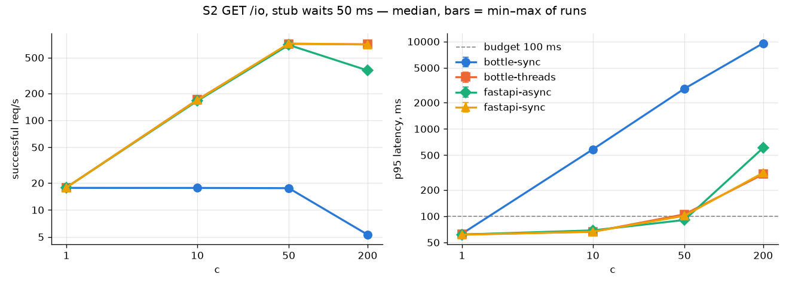
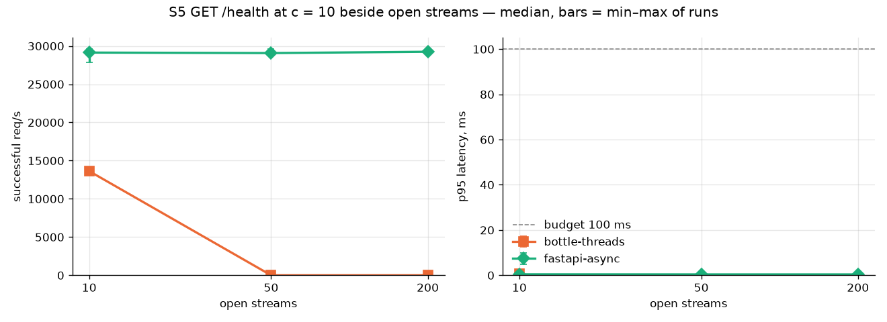

# Migrating the Trading Desk backend from WSGI (Bottle) to ASGI (FastAPI)

| | |
| --- | --- |
| Repository | `trading-desk`, branch `hw-5.5-asgi-migration` |
| Machine | Apple M3 (4 fast + 4 efficient cores), 16 GB, macOS 27.0, mains power |
| Docker | Docker Desktop 29.4, Linux VM with 8 CPUs and 8 GB |
| Image | `python:3.14.7-slim`: Debian 13, Python 3.14.7 |
| Stack | Bottle 0.13.4, gunicorn 26.2.0, SQLAlchemy 2.0.52, psycopg 3.3.4, PostgreSQL 18.6, Docker Compose |

- **Slim image**: 44 MB download instead of 404 MB (arm64). No compiler needed: every dependency
  installs from a prebuilt wheel. Services and benchmark share the same base image.

---

## 1. Summary

> **Part 1: NO-GO for a full migration; gunicorn replaced the `wsgiref` development server.**

- **Part 1** (a books-service sample): the framework alone brings nothing; threads and open
  streams set the limit.

---

## 2. System

Six Bottle services, one PostgreSQL database, a React UI behind the Vite proxy. 43 endpoints:
appendix A.

### 2.1 How the services run

| | |
| --- | --- |
| Server | gunicorn, one gthread worker per service; before it, `wsgiref`, a development server |
| Threads | `SERVER_THREADS`, default 40: one thread per request or open stream; in production market-data, pricing and monitoring serve streams and use 256 |
| Processes | One worker per service: services keep live state in memory |
| Database | SQLAlchemy ORM, synchronous sessions, psycopg 3; 15 connections per service (6 × 15 = 90, under PostgreSQL's default 100) |
| Calls to other services | `urllib`: blocking, with timeouts |
| Errors | JSON `{"error": "…"}` for every status |

| Service (port) | Endpoints | Does |
| --- | --- | --- |
| market-data (8001) | 14 | Polls market-data APIs, stores quotes and curves, streams updates |
| pricing (8002) | 8 | Revalues trades on every market update; valuations, book risk, previews |
| monitoring (8003) | 5 | Checks every service, collects and streams logs |
| books (8004) | 6 | Trading books |
| blotter (8006) | 7 | Trades with valuations, book summaries, audit history |
| trade-action (8008) | 3 | Validates and executes trade orders, one transaction per action |

### 2.2 Load character

- **All six are I/O-bound** (from the code and 61 000 provider calls in the logs).
- **Request handlers**: short database queries. The only computation: pricing's `POST /price`
  and `POST /scenario`.
- **Long waits run in background threads** (external APIs, other services' streams, health
  polling). The framework does not change them.
- **External APIs inside a request**: market-data's `GET /symbols/search` and `POST /refresh`;
  they answer in 83–378 ms at the median, up to 1.8 s at p95.
- **Streams to the UI**: market-data, pricing, monitoring; every open UI holds two or three.
- **A migration can change only**: database waits in handlers, the UI streams, market-data's
  in-request API calls.

### 2.3 Dependencies under ASGI

No library needs WSGI; only our own code blocks an async migration.

| Dependency | Under ASGI |
| --- | --- |
| Bottle 0.13 | replaced by FastAPI |
| SQLAlchemy 2.0 | async sessions in `sqlalchemy.ext.asyncio`; needs greenlet, already installed |
| psycopg 3 | async connections built in |
| structlog | request context lives in `contextvars`; async code keeps it per task |
| Alembic | runs migrations in its own container, outside the services |
| desk-pricing | pure Python, no dependencies |
| **Our code** | blocking `urllib` calls; streams fed by background threads; handlers use Bottle's global `request` and `response` |

---

## 3. Method

Rules:

- **Criteria committed before the first run**: [`docs/decision_criteria.md`](decision_criteria.md).
- **Machine**: one laptop (header); services, load and database in Docker on the same VM.
- **Pinned versions**: every package in `requirements.txt`; appendix B.
- **Production mode**: no reload, no debug, no access log.
- **Variants interleaved** within each run.
- **Each point = median of 3 runs; spread = max − min.**
- **A difference counts only if larger than the larger spread.**
- **More than 1 % errors or timeouts → the variant loses the point.**

### 3.1 Part 1: the sample

**books-service** code and a stub standing in for another service, behind Bottle and FastAPI;
identical responses. Request → short database query → JSON, like nearly every handler; no
background threads, nothing in memory.

| Variant | Server | Handlers and clients |
| --- | --- | --- |
| `bottle-sync` | gunicorn, sync worker | one request at a time |
| `bottle-threads` | gunicorn, 40 threads | `requests`, sync database driver |
| `bottle-threads-256` † | gunicorn, 256 threads | as `bottle-threads` |
| `bottle-wsgiref` † | `wsgiref`, the server before gunicorn | as `bottle-threads` |
| `fastapi-async` | uvicorn | `async def`, httpx, async database driver |
| `fastapi-sync` | uvicorn | `def` in a 40-thread pool, `requests`, sync database driver |

| # | Request | Shows | In this system |
| --- | --- | --- | --- |
| S1 | `GET /health` | framework and server overhead | every request |
| S2 | `GET /io`: the stub waits 50 ms | waiting on another service | market-data's symbol search and refresh |
| S3 | `GET /cpu`: 20 000 × SHA-256 | computation | pricing's `POST /price` |
| S4 | insert a book, read it by id | synchronous database work | most handlers |
| S5 | `GET /health` at c = 10 beside 10, 50, 200 open streams | whether open streams block other requests | the UI streams |

- **Load**: c = 1, 10, 50, 200; target c = 50. Latency budget p95 ≤ 100 ms (S3 none).
- **One point**: 10 s warm-up, 30 s measured; client timeout 10 s; load generator oha.
- **Setup**: one process per variant, server on its own CPU; S4 on a separate PostgreSQL,
  emptied before each point.
- **Metrics**: successful req/s; p50, p95, p99; errors and timeouts; server CPU and RSS.

---

## 4. Part 1: the sample (books-service)

Successful req/s / p95 ms at c = 50 (S5: 50 open streams). p99 in brackets where the tail is the
result.

| | `bottle-sync` | `bottle-threads` | `bottle-threads-256` † | `bottle-wsgiref` † | `fastapi-async` | `fastapi-sync` |
| --- | --- | --- | --- | --- | --- | --- |
| S1 `/health` | 11 479 / 4.7 | 14 116 / 5.7 | 14 013 / 4.9 | 7 016 / 0.9 | 33 064 / 2.5 | 17 447 / 3.2 |
| S2 `/io` | 17.5 / 2 886 | 711 / 105 | 918 / 59.2 | 656 / 56.2 (p99 1 094) | 693 / 90.5 | 719 / 101 |
| S3 `/cpu` | 201 / 256 | 201 / 555 | 202 / 496 | 207 / 1 103 (p99 2 526) | 216 / 380 | 212 / 460 |
| S4 `/db` | 1 117 / 48.5 | 1 343 / 120 | 1 346 / 72.6 | 1 249 / 19.0 (p99 1 050) | 1 094 / 73.2 | 1 343 / 57.6 |
| S5 `/health` | – | 0 / all timeouts | 13 367 / 0.8 | 7 058 / 0.9 | 29 074 / 0.4 | – |
| S2, c = 200 | 5.3, 71.5 % errors ✗ | 705 / 302 | 2 966 / 84.5 | 1 700 / 55.2 (p99 1 308) | 360 / 606 | 700 / 314 |
| S3, c = 200 | 203 / 1 004 | 202 / 1 445 | 194 / 2 109 | 207 / 1 894, 4.4 % errors ✗ | 210 / 613, 3.8 % errors ✗ | 210 / 1 206 |

† One run, 24 September. The others: median of 3 runs; spread typically 1–7 % of the median,
S4 up to 25 %. Every range: `benchmark/results/summary.md`, `benchmark/results/threads-check/summary.md`.
`–`: not measured. ✗: more than 1 % errors, the variant loses the point.

**Observations**

- **Open streams exhaust a fixed thread pool**: beside 50 streams `bottle-threads` (40) answers
  nothing; with 256 threads 13 367 req/s at 0.8 ms; `fastapi-async` 29 074 req/s at 0.4 ms.
- **Waiting is limited by threads, not by the framework**: at 40 threads Bottle and FastAPI `def`
  both stop near 710 req/s (711, 719); with 256 threads Bottle reaches 918 req/s at p95 59.2 ms,
  and 2 966 req/s at c = 200, where `fastapi-async` gives 360.
- **`wsgiref` has a 1 s tail**: p99 1 094 ms in S2 and 1 050 ms in S4 at c = 50, from c = 10
  (S2 p99 1 079 ms); its listen queue of 5 drops connections, which retry after 1 s. p95 hides it.
- **Computation is the same everywhere**: S3 201–216 req/s on one core; only the order of service
  changes p95 (256 to 555 ms).
- **A short database request gains nothing from async**: S4 FastAPI `def` = Bottle threads
  (1 343 req/s each); `fastapi-async` 1 094.
- **FastAPI async has the lowest framework overhead**: S1 33 064 req/s vs 11 479–17 447; every
  variant answers in 0.1 ms at c = 1.
- **Memory**: Bottle 77–87 MB, FastAPI 110–117 MB.

**Result of Part 1: NO-GO for a full migration**

| Gate | Result |
| --- | --- |
| 1. No regression in S3, S4 | **FAIL**: S3 p95 FastAPI 380 ms, Bottle 256 ms |
| 2. Real gain in S2 or S5 | **PASS**: S5, Bottle answers nothing beside 50 streams |
| 3. Cost | not scored |
| 4. Need: Bottle over budget, FastAPI within | **PASS** at 40 threads; **FAIL** at 256 threads (S2 p95 59.2 ms) |

- **What Part 1 could not say**: whether ASGI's one win, open streams, matters at the desk's
  real volume (Part 2).




All charts, S1–S5: [`benchmark/results/charts/`](../benchmark/results/charts/) (3 runs, min–max bars) and
[`benchmark/results/threads-check/charts/`](../benchmark/results/threads-check/charts/) (†).

**Limitations**

- One laptop; macOS decides whether the server's CPU is a fast or a slow core.
- Each client waits for its answer before the next request: overload latency is understated.
- The stub waits a fixed 50 ms; the real external APIs take 83–378 ms.
- The sample has no background threads and no in-memory state.

---

## 5. CPU cost

Cloud cost follows cores.

**Per request** (Part 1, c = 50): CPU ms per request = cores one service needs for 1 000 requests
per second.

| | Bottle, 40 threads | FastAPI `def` | FastAPI async |
| --- | --- | --- | --- |
| S1 `/health`: framework only | 0.07 | 0.06 | **0.03** |
| S2 `/io`: waits on a service | 0.45 | 0.43 | **0.73** (httpx) |
| S3 `/cpu`: computation | 4.97 | 4.71 | 4.62 |
| S4 `/db`: database | 0.74 | 0.74 | **0.91** (async driver) |

- **Async libraries cost more per request**: +63 % CPU when a request waits on a service, +23 %
  on the database. Async request handlers would raise the bill.

---

## 6. gunicorn: before and after

Implemented after Part 1's NO-GO.

- gunicorn gthread, one worker per service; threads from `SERVER_THREADS`; startup work and
  background threads in the worker; 5 s graceful stop; streams send a comment every 5 s so a
  closed client frees its thread.

| | Before (`wsgiref`) | After (gunicorn) |
| --- | --- | --- |
| Sample, S2 at c = 50 (Part 1) | 656 req/s, p99 1 094 ms | 918 req/s, p99 61.7 ms (256 threads) |
| `/health` beside 200 streams | 1 121 req/s, p95 12.7 ms | 6 393 req/s, p95 2.4 ms |
| `docker stop` | 10.23 s, killed | 0.41–0.83 s; 5.31–5.40 s with open streams; clean exit |
| Closed stream clients | threads kept until the next event (395 threads) | thread freed within 5 s |

- **Cost**: 10–13 MB more memory per container; the thread count caps open streams (256 held 255
  streams, then waited).

---

## Appendix A. Endpoints

All responses are JSON. Errors are `{"error": "..."}` with the HTTP status — also for unknown
routes (404), wrong methods (405) and unhandled exceptions (500). SSE endpoints return
`text/event-stream`. `/health` answers `{service, status}`; pricing and blotter add counters.

**market-data-service** (14)

| Method | Path | Params | Codes | Body |
| --- | --- | --- | --- | --- |
| GET | `/stream` | — | 200 | SSE: quote and curve updates |
| GET | `/snapshot` | — | 200 | `{stream_id, event_id, spots, curves}` |
| GET | `/curves`, `/curves/<provider>` | `raw` | 200, 404 | list of curves |
| GET | `/curves/<provider>/<curve>/<as_of>` | `raw` | 200, 400, 404 | one curve |
| GET | `/quotes/<provider>/<symbol>/history` | `limit` 1–200, `raw` | 200, 400, 404 | list of snapshots |
| GET | `/watchlist` | — | 200 | list of items |
| POST | `/watchlist` | JSON body | 201, 400, 409, 422 | item |
| DELETE | `/watchlist/<symbol>` | `provider` | 200, 404, 409 | removal result |
| GET | `/fx/rates` | `to` | 200, 400 | `{to, rates}` |
| GET | `/symbols/search` | `q` (≥ 2 chars) | 200, 400 | `{query, results, provider_errors}` |
| GET | `/providers` | — | 200 | provider status |
| POST | `/refresh` | `symbol`, `provider` | 200, 404, 422, 429, 502, 503 | tick, or `{refreshed, skipped}` without `symbol` |
| GET | `/health` | — | 200 | `{service, status}` |

**pricing-service** (8)

| Method | Path | Params | Codes | Body |
| --- | --- | --- | --- | --- |
| GET | `/curves/<curve>/at` | `maturity_years`, `index_tenor` 3M/6M or `payments_per_year` | 200, 400, 404 | zero rate, discount factor, par rate |
| GET | `/valuations` | — | 200 | list of valuations |
| GET | `/valuations/<trade_id>` | — | 200, 404 | one valuation |
| GET | `/book-risk` | — | 200 | list of book-risk records |
| POST | `/price` | JSON body | 200, 400, 404, 409, 503 | priced instrument |
| POST | `/scenario` | JSON body | 200, 400, 404 | scenario result |
| GET | `/valuation-stream` | — | 200 | SSE: valuation and book-risk updates |
| GET | `/health` | — | 200 | `{service, status, …}` |

**monitoring-service** (5)

| Method | Path | Params | Codes | Body |
| --- | --- | --- | --- | --- |
| GET | `/status` | — | 200 | health of every target |
| GET | `/audits` | `limit`, `since`, `severity`, `service`, `event_type`, `correlation_id`, `entity_id` | 200, 400 | list of audit rows |
| GET | `/logs` | `level`, `service`, `q`, `limit` (1–10 000) | 200, 400 | `{lines, meta}` |
| GET | `/logs/stream` | — | 200 | SSE: `run`, then log lines |
| GET | `/health` | — | 200 | `{service, status}` |

**books-service** (6)

| Method | Path | Params | Codes | Body |
| --- | --- | --- | --- | --- |
| GET | `/books` | — | 200 | list of books |
| GET | `/books/<book_id>` | — | 200, 404 | one book |
| POST | `/books` | `name` (≤ 60), `expected_asset_class`, `description` (≤ 200) | 201, 400, 409 | created book |
| PUT | `/books/<book_id>` | partial body | 200, 400, 404, 409 | updated book |
| DELETE | `/books/<book_id>` | — | 200, 404, 409 | deactivated book |
| GET | `/health` | — | 200 | `{service, status}` |

**trade-action-service** (3)

| Method | Path | Params | Codes | Body |
| --- | --- | --- | --- | --- |
| GET | `/instruments/term-schemas` | — | 200 | `{instruments, schemas, curves}` |
| POST | `/trade-actions` | JSON: `OPEN_TRADE`, `CLOSE_TRADE`, `REASSIGN_TRADES` | 201, 200 (replay, close, reassign), 400, 422 | result |
| GET | `/health` | — | 200 | `{service, status}` |

**blotter-service** (7)

| Method | Path | Params | Codes | Body |
| --- | --- | --- | --- | --- |
| GET | `/trades`, `/trades/overview` | `limit` 1–500, `offset`, `book_id`, `asset_class`, `status`, `symbol` | 200, 400 | list of trades / `{trades, books}` |
| GET | `/trades/<trade_id>` | — | 200, 404 | trade with valuations and audit logs |
| GET | `/trades/<trade_id>/valuations`, `…/audit-logs` | — | 200, 404 | list |
| GET | `/books/summary` | `currency` | 200, 400 | book summaries |
| GET | `/health` | — | 200 | `{service, status, …}` |

## Appendix B. Commands and versions

**Part 1**

| | Command |
| --- | --- |
| `bottle-sync` | `gunicorn -w 1 sample_wsgi.app:app` |
| `bottle-threads` | `gunicorn -w 1 -k gthread --threads 40 sample_wsgi.app:app` |
| `fastapi-async` | `uvicorn sample_asgi.app:app --no-access-log` |
| `fastapi-sync` | `uvicorn sample_asgi.app:sync_app --no-access-log` |
| Stub | `uvicorn downstream_stub.app:app --no-access-log` (one process) |
| Load, per point | `oha -z 10s -w -c <c> -t 10s <url>` (warm-up), then `oha -z 30s -c <c> -t 10s --output-format json <url>` |

```sh
benchmark/run_benchmark.sh                            # full grid, about 2 h 45 min
SCENARIOS=s4 benchmark/run_benchmark.sh               # one scenario again
docker compose -f benchmark/infra/compose.yml down    # removes the benchmark database
```

- **Versions**: Python 3.14.7, Bottle 0.13.4, gunicorn 26.2.0, FastAPI 0.141.1, uvicorn 0.53.0
  (uvloop 0.22.1, httptools 0.8.0), httpx 0.28.1, requests 2.34.2,
  SQLAlchemy 2.0.52, psycopg 3.3.4, PostgreSQL 18.6, oha 1.16.0. All pins:
  `benchmark/infra/requirements.txt`; services: `requirements.txt`.
- **Machine**: Apple M3 (4 fast + 4 efficient cores), 16 GB, macOS 27.0, mains power; Docker
  Desktop 29.4, VM with 8 CPUs and 8 GB. Part 1: server on CPU 7, stub 6, PostgreSQL 4–5,
  load 0–3.
- **Part 1 settings** (`benchmark/infra/compose.yml`): 15 database connections kept open, log
  level WARNING, load generator may reuse closed ports.
