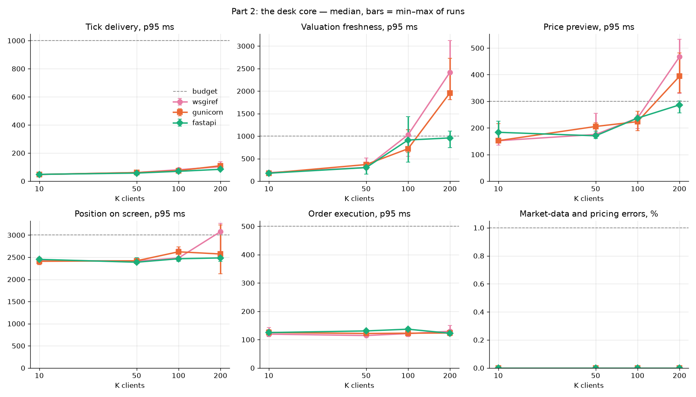
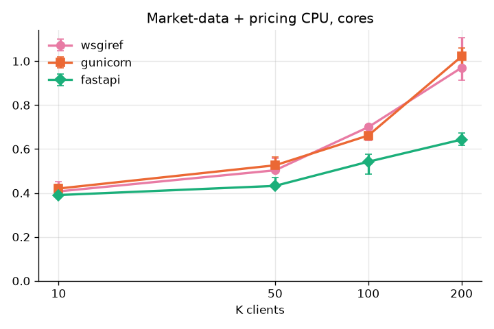

# Migrating the Trading Desk backend from WSGI (Bottle) to ASGI (FastAPI)

| | |
| --- | --- |
| Repository | `trading-desk`, branch `hw-5.5-asgi-migration` |
| Machine | Apple M3 (4 fast + 4 efficient cores), 16 GB, macOS 27.0, mains power |
| Docker | Docker Desktop 29.4, Linux VM with 8 CPUs and 8 GB |
| Image | `python:3.14.7-slim`: Debian 13, Python 3.14.7 |
| Stack | Bottle 0.13.4, gunicorn 26.2.0, SQLAlchemy 2.0.52, psycopg 3.3.4, PostgreSQL 18.6, Docker Compose |
| Part 2 variant 3 | FastAPI 0.141.1, uvicorn 0.53.0, a2wsgi 1.10.10 |

- **Exact Python version**: 3.14.0–3.14.4 use an incremental garbage collector; 3.14.5 returned
  to three generations. Memory and latency figures apply to 3.14.7.
- **Slim image**: 44 MB download instead of 404 MB (arm64). No compiler needed: every dependency
  installs from a prebuilt wheel. Services and benchmark share the same base image.

---

## 1. Summary

> **Decision: keep Bottle for request handling; serve the two live streams (prices and
> valuations) with FastAPI.** Recommended as the next step.

- **One desk process per service keeps 100 traders' screens within budget on gunicorn, 200 with
  FastAPI serving the streams** (10 000 instruments, 5 000 open positions, live trading).
- **At 200 traders, valuations reach the screen in about 1 s instead of 2 s**, and market-data +
  pricing use 37 % less CPU (0.64 vs 1.02 cores).
- **Orders take 0.11–0.15 s in every variant**, also with 20 traders trading at once.
- **Part 1** (a books-service sample): the framework alone brings nothing; threads and open
  streams set the limit. Stage 4B replaced the `wsgiref` development server with gunicorn.

---

## 2. System

Six Bottle services, one PostgreSQL database, a React UI behind the Vite proxy. 43 endpoints:
appendix A.

### 2.1 How the services run

| | |
| --- | --- |
| Server | gunicorn, one gthread worker per service (stage 4B); before it, `wsgiref`, a development server |
| Threads | `SERVER_THREADS`, default 40: one thread per request or open stream; market-data, pricing and monitoring serve streams and use 256 |
| Processes | One worker per service: services keep live state in memory |
| Database | SQLAlchemy ORM, synchronous sessions, psycopg 3; 15 connections per service (6 × 15 = 90, under PostgreSQL's default 100) |
| Calls to other services | `urllib`: blocking, with timeouts |
| Errors | JSON `{"error": "…"}` for every status |

| Service (port) | Endpoints | Does |
| --- | --- | --- |
| market-data (8001) | 14 | Polls market-data APIs, stores quotes and curves, streams updates |
| pricing (8002) | 8 | Revalues trades on every market update; valuations, book risk, previews |
| monitoring (8003) | 5 | Checks every service, collects and streams logs |
| books (8004) | 6 | Trading books |
| blotter (8006) | 7 | Trades with valuations, book summaries, audit history |
| trade-action (8008) | 3 | Validates and executes trade orders, one transaction per action |

### 2.2 Load character

- **All six are I/O-bound** (from the code and 61 000 provider calls in the logs).
- **Request handlers**: short database queries. The only computation: pricing's `POST /price`
  and `POST /scenario`.
- **Long waits run in background threads** (external APIs, other services' streams, health
  polling). The framework does not change them.
- **External APIs inside a request**: market-data's `GET /symbols/search` and `POST /refresh`;
  they answer in 83–378 ms at the median, up to 1.8 s at p95.
- **Streams to the UI**: market-data, pricing, monitoring; every open UI holds two or three.
- **A migration can change only**: database waits in handlers, the UI streams, market-data's
  in-request API calls.

### 2.3 Dependencies under ASGI

No library needs WSGI; only our own code blocks an async migration.

| Dependency | Under ASGI |
| --- | --- |
| Bottle 0.13 | replaced by FastAPI |
| SQLAlchemy 2.0 | async sessions in `sqlalchemy.ext.asyncio`; needs greenlet, already installed |
| psycopg 3 | async connections built in |
| structlog | request context lives in `contextvars`; async code keeps it per task |
| Alembic | runs migrations in its own container, outside the services |
| desk-pricing | pure Python, no dependencies |
| **Our code** | blocking `urllib` calls; streams fed by background threads; handlers use Bottle's global `request` and `response` |

### 2.4 Simplified before measuring

| | Before | After |
| --- | --- | --- |
| Python (services + libs) | 11 964 lines, 139 files | 10 206 lines, 129 files (−15 %) |
| Frontend (js / jsx) | 13 376 lines | 12 381 lines (−7 %) |
| Endpoints | 50 | 43 (market-data −5, trade-action −3, pricing +1) |
| Migrations | 9 files | 1 baseline |
| market-data | 5 010 lines | 3 957 lines |
| blotter | 848 lines | ~590 lines |

- **Streams**: three hand-written SSE copies → one `EventHub` and `follow_stream` in
  `desk_runtime/streams.py`; each frame serialized once.
- **market-data**: one owner of "is this symbol served" (`quote_board.py`); three feed copies →
  `SymbolQuoteFeed`; no full active-set query per quote.
- **pricing**: no `FOR UPDATE` transaction per tick; valuation status, `stale_at`, curve hints and
  curve moves in bp computed in the backend.
- **trade-action**: no queue, worker or second validation; one transaction per action;
  201 / 200 (replay) / 422.
- **blotter**: no second in-memory copy of trades; 5 queries per page instead of 5 + N; totals and
  currency conversion in the backend.
- **monitoring**: one loop per target; state at once, audit after 3 failures.
- **UI**: no curve maths, currency totals, freshness rules or statuses; dead `sessionStorage`
  cache removed.
- **Infra**: `python:3.14.7-slim` pinned; one compose block and one `HEALTHCHECK`.

---

## 3. Method

Rules for both parts:

- **Criteria committed before the first run** of each part: [`docs/decision_criteria.md`](decision_criteria.md)
  (Part 1: `174eb35`; Part 2: `c10e7dd`; Part 2b: `1749779`).
- **Machine**: one laptop (header); services, load and database in Docker on the same VM.
- **Pinned versions**: every package in `requirements.txt`; appendix B.
- **Production mode**: no reload, no debug, no access log.
- **Variants interleaved** within each run.
- **Each point = median of 3 runs; spread = max − min.**
- **A difference counts only if larger than the larger spread.**
- **More than 1 % errors or timeouts → the variant loses the point.**

### 3.1 Part 1: the sample

**books-service** code and a stub standing in for another service, behind Bottle and FastAPI;
identical responses. Request → short database query → JSON, like nearly every handler; no
background threads, nothing in memory.

| Variant | Server | Handlers and clients |
| --- | --- | --- |
| `bottle-sync` | gunicorn, sync worker | one request at a time |
| `bottle-threads` | gunicorn, 40 threads | `requests`, sync database driver |
| `bottle-threads-256` † | gunicorn, 256 threads | as `bottle-threads` |
| `bottle-wsgiref` † | `wsgiref`, the pre-4B server | as `bottle-threads` |
| `fastapi-async` | uvicorn | `async def`, httpx, async database driver |
| `fastapi-sync` | uvicorn | `def` in a 40-thread pool, `requests`, sync database driver |

| # | Request | Shows | In this system |
| --- | --- | --- | --- |
| S1 | `GET /health` | framework and server overhead | every request |
| S2 | `GET /io`: the stub waits 50 ms | waiting on another service | market-data's symbol search and refresh |
| S3 | `GET /cpu`: 20 000 × SHA-256 | computation | pricing's `POST /price` |
| S4 | insert a book, read it by id | synchronous database work | most handlers |
| S5 | `GET /health` at c = 10 beside 10, 50, 200 open streams | whether open streams block other requests | the UI streams |

- **Load**: c = 1, 10, 50, 200; target c = 50. Latency budget p95 ≤ 100 ms (S3 none).
- **One point**: 10 s warm-up, 30 s measured; client timeout 10 s; load generator oha.
- **Setup**: one process per variant, server on its own CPU; S4 on a separate PostgreSQL,
  emptied before each point.
- **Metrics**: successful req/s; p50, p95, p99; errors and timeouts; server CPU and RSS.

Fixes made during the measurement:

| Problem | Fix |
| --- | --- |
| httpx spent 20 % of the CPU on a missing package (`sniffio`) | package installed |
| httpx with an unlimited connection pool collapsed at c = 200 | default pool |
| Warm-up requests still running during the measurement | warm-up waits for them |
| Load generator ran out of ports: `bottle-sync` closes every connection | port reuse; first full run discarded |
| Database pool kept reopening connections, FastAPI 2–4× more often | 15 connections kept open; S4 measured again |

### 3.2 Part 2: the desk core

The business core of the desk: quotes in, valuations out, trades through.

| # | Variant | Serving |
| --- | --- | --- |
| 1 | `wsgiref` | the development server before stage 4B |
| 2 | gunicorn | gthread, one worker, threads = 40 + K + 10 for market-data and pricing (stage 4B) |
| 3 | FastAPI streams | FastAPI serves `/stream` (market-data) and `/valuation-stream` (pricing); their other routes are the same Bottle app behind `a2wsgi` (40 workers); the other four services as in variant 2 |

- **Same application code** in all variants; only the HTTP layer differs.
- **Desk**: 10 000 watched equities; 1 000 of them held, refreshed every 15 s, the rest every
  60 s (about 217 quotes per second); 5 000 open positions (3 500 spot, 500 bonds, 500 swaps,
  500 options).
- **Provider stub**: constant 200 ms, seeded random-walk prices; 401 req/s at p99 203 ms alone.
- **Watching clients**: K = 10, 50, 100, 200; each holds the price stream and the valuation
  stream, about 390 frames per second. K = 200 means about 78 000 frames per second.
- **Trading**: 0.2 orders opened per second (720 per hour), each closed about 60 s later.
  Part 2b: T = 5 and 20 traders at once, one order about every 20 s each.
- **Price previews**: `POST /price`, a European option, 0.2 per second.
- **One run**: fresh database from a template → all 10 000 quotes and 5 000 valuations live →
  90 s warm-up → clients connect at K / 10 per second → 30 s without a dropped stream → 150 s
  measured.
- **Each service on its own CPU of the VM**: market-data 7, pricing 6, trade-action and stub 5,
  blotter 4, the rest 2–3, load client 0–1.
- **A run counts only if** all clients stay connected, the load client uses < 0.8 cores and other
  programs on the laptop use ≤ 3 cores during the window. No run crossed a limit.

| Budget (p95) | |
| --- | --- |
| Tick delivery: provider response → tick at the client | ≤ 1 s |
| Valuation freshness: provider response → valuation at the client | ≤ 1 s |
| Price preview (`POST /price`) | ≤ 300 ms |
| Position on screen: order confirmed → first valuation of that position | ≤ 3 s |
| Order execution (`POST /trade-actions`) | ≤ 500 ms |
| Errors: timeouts, 5xx, dropped streams | ≤ 1 % |

---

## 4. Part 1: the sample (books-service)

Successful req/s / p95 ms at c = 50 (S5: 50 open streams). p99 in brackets where the tail is the
result.

| | `bottle-sync` | `bottle-threads` | `bottle-threads-256` † | `bottle-wsgiref` † | `fastapi-async` | `fastapi-sync` |
| --- | --- | --- | --- | --- | --- | --- |
| S1 `/health` | 11 479 / 4.7 | 14 116 / 5.7 | 14 013 / 4.9 | 7 016 / 0.9 | 33 064 / 2.5 | 17 447 / 3.2 |
| S2 `/io` | 17.5 / 2 886 | 711 / 105 | 918 / 59.2 | 656 / 56.2 (p99 1 094) | 693 / 90.5 | 719 / 101 |
| S3 `/cpu` | 201 / 256 | 201 / 555 | 202 / 496 | 207 / 1 103 (p99 2 526) | 216 / 380 | 212 / 460 |
| S4 `/db` | 1 117 / 48.5 | 1 343 / 120 | 1 346 / 72.6 | 1 249 / 19.0 (p99 1 050) | 1 094 / 73.2 | 1 343 / 57.6 |
| S5 `/health` | – | 0 / all timeouts | 13 367 / 0.8 | 7 058 / 0.9 | 29 074 / 0.4 | – |
| S2, c = 200 | 5.3, 71.5 % errors | 705 / 302 | 2 966 / 84.5 | 1 700 / 55.2 (p99 1 308) | 360 / 606 | 700 / 314 |
| S3, c = 200 | 203 / 1 004 | 202 / 1 445 | 194 / 2 109 | 207 / 1 894, 4.4 % errors | 210 / 613, 3.8 % errors | 210 / 1 206 |

† One run, 24 September. The others: median of 3 runs; spread typically 1–7 % of the median,
S4 up to 25 %. Every range: `benchmark/results/summary.md`, `benchmark/results/threads-check/summary.md`.
`–`: not measured.

**Observations**

- **Open streams exhaust a fixed thread pool**: beside 50 streams `bottle-threads` (40) answers
  nothing; with 256 threads 13 367 req/s at 0.8 ms; `fastapi-async` 29 074 req/s at 0.4 ms.
- **Waiting is limited by threads, not by the framework**: at 40 threads Bottle and FastAPI `def`
  both stop near 710 req/s (711, 719); with 256 threads Bottle reaches 918 req/s at p95 59.2 ms,
  and 2 966 req/s at c = 200, where `fastapi-async` gives 360.
- **`wsgiref` has a 1 s tail**: p99 1 094 ms in S2 and 1 050 ms in S4 at c = 50, from c = 10
  (S2 p99 1 079 ms); its listen queue of 5 drops connections, which retry after 1 s. p95 hides it.
- **Computation is the same everywhere**: S3 201–216 req/s on one core; only the order of service
  changes p95 (256 to 555 ms).
- **A short database request gains nothing from async**: S4 FastAPI `def` = Bottle threads
  (1 343 req/s each); `fastapi-async` 1 094.
- **FastAPI async has the lowest framework overhead**: S1 33 064 req/s vs 11 479–17 447; every
  variant answers in 0.1 ms at c = 1.
- **Memory**: Bottle 77–87 MB, FastAPI 110–117 MB.

**Result of Part 1 (criteria `174eb35`): NO-GO for a full migration**

| Gate | Result |
| --- | --- |
| 1. No regression in S3, S4 | **FAIL**: S3 p95 FastAPI 380 ms, Bottle 256 ms |
| 2. Real gain in S2 or S5 | **PASS**: S5, Bottle answers nothing beside 50 streams |
| 3. Cost | not scored |
| 4. Need: Bottle over budget, FastAPI within | **PASS** at 40 threads; **FAIL** at 256 threads (S2 p95 59.2 ms) |

- **What Part 1 could not say**: whether ASGI's one win, open streams, matters at the desk's
  real volume (Part 2).


All charts, S1–S5: [`benchmark/results/charts/`](../benchmark/results/charts/) (3 runs, min–max bars) and
[`benchmark/results/threads-check/charts/`](../benchmark/results/threads-check/charts/) (†).

**Limitations**

- One laptop; macOS decides whether the server's CPU is a fast or a slow core.
- Each client waits for its answer before the next request: overload latency is understated.
- The stub waits a fixed 50 ms; the real external APIs take 83–378 ms.
- The sample has no background threads and no in-memory state.

---

## 5. Part 2: the desk core

p95 in ms, median of 3 runs (spread in brackets). ✗ = over budget. Every table and run:
`benchmark/results/desk_day/summary.md`.

| K watching clients | 10 | 50 | 100 | 200 |
| --- | --- | --- | --- | --- |
| **Valuation freshness** (≤ 1 000) | | | | |
| `wsgiref` | 189 | 303 | 1 029 ✗ | 2 419 ✗ |
| gunicorn | 177 | 368 | 719 | 1 960 ✗ |
| FastAPI streams | 176 | 300 | 913 | 959 |
| **Tick delivery** (≤ 1 000) | | | | |
| `wsgiref` | 47.4 | 60.9 | 81.0 | 103 |
| gunicorn | 47.5 | 61.2 | 74.8 | 110 |
| FastAPI streams | 48.2 | 57.3 | 69.8 | 84.1 |
| **Price preview** (≤ 300) | | | | |
| `wsgiref` | 152 | 175 | 237 | 467 ✗ |
| gunicorn | 152 | 205 | 223 | 394 ✗ |
| FastAPI streams | 183 | 170 | 237 | 286 |
| **Position on screen** (≤ 3 000) | | | | |
| `wsgiref` | 2 426 | 2 414 | 2 482 | 3 077 ✗ |
| gunicorn | 2 408 | 2 419 | 2 622 | 2 573 |
| FastAPI streams | 2 451 | 2 387 | 2 465 | 2 484 |
| **Order execution** (≤ 500) | | | | |
| `wsgiref` | 119 | 114 | 121 | 129 |
| gunicorn | 125 | 122 | 123 | 124 |
| FastAPI streams | 125 | 131 | 137 | 122 |
| **Largest K within budget** | `wsgiref` 50 | gunicorn 100 | FastAPI streams 200 | |

- **Errors**: 0 % everywhere; no dropped stream in 36 runs.

**Observations**

- **Up to about 100 clients the server makes no measurable difference**: at K = 100 FastAPI's
  freshness spans 426–1 437 ms over three runs and overlaps the others.
- **At 200 clients FastAPI keeps valuations fresh; threads do not.** Every FastAPI run
  (743 / 959 / 1 107 ms) beats every gunicorn run (1 807 / 1 960 / 2 727 ms).
- **The same shows on the server**: pricing's lag behind market data at K = 200 is 0.7–1.3 s
  with FastAPI, 1.6–2.9 s with gunicorn.
- **Why**: on gunicorn every open stream is a thread woken for each frame: 200 threads in
  market-data at about 170 frames a second, 200 in pricing at about 220. They compete for the
  interpreter with pricing's single revaluation thread. FastAPI serves all streams from one
  event loop.
- **Tick delivery and previews improve less** (84 vs 110 ms, 286 vs 394 ms): −24 % and −27 %.
- **Orders do not depend on the variant**: 114–137 ms; FastAPI does not change trade-action.
- **The margin is thin**: FastAPI's K = 200 freshness median is 959 ms against a 1 000 ms budget;
  one run was 1 107 ms.

**Part 2b: many traders trading at once** (K = 50; `benchmark/results/desk_day_trading/summary.md`)

| T traders | 5 (0.25 orders/s) | | | 20 (1 order/s) | | |
| --- | --- | --- | --- | --- | --- | --- |
| | `wsgiref` | gunicorn | FastAPI | `wsgiref` | gunicorn | FastAPI |
| Order execution | 124 | 119 | 130 | 150 | 138 | 137 |
| Valuation freshness | 334 | 440 | 201 | 413 | 376 | 258 |
| Position on screen | 2 481 | 2 527 | 2 430 | 2 421 | 2 409 | 2 385 |

- **Every variant within every budget**; 0 errors; about 150 orders opened per run at T = 20.
- **Orders take the same time in every variant**: differences are within the spread (up to 53 ms).
- **The Part 2 decision stands** (criterion `1749779`).

**What limits the desk besides the server** (measured on gunicorn while setting up Part 2)

- **Logging in costs 12.8 MB per trader**: `/snapshot` 7.4 MB and 0.9 s of market-data CPU,
  `/valuations` 5.4 MB.
- **A price preview checks the underlying against the whole watchlist**: 120–170 ms of pricing CPU;
  one preview per second already pushes freshness past 1 s with one client.
- **Every new trade makes pricing rebuild its index of 5 000 positions** (every 2 s): at 2 orders
  per second freshness reaches 1 s with one client.
- **The Trades & PnL screen returns 8.2 MB in 290–480 ms**: polled every 5 s, it fills the
  blotter's core at about 15 traders (calculated).




Part 2b charts: [`benchmark/results/desk_day_trading/charts/`](../benchmark/results/desk_day_trading/charts/).

**Limitations**

- The whole desk on one laptop; other programs used a median of 1.3 cores during the runs.
- p95 of orders and previews rests on about 30 samples per run.
- Clients hit the services directly, not through the Vite proxy; they do not poll screens.
- One process per service in every variant; many processes behind a shared message bus were not
  measured.

---

## 6. CPU cost

Cloud cost follows cores.

**Per request** (Part 1, c = 50): CPU ms per request, which is also the cores one service needs
for 1 000 requests per second.

| | Bottle, 40 threads | FastAPI `def` | FastAPI async |
| --- | --- | --- | --- |
| S1 `/health`: framework only | 0.07 | 0.06 | **0.03** |
| S2 `/io`: waits on a service | 0.45 | 0.43 | **0.73** (httpx) |
| S3 `/cpu`: computation | 4.97 | 4.71 | 4.62 |
| S4 `/db`: database | 0.74 | 0.74 | **0.91** (async driver) |

**Per trader** (Part 2): market-data + pricing cores (per 100 watching clients).

| K | 10 | 50 | 100 | 200 |
| --- | --- | --- | --- | --- |
| `wsgiref` | 0.41 | 0.50 | 0.70 | 0.97 (0.48) |
| gunicorn | 0.42 | 0.53 | 0.66 | 1.02 (0.51) |
| FastAPI streams | 0.39 | 0.43 | 0.54 | 0.64 (0.32) |

- **Async libraries cost more per request**: +63 % CPU when a request waits on a service, +23 %
  on the database. Moving request handlers to async would raise the bill.
- **Async streams cost less per trader**: at K = 200 market-data drops from 0.62 to 0.36 cores and
  pricing from 0.40 to 0.28; together 37 % less.
- **In business terms**: 200 traders' screens need about one core for market-data and pricing on
  gunicorn and about two thirds of a core with FastAPI streams.

---

## 7. Decision (ADR)

**ADR-002 · Serve the market-data and pricing streams with FastAPI · 29 September 2026**

> **Decision: GO for the streams, NO-GO for the rest.** FastAPI serves market-data's `/stream`
> and pricing's `/valuation-stream`; every other route stays Bottle; the other four services stay
> on gunicorn.

**Why**

- **The criterion passed on two counts**: FastAPI streams stay within the market-data and pricing
  budgets at 200 clients, gunicorn at 100 (a); valuation freshness at K = 200 is 51 % lower,
  beyond the spread (b).
- **It costs less CPU, not more**: −37 % for market-data + pricing at K = 200.
- **It holds under trading**: 5 and 20 traders trading at once change nothing (Part 2b).
- **Request handlers stay synchronous**: Part 1 showed no gain for short database requests and
  higher CPU for async libraries.

**Context**: six Bottle services; ADR-001 (Part 1, 24 September) chose gunicorn threads over a
full migration. Does ASGI help the desk's core at real volume?

**Criteria**: `docs/decision_criteria.md`, Part 2 (`c10e7dd`) and Part 2b (`1749779`), committed
before the runs.

| Criterion | Result |
| --- | --- |
| (a) One K level higher within the market-data and pricing budgets | **yes**: FastAPI 200, gunicorn 100 |
| (b) p95 ≥ 30 % lower at K = 200, beyond the spread | **yes, freshness**: 959 vs 1 960 ms; tick −24 % and preview −27 % do not count |
| CPU per client ≤ +10 % | **yes**: −37 % |
| Part 2b: the decision holds with many traders | **yes**: all variants within budget at T = 5 and 20 |

- **Uncertainty**: (a) rests on a median of 959 ms against 1 000 ms; (b) and the CPU saving are
  clear of the spread.

**Options**

| Option | For | Against |
| --- | --- | --- |
| 1. Keep gunicorn everywhere | one runtime; enough up to about 100 clients | thread-per-stream; freshness over 1 s at 200 clients |
| 2. **FastAPI for the streams (chosen)** | 200 clients within budget; −37 % CPU; 107 lines in the proof of concept | two runtimes; a bridge (`a2wsgi`) for the other routes |
| 3. Full async migration | one framework | no gain for database requests; +23–63 % CPU per request; 43 endpoints to port |

---

## 8. Risks

What could go wrong with option 2 in production. P = probability, I = impact: L / M / H.

| # | Risk | P | I | Mitigation | Warning signal |
| --- | --- | --- | --- | --- | --- |
| 1 | **A blocking call on the event loop freezes every stream.** Only the stream hub runs on the loop; any synchronous code added to a native route stops all clients | M | H | native routes only for streams; review rule; a test holding a stream while a slow route runs | tick delivery p95 > 1 s while CPU < 50 % |
| 2 | **The bridge becomes the new thread limit.** Other routes run in `a2wsgi`'s 40 workers; previews cost 120–170 ms CPU each | M | M | size the workers; make preview validation cheap | preview p95 > 300 ms |
| 3 | **The gain is smaller than expected.** Freshness is limited by pricing's rebuild of 5 000 positions, not only by the server | M | M | fix the rebuild before scaling; measure again | freshness p95 > 1 s with pricing CPU < 50 % |
| 4 | **Slow clients handled differently.** Overflow closes an asyncio queue instead of `EventHub`'s sentinel | L | M | the same overflow test for both hubs | overflow warnings without reconnects |
| 5 | **Two runtimes to operate.** gunicorn and uvicorn differ in shutdown, logging and settings | H | L | one launcher in `desk_runtime`; same 5 s graceful stop and log format | `docker stop` > 10 s; log lines missing in the Logs view |
| 6 | **New dependencies.** FastAPI, Starlette, uvicorn, `a2wsgi` (a small project) | M | M | pinned versions; the bridge can later be replaced by native routes | advisories against a pinned version |
| 7 | **Error format drifts.** FastAPI answers `{"detail": …}` by default | L | L | only two native routes; a check that every error has an `error` key | error responses without `error` |
| 8 | **Scope creeps into async database code.** Part 1: no gain, +23 % CPU | M | M | scope agreed: streams only | an async database driver added |

- **Top 3**: 1, 2, 3.

---

## 9. Alternative plan (stage 4B) and next step (stage 4A)

**Stage 4B, after Part 1's NO-GO: gunicorn instead of `wsgiref` — implemented** (`3790d5d`)

- gunicorn gthread, one worker per service; threads from `SERVER_THREADS`; startup work and
  background threads in the worker; 5 s graceful stop; streams send a comment every 5 s so a
  closed client frees its thread.

| | Before (`wsgiref`) | After (gunicorn) |
| --- | --- | --- |
| Sample, S2 at c = 50 (Part 1) | 656 req/s, p99 1 094 ms | 918 req/s, p99 61.7 ms (256 threads) |
| Desk: clients within budget (Part 2) | 50 | 100 |
| Desk: valuation freshness at K = 100 | 1 029 ms | 719 ms |
| `/health` beside 200 streams | 1 121 req/s, p95 12.7 ms | 6 393 req/s, p95 2.4 ms |
| `docker stop` | 10.23 s, killed | 0.41–0.83 s; 5.31–5.40 s with open streams; clean exit |
| Closed stream clients | threads kept until the next event (395 threads) | thread freed within 5 s |

- **Cost**: 10–13 MB more memory per container; open streams are capped by the thread count (256
  held 255 streams, then waited).

**Stage 4A, after Part 2's GO: recommended next step**

- Move variant 3 from `benchmark/desk_day/fastapi_streams.py` into `desk_runtime`: a launcher for
  market-data and pricing; FastAPI, uvicorn and `a2wsgi` pinned; README; the full UI check.
- Expected effect (Part 2): 200 instead of 100 clients within budget; −37 % market-data + pricing
  CPU at 200 clients.

**Revisit when**

- the desk needs more than about 200 screens on one process per service;
- services must run as several processes (then streams move to a shared message bus);
- pricing's rebuild and the preview validation are fixed, and freshness is limited only by the
  server.

---

## 10. Conclusions

**Answers to the assignment's questions**

1. **Problem and whether it exists**: thread-per-stream serving. Not at today's load (one UI, two
   or three streams); it appears from about 200 watching clients on one desk.
2. **What the scenarios measure**: Part 1, one request type at a time on a sample; Part 2, the
   desk core at 10 000 instruments.
3. **Uncertainty**: median of 3 runs. Up to 100 clients the variants overlap. At 200 the freshness
   ranges do not overlap; (a) rests on a median 41 ms under budget.
4. **What decided**: Part 2 criterion (a) and (b) on valuation freshness, with 37 % less CPU. It
   would change under the conditions below.
5. **Top 3 risks**: a blocking call on the event loop, the bridge's thread limit, a gain smaller
   than expected (section 8).
6. **Cost against the estimate**: the proof of concept is 107 lines; the forecast gave FastAPI
   50–200 clients and GO a 40 % chance; the result is at the top of that range.
7. **What instead, and its effect**: after Part 1, gunicorn: no 1 s tail, clean stops, 100 instead
   of 50 clients on the desk (section 9).
8. **Lessons**:
   - **Benchmarks**: measure the application's own costs first (previews, logins and screens
     limited the desk before the server did); keep the load client and other programs out of the
     result (checked each run); warm up; alternate variants.
   - **Async**: it pays where many connections wait (open streams), not in short database requests;
     its libraries cost more CPU per request.

**What would change the result**

- **Many processes**: in-memory state keeps each service to one process; with a shared cache and
  a message bus (e.g. Redis pub-sub) streams could be spread over processes, and the server model
  would matter less.
- **A cheaper pricing engine**: rebuilding 5 000 positions and validating previews against 10 000
  instruments limit freshness in every variant.

---

## Appendix A. Endpoints

All responses are JSON. Errors are `{"error": "..."}` with the HTTP status — also for unknown
routes (404), wrong methods (405) and unhandled exceptions (500). SSE endpoints return
`text/event-stream`. `/health` answers `{service, status}`; pricing and blotter add counters.

**market-data-service** (14)

| Method | Path | Params | Codes | Body |
| --- | --- | --- | --- | --- |
| GET | `/stream` | — | 200 | SSE: quote and curve updates |
| GET | `/snapshot` | — | 200 | `{stream_id, event_id, spots, curves}` |
| GET | `/curves`, `/curves/<provider>` | `raw` | 200, 404 | list of curves |
| GET | `/curves/<provider>/<curve>/<as_of>` | `raw` | 200, 400, 404 | one curve |
| GET | `/quotes/<provider>/<symbol>/history` | `limit` 1–200, `raw` | 200, 400, 404 | list of snapshots |
| GET | `/watchlist` | — | 200 | list of items |
| POST | `/watchlist` | JSON body | 201, 400, 409, 422 | item |
| DELETE | `/watchlist/<symbol>` | `provider` | 200, 404, 409 | removal result |
| GET | `/fx/rates` | `to` | 200, 400 | `{to, rates}` |
| GET | `/symbols/search` | `q` (≥ 2 chars) | 200, 400 | `{query, results, provider_errors}` |
| GET | `/providers` | — | 200 | provider status |
| POST | `/refresh` | `symbol`, `provider` | 200, 404, 422, 429, 502, 503 | tick, or `{refreshed, skipped}` without `symbol` |
| GET | `/health` | — | 200 | `{service, status}` |

**pricing-service** (8)

| Method | Path | Params | Codes | Body |
| --- | --- | --- | --- | --- |
| GET | `/curves/<curve>/at` | `maturity_years`, `index_tenor` 3M/6M or `payments_per_year` | 200, 400, 404 | zero rate, discount factor, par rate |
| GET | `/valuations` | — | 200 | list of valuations |
| GET | `/valuations/<trade_id>` | — | 200, 404 | one valuation |
| GET | `/book-risk` | — | 200 | list of book-risk records |
| POST | `/price` | JSON body | 200, 400, 404, 409, 503 | priced instrument |
| POST | `/scenario` | JSON body | 200, 400, 404 | scenario result |
| GET | `/valuation-stream` | — | 200 | SSE: valuation and book-risk updates |
| GET | `/health` | — | 200 | `{service, status, …}` |

**monitoring-service** (5)

| Method | Path | Params | Codes | Body |
| --- | --- | --- | --- | --- |
| GET | `/status` | — | 200 | health of every target |
| GET | `/audits` | `limit`, `since`, `severity`, `service`, `event_type`, `correlation_id`, `entity_id` | 200, 400 | list of audit rows |
| GET | `/logs` | `level`, `service`, `q`, `limit` (1–10 000) | 200, 400 | `{lines, meta}` |
| GET | `/logs/stream` | — | 200 | SSE: `run`, then log lines |
| GET | `/health` | — | 200 | `{service, status}` |

**books-service** (6)

| Method | Path | Params | Codes | Body |
| --- | --- | --- | --- | --- |
| GET | `/books` | — | 200 | list of books |
| GET | `/books/<book_id>` | — | 200, 404 | one book |
| POST | `/books` | `name` (≤ 60), `expected_asset_class`, `description` (≤ 200) | 201, 400, 409 | created book |
| PUT | `/books/<book_id>` | partial body | 200, 400, 404, 409 | updated book |
| DELETE | `/books/<book_id>` | — | 200, 404, 409 | deactivated book |
| GET | `/health` | — | 200 | `{service, status}` |

**trade-action-service** (3)

| Method | Path | Params | Codes | Body |
| --- | --- | --- | --- | --- |
| GET | `/instruments/term-schemas` | — | 200 | `{instruments, schemas, curves}` |
| POST | `/trade-actions` | JSON: `OPEN_TRADE`, `CLOSE_TRADE`, `REASSIGN_TRADES` | 201, 200 (replay, close, reassign), 400, 422 | result |
| GET | `/health` | — | 200 | `{service, status}` |

**blotter-service** (7)

| Method | Path | Params | Codes | Body |
| --- | --- | --- | --- | --- |
| GET | `/trades`, `/trades/overview` | `limit` 1–500, `offset`, `book_id`, `asset_class`, `status`, `symbol` | 200, 400 | list of trades / `{trades, books}` |
| GET | `/trades/<trade_id>` | — | 200, 404 | trade with valuations and audit logs |
| GET | `/trades/<trade_id>/valuations`, `…/audit-logs` | — | 200, 404 | list |
| GET | `/books/summary` | `currency` | 200, 400 | book summaries |
| GET | `/health` | — | 200 | `{service, status, …}` |

## Appendix B. Commands and versions

**Part 1**

| | Command |
| --- | --- |
| `bottle-sync` | `gunicorn -w 1 sample_wsgi.app:app` |
| `bottle-threads` | `gunicorn -w 1 -k gthread --threads 40 sample_wsgi.app:app` |
| `fastapi-async` | `uvicorn sample_asgi.app:app --no-access-log` |
| `fastapi-sync` | `uvicorn sample_asgi.app:sync_app --no-access-log` |
| Stub | `uvicorn downstream_stub.app:app --no-access-log` (one process) |
| Load, per point | `oha -z 10s -w -c <c> -t 10s <url>` (warm-up), then `oha -z 30s -c <c> -t 10s --output-format json <url>` |

```sh
benchmark/run_benchmark.sh                            # full grid, about 2 h 45 min
SCENARIOS=s4 benchmark/run_benchmark.sh               # one scenario again
docker compose -f benchmark/infra/compose.yml down    # removes the benchmark database
```

**Part 2**

```sh
benchmark/run_desk_day.sh                                                     # K = 10 50 100 200, 3 variants, 3 runs, about 3.5 h
RESULTS=results/desk_day_trading KS=50 TRADERS="5 20" benchmark/run_desk_day.sh  # Part 2b, about 1.5 h
docker compose -f benchmark/infra/desk.compose.yml run --rm client python -m desk_day.analyze_desk
docker compose -f benchmark/infra/desk.compose.yml down -v                     # removes the desk database
```

- **Versions**: Python 3.14.7, Bottle 0.13.4, gunicorn 26.2.0, FastAPI 0.141.1, uvicorn 0.53.0
  (uvloop 0.22.1, httptools 0.8.0), a2wsgi 1.10.10, httpx 0.28.1, requests 2.34.2,
  SQLAlchemy 2.0.52, psycopg 3.3.4, PostgreSQL 18.6, oha 1.16.0. All pins:
  `benchmark/infra/requirements.txt`; services: `requirements.txt`.
- **Machine**: Apple M3 (4 fast + 4 efficient cores), 16 GB, macOS 27.0, mains power; Docker
  Desktop 29.4, VM with 8 CPUs and 8 GB. Part 1: server on CPU 7, stub 6, PostgreSQL 4–5,
  load 0–3.
- **Part 1 settings** (`benchmark/infra/compose.yml`): 15 database connections kept open, log
  level WARNING, load generator may reuse closed ports.
- **Part 2 settings** (`benchmark/infra/desk.compose.yml`): 15 database connections per service,
  log level WARNING, provider limits lifted, 64 quote requests in flight.
